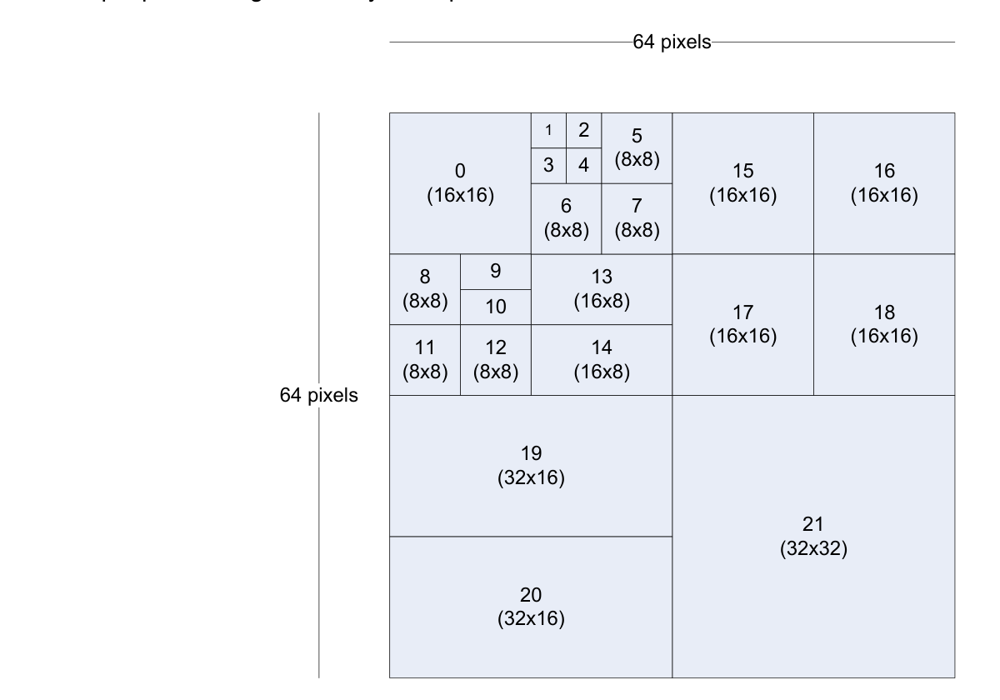
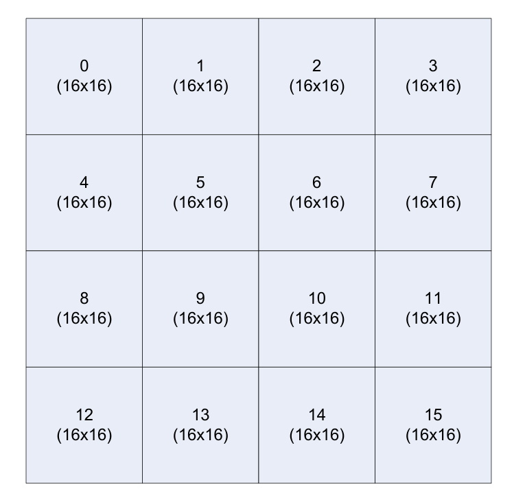
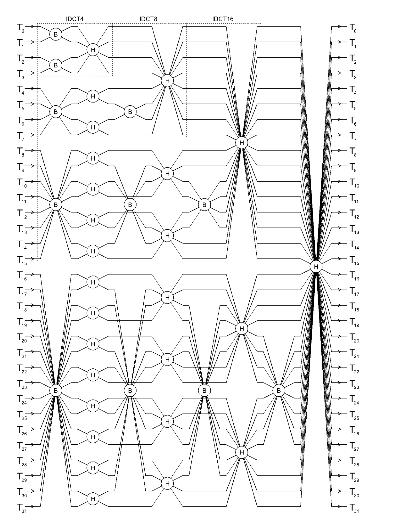
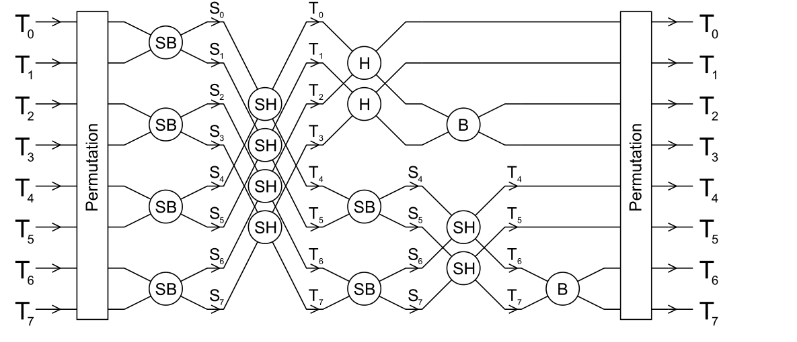
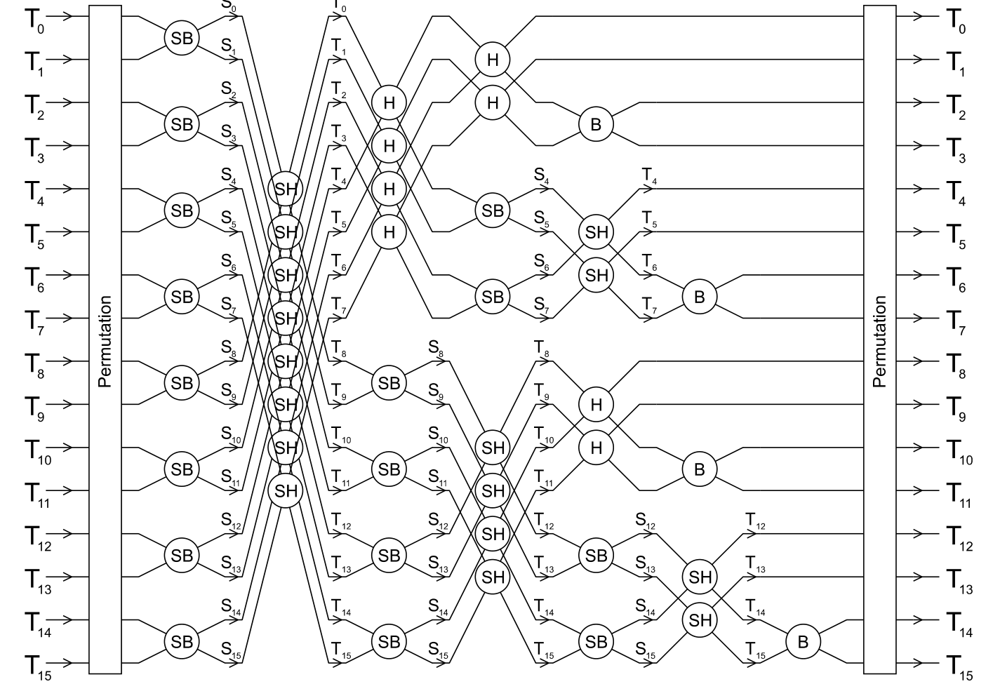
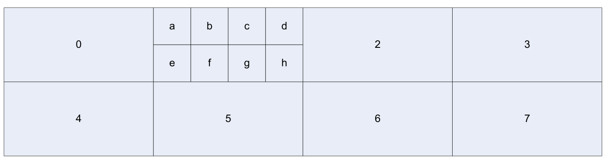
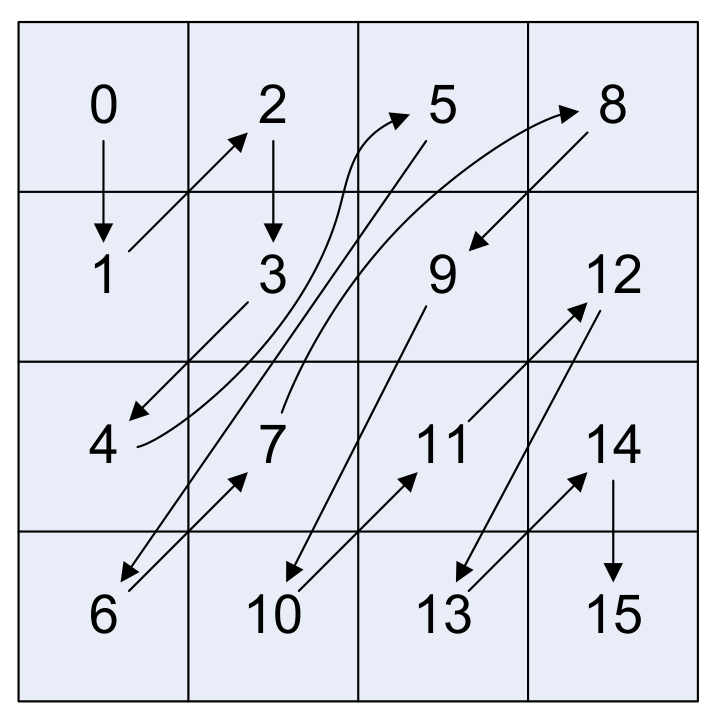
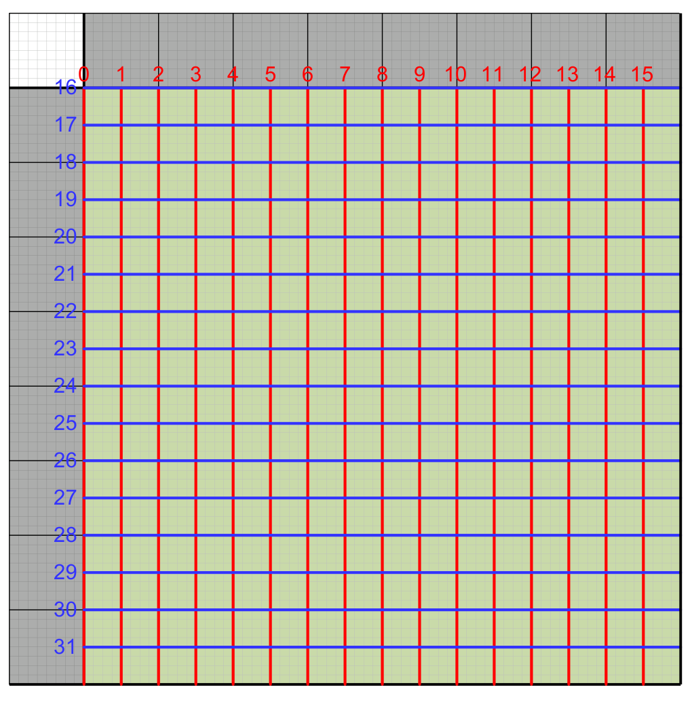
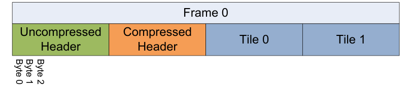
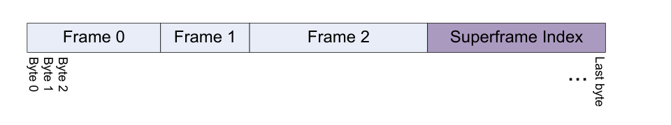

# VP9 Bitstream & Decoding Process Specification

- Version: 0.7
- Date: 22nd February 2017
- Source PDF: `vp9-bitstream-specification-v0.7-20170222-draft.pdf`
- Conversion note: layout text was extracted with Poppler; visual-only diagrams are inserted as rendered PNG crops from the source PDF.

<!-- Source: PDF page 1, printed page i -->

VP9 Bitstream & Decoding Process Specification

Version 0.7

Adrian Grange, Google

Peter de Rivaz, Argon Design

Jonathan Hunt, Argon Design

ABSTRACT This document defines the bitstream format and decoding process for the Google VP9 video codec.

<!-- Source: PDF page 2, printed page ii -->

## Contents

```text
Contents                                                                                                                                                         Page
```

```text
1         Scope ..................................................................................................................................................... 1
2         Terms and definitions ............................................................................................................................. 2
3         Symbols (and abbreviated terms)........................................................................................................... 5
4         Conventions............................................................................................................................................ 7
4.1       Arithmetic operators ............................................................................................................................... 7
4.2       Logical operators .................................................................................................................................... 7
4.3       Relational operators ............................................................................................................................... 7
4.4       Bitwise operators .................................................................................................................................... 7
4.5       Assignment ............................................................................................................................................. 8
4.6       Mathematical functions ........................................................................................................................... 8
4.7       Method of describing bitstream syntax ................................................................................................... 8
4.8       Functions .............................................................................................................................................. 10
4.9       Descriptors ........................................................................................................................................... 11
4.9.1     f(n) ........................................................................................................................................................ 11
4.9.2     s(n) ....................................................................................................................................................... 11
4.9.3     B(p) ....................................................................................................................................................... 11
4.9.4     L(n) ....................................................................................................................................................... 11
4.9.5     T ........................................................................................................................................................... 11
5         Overview of the decoding process (Informative) .................................................................................. 12
5.1       Purpose of VP9 .................................................................................................................................... 12
5.2       Compressing image data...................................................................................................................... 12
5.3       Quantization and lossy compression .................................................................................................... 13
5.4       Predicting image data ........................................................................................................................... 13
5.5       Inter prediction ...................................................................................................................................... 14
5.6       Superblocks .......................................................................................................................................... 15
5.7       Multiple transforms ............................................................................................................................... 16
5.8       Inverse DCT structure .......................................................................................................................... 16
5.9       Inverse ADST structure ........................................................................................................................ 19
5.10      Reference frames ................................................................................................................................. 19
5.11      Hidden frames ...................................................................................................................................... 20
5.12      Compound prediction ........................................................................................................................... 20
5.13      Motion vector prediction ....................................................................................................................... 20
5.14      Tiles ...................................................................................................................................................... 20
5.15      Segmentation map ............................................................................................................................... 21
5.16      Reference frame scaling....................................................................................................................... 21
5.17      Arithmetic coding .................................................................................................................................. 21
5.18      Probability updates ............................................................................................................................... 22
5.19      Chroma format...................................................................................................................................... 22
5.20      High bit depth ....................................................................................................................................... 23
5.21      Probability Contexts.............................................................................................................................. 23
5.22      Zigzag ordering..................................................................................................................................... 23
5.23      Loop filter .............................................................................................................................................. 24
5.24      Loop filter ordering and filters ............................................................................................................... 24
5.25      Frame structure .................................................................................................................................... 25
5.26      Superframes ......................................................................................................................................... 26
6         Bitstream syntax ................................................................................................................................... 27
6.1       Frame syntax ........................................................................................................................................ 27
6.1.1     Trailing bits syntax ................................................................................................................................ 27
```

<!-- Source: PDF page 3, printed page iii -->

```text
6.1.2    Refresh probs syntax ........................................................................................................................... 27
6.2      Uncompressed header syntax.............................................................................................................. 28
6.2.1    Frame sync syntax ............................................................................................................................... 30
6.2.2    Color config syntax ............................................................................................................................... 30
6.2.3    Frame size syntax ................................................................................................................................ 30
6.2.4    Render size syntax ............................................................................................................................... 31
6.2.5    Frame size with refs syntax .................................................................................................................. 31
6.2.6    Compute image size syntax ................................................................................................................. 31
6.2.7    Interpolation filter syntax ...................................................................................................................... 31
6.2.8    Loop filter params syntax ..................................................................................................................... 32
6.2.9    Quantization params syntax ................................................................................................................. 32
6.2.10   Delta quantizer syntax .......................................................................................................................... 33
6.2.11   Segmentation params syntax ............................................................................................................... 33
6.2.12   Probability syntax ................................................................................................................................. 34
6.2.13   Tile info syntax ..................................................................................................................................... 34
6.2.14   Tile size calculation .............................................................................................................................. 34
6.3      Compressed header syntax ................................................................................................................. 35
6.3.1    Tx mode syntax .................................................................................................................................... 35
6.3.2    Tx mode probs syntax .......................................................................................................................... 36
6.3.3    Diff update prob syntax ........................................................................................................................ 36
6.3.4    Decode term subexp syntax ................................................................................................................. 36
6.3.5    Inv remap prob syntax .......................................................................................................................... 37
6.3.6    Inv recenter noneg syntax .................................................................................................................... 37
6.3.7    Coef probs syntax ................................................................................................................................ 38
6.3.8    Skip probs syntax ................................................................................................................................. 38
6.3.9    Inter mode probs syntax ....................................................................................................................... 38
6.3.10   Interp filter probs syntax ....................................................................................................................... 38
6.3.11   Intra inter probs syntax ......................................................................................................................... 38
6.3.12   Frame reference mode syntax ............................................................................................................. 39
6.3.13   Frame reference mode probs syntax ................................................................................................... 39
6.3.14   Y mode probs syntax............................................................................................................................ 40
6.3.15   Partition probs syntax ........................................................................................................................... 40
6.3.16   MV probs syntax................................................................................................................................... 40
6.3.17   Update mv prob syntax ........................................................................................................................ 40
6.3.18   Setup compound reference mode syntax............................................................................................. 41
6.4      Decode tiles syntax .............................................................................................................................. 41
6.4.1    Get tile offset syntax ............................................................................................................................. 42
6.4.2    Decode tile syntax ................................................................................................................................ 42
6.4.3    Decode partition syntax ........................................................................................................................ 42
6.4.4    Decode block syntax ............................................................................................................................ 43
6.4.5    Mode info syntax .................................................................................................................................. 44
6.4.6    Intra frame mode info syntax ................................................................................................................ 44
6.4.7    Intra segment id syntax ........................................................................................................................ 44
6.4.8    Skip syntax ........................................................................................................................................... 45
6.4.9    Segmentation feature active syntax ..................................................................................................... 45
6.4.10   Tx size syntax....................................................................................................................................... 45
6.4.11   Inter frame mode info syntax ................................................................................................................ 45
6.4.12   Inter segment id syntax ........................................................................................................................ 46
6.4.13   Is inter syntax ....................................................................................................................................... 46
6.4.14   Get segment id syntax.......................................................................................................................... 47
6.4.15   Intra block mode info syntax................................................................................................................. 47
6.4.16   Inter block mode info syntax................................................................................................................. 48
6.4.17   Ref frames syntax ................................................................................................................................ 49
6.4.18   Assign MV syntax ................................................................................................................................. 49
6.4.19   MV syntax............................................................................................................................................. 50
6.4.20   MV component syntax .......................................................................................................................... 50
6.4.21   Residual syntax .................................................................................................................................... 50
6.4.22   Get uv size syntax ................................................................................................................................ 52
6.4.23   Get plane block size syntax.................................................................................................................. 52
```

<!-- Source: PDF page 4, printed page iv -->

```text
6.4.24    Token syntax ........................................................................................................................................ 52
6.4.25    Get scan syntax .................................................................................................................................... 53
6.4.26    Coef syntax........................................................................................................................................... 54
6.5       Motion vector prediction ....................................................................................................................... 55
6.5.1     Find MV refs syntax .............................................................................................................................. 55
6.5.2     Is inside syntax ..................................................................................................................................... 57
6.5.3     Clamp mv ref syntax ............................................................................................................................. 57
6.5.4     Clamp mv row syntax ........................................................................................................................... 57
6.5.5     Clamp mv col syntax ............................................................................................................................ 58
6.5.6     Add mv ref list syntax ........................................................................................................................... 58
6.5.7     If same ref frame add syntax ................................................................................................................ 58
6.5.8     If diff ref frame add syntax .................................................................................................................... 58
6.5.9     Scale mv syntax ................................................................................................................................... 59
6.5.10    Get block mv syntax ............................................................................................................................. 59
6.5.11    Get sub block mv syntax ...................................................................................................................... 59
6.5.12    Find best ref mvs syntax....................................................................................................................... 59
6.5.13    Use mv hp syntax ................................................................................................................................. 60
6.5.14    Append sub8x8 mvs syntax ................................................................................................................. 60
7         Bitstream semantics ............................................................................................................................. 62
7.1       Frame semantics .................................................................................................................................. 62
7.1.1     Trailing bits semantics .......................................................................................................................... 62
7.1.2     Refresh probs semantics ...................................................................................................................... 62
7.2       Uncompressed header semantics ........................................................................................................ 62
7.2.1     Frame sync semantics.......................................................................................................................... 64
7.2.2     Color config semantics ......................................................................................................................... 64
7.2.3     Frame size semantics........................................................................................................................... 65
7.2.4     Render size semantics ......................................................................................................................... 65
7.2.5     Frame size with refs semantics ............................................................................................................ 65
7.2.6     Compute image size semantics............................................................................................................ 66
7.2.7     Interpolation filter semantics ................................................................................................................. 66
7.2.8     Loop filter semantics............................................................................................................................. 66
7.2.9     Quantization params syntax ................................................................................................................. 67
7.2.10    Segmentation params syntax ............................................................................................................... 67
7.2.11    Tile info semantics ................................................................................................................................ 68
7.3       Compressed header semantics ............................................................................................................ 68
7.3.1     Tx mode semantics .............................................................................................................................. 68
7.3.2     Diff update prob semantics ................................................................................................................... 69
7.3.3     Decode term subexp semantics ........................................................................................................... 69
7.3.4     Inv remap prob semantics .................................................................................................................... 69
7.3.5     Coef prob semantics............................................................................................................................. 69
7.3.6     Frame reference mode semantics ........................................................................................................ 69
7.3.7     Update mv prob semantics ................................................................................................................... 69
7.4       Tile level ............................................................................................................................................... 70
7.4.1     Decode tiles semantics......................................................................................................................... 70
7.4.2     Decode tile semantics .......................................................................................................................... 70
7.4.3     Decode partition semantics .................................................................................................................. 70
7.4.4     Decode block semantics....................................................................................................................... 71
7.4.5     Intra frame mode info semantics .......................................................................................................... 71
7.4.6     Intra and inter segment id semantics.................................................................................................... 71
7.4.7     Skip semantics ..................................................................................................................................... 72
7.4.8     Tx size semantics ................................................................................................................................. 72
7.4.9     Is inter semantics.................................................................................................................................. 72
7.4.10    Intra block mode info semantics ........................................................................................................... 72
7.4.11    Inter block mode info semantics ........................................................................................................... 72
7.4.12    Ref frames semantics ........................................................................................................................... 73
7.4.13    MV semantics ....................................................................................................................................... 73
7.4.14    MV component semantics .................................................................................................................... 73
```

<!-- Source: PDF page 5, printed page v -->

```text
7.4.15 Residual semantics .............................................................................................................................. 74
7.4.16 Token semantics .................................................................................................................................. 74
7.4.17 Coef semantics..................................................................................................................................... 75
8          Decoding process................................................................................................................................. 76
8.1        General................................................................................................................................................. 76
8.2        Frame order constraints ....................................................................................................................... 76
8.3        Clear counts process............................................................................................................................ 76
8.4        Probability adaptation process ............................................................................................................. 77
8.4.1      Merge prob process ............................................................................................................................. 77
8.4.2      Merge probs process............................................................................................................................ 77
8.4.3      Coefficient probability adaption process............................................................................................... 78
8.4.4      Non coefficient probability adaption process ........................................................................................ 79
8.5        Prediction processes ............................................................................................................................ 80
8.5.1      Intra prediction process ........................................................................................................................ 80
8.5.2      Inter prediction process ........................................................................................................................ 83
8.6        Reconstruction and dequantization ...................................................................................................... 89
8.6.1      Dequantization functions ...................................................................................................................... 89
8.6.2      Reconstruct process............................................................................................................................. 94
8.7        Inverse transform process .................................................................................................................... 94
8.7.1      1D Transforms...................................................................................................................................... 94
8.7.2      2D Inverse Transform......................................................................................................................... 100
8.8        Loop filter process .............................................................................................................................. 100
8.8.1      Loop filter frame init process .............................................................................................................. 101
8.8.2      Superblock loop filter process ............................................................................................................ 101
8.8.3      Filter size process .............................................................................................................................. 103
8.8.4      Adaptive filter strength process .......................................................................................................... 104
8.8.5      Sample filtering process ..................................................................................................................... 105
8.9        Output process ................................................................................................................................... 109
8.10       Reference frame update process ....................................................................................................... 110
9          Parsing Process ................................................................................................................................. 111
9.1        Parsing process for f(n) ...................................................................................................................... 111
9.2        Parsing process for Boolean decoder ................................................................................................ 111
9.2.1      Initialization process for Boolean decoder.......................................................................................... 111
9.2.2      Boolean decoding process ................................................................................................................. 111
9.2.3      Exit process for Boolean decoder ...................................................................................................... 112
9.2.4      Parsing process for read_literal.......................................................................................................... 112
9.3        Parsing process for tree encoded syntax elements ........................................................................... 112
9.3.1      Tree selection process ....................................................................................................................... 113
9.3.2      Probability selection process .............................................................................................................. 116
9.3.3      Tree decoding process ....................................................................................................................... 125
9.3.4      Syntax element counting process ...................................................................................................... 125
10         Additional tables ................................................................................................................................. 127
10.1       Scan tables......................................................................................................................................... 127
10.2       Conversion tables............................................................................................................................... 131
10.3       Pareto probability table....................................................................................................................... 135
10.4       Fixed probability tables....................................................................................................................... 138
10.5       Default probability tables .................................................................................................................... 141
Annex A Levels ............................................................................................................................................... 162
A.1    Overview ............................................................................................................................................ 162
Annex B Superframes ..................................................................................................................................... 165
B.1    Overview ............................................................................................................................................ 165
B.2    Superframe syntax ............................................................................................................................. 165
B.2.1 Superframe index ............................................................................................................................... 165
B.2.2 Superframe header syntax ................................................................................................................. 165
B.3    Superframe semantics ....................................................................................................................... 165
B.4    Superframe parsing ............................................................................................................................ 166
```

<!-- Source: PDF page 6, printed page vi -->

```text
Bibliography ..................................................................................................................................................... 167
```

<!-- Source: PDF page 7, printed page 1 -->

## 1 Scope

This document specifies the Google VP9 bitstream format and decoding process.

<!-- Source: PDF page 8, printed page 2 -->

## 2 Terms and definitions

For the purposes of this document, the following terms and definitions apply:

- **2.1 AC coefficient:** Any transform coefficient whose frequency indices are non-zero in at least one dimension.
- **2.2 Altref (Alternative reference frame):** A frame that can be used in inter coding.
- **2.3 Bitstream:** The sequence of bits generated by encoding a sequence of frames.
- **2.4 Bit string:** An ordered string with limited number of bits. The left most bit is the most significant bit (MSB), the right most bit is the least significant bit (LSB).
- **2.5 Block:** A square or rectangular region of pixels consisting of one Luma and two Chroma matrices.
- **2.6 Block scan:** A specified serial ordering of quantized coefficients.
- **2.7 Byte:** An 8-bit bit string.
- **2.8 Byte alignment:** One bit is byte aligned if the position of the bit is an integer multiple of eight from the position of the first bit in the bitstream.
- **2.9 Chroma:** A sample value matrix or a single sample value of one of the two color difference signals. NOTE – Symbols of chroma are U and V.
- **2.10 Coded frame:** The representation of one frame before the decoding process.
- **2.11 Component:** One of the three sample value matrices (one luma matrix and two chroma matrices) or its single sample value.
- **2.12 Compound prediction:** a type of inter prediction where sample values are computed by blending together predictions from two different reference frames.
- **2.13 Compressed header:** An arithmetically encoded description of frame level settings of transform mode and probability adjustments.
- **2.14 DC coefficient:** A transform coefficient whose frequency indices are zero in both dimensions.
- **2.15 Decoded frame:** The frame reconstructed out of the bitstream by the decoder.
- **2.16 Decoder:** One embodiment of the decoding process.
- **2.17 Decoding process:** The process that derives decoded frames from syntax elements.
- **2.18 Dequantization:** The process in which transform coefficients are obtained by scaling the quantized coefficients.
- **2.19 Encoder:** One embodiment of the encoding process.
- **2.20 Encoding process:** A process not specified in this Specification that generates the bitstream that conforms to the description provided in this document.
- **2.21 Flag:** A binary variable.
- **2.22 Frame:** The representation of video signals in the space domain, composed of one luma sample matrix (Y) and two chroma sample matrices (U and V).
- **2.23 Frame context:** A set of probabilities used in the decoding process.
- **2.24 Golden frame:** A frame that can be used in inter coding. Typically the golden frame is encoded with higher quality and is used as a reference for multiple inter frames.
- **2.25 Inter coding:** Coding one block or frame using inter prediction.
- **2.26 Inter frame:** A frame compressed by referencing previously decoded frames and which may use intra prediction or inter prediction.
<!-- Source: PDF page 9, printed page 3 -->

- **2.27 Inter prediction:** The process of deriving the prediction value for the current frame using previously decoded frames.
- **2.28 Intra coding:** Coding one block or frame using intra prediction.
- **2.29 Intra frame:** A frame compressed using only intra prediction which can be independently decoded.
- **2.30 Intra-only frame:** A type of intra frame that does not reset the decoding process. NOTE – A key frame is different to an intra-only frame even though both only use intra prediction. The difference is that a key frame fully resets the decoding process.
- **2.31 Intra prediction:** The process of deriving the prediction value for the current sample using previously decoded sample values in the same decoded frame.
- **2.32 Inverse transform:** The process in which a transform coefficient matrix is transformed into a spatial sample value matrix.
- **2.33 Key frame:** A frame where the decoding process is reset. Key frames, and following frames, are always decodable without access to preceding frames. A key frame only uses intra prediction.
- **2.34 Level:** A defined set of constraints on the values for the syntax elements and variables.
- **2.35 Loop filter:** A filtering process applied to the reconstruction intended to reduce the visibility of block edges.
- **2.36 Luma:** A sample value matrix or a single sample value representing the monochrome signal related to the primary colors. NOTE – The symbol representing luma is Y.
- **2.37 Mode info:** A header describing one or more blocks. Blocks of size 8x8 and larger are described with a single mode info header. Blocks of size less than 8x8 share a mode info header that covers the whole 8x8 block of luma samples.
- **2.38 Mode info block:** A luma sample value block of size 8x8 or larger and its two corresponding chroma sample value blocks. A mode info block has a single mode info header.
- **2.39 Motion vector:** A two-dimensional vector used for inter prediction which refers the current frame to the reference frame, the value of which provides the coordinate offsets from a location in the current frame to a location in the reference frame.
- **2.40 Parse:** The procedure of getting the syntax element from the bitstream.
- **2.41 Prediction:** The implementation of the prediction process consisting of either inter or intra prediction.
- **2.42 Prediction process:** The process of estimating the decoded sample value or data element using a predictor.
- **2.43 Prediction value:** The value, which is the combination of the previously decoded sample values or data elements, used in the decoding process of the next sample value or data element.
- **2.44 Profile:** A subset of syntax, semantics and algorithms defined in a part.
- **2.45 Quantization parameter:** A variable used for scaling the quantized coefficients in the decoding process.
- **2.46 Quantized coefficient:** A transform coefficient before dequantization.
- **2.47 Raster scan:** Maps a two dimensional rectangular raster into a one dimensional raster, in which the entry of the one dimensional raster starts from the first row of the two dimensional raster, and the scanning then goes through the second row and the third row, and so on. Each raster row is scanned in left to right order.
- **2.48 Reconstruction:** Obtaining the addition of the decoded residual and the corresponding prediction values.
- **2.49 Reference frame:** A previously decoded frame used during inter prediction.
- **2.50 Reserved:** A special syntax element value which may be used to extend this part in the future.
<!-- Source: PDF page 10, printed page 4 -->

- **2.51 Residual:** The differences between the reconstructed samples and the corresponding prediction values.
- **2.52 Sample:** The basic elements that compose the frame.
- **2.53 Sample value:** The value of a sample. This is an integer from 0 to 255 (inclusive) for 8-bit frames, from 0 to 1023 (inclusive) for 10-bit frames, and from 0 to 4095 (inclusive) for 12-bit frames.
- **2.54 Segmentation map:** a 3-bit number containing the segment affiliation for each 8x8 block in the image. The segmentation map persists across frames.
- **2.55 Sequence:** The highest level syntax structure of coding bitstream, including one or several consecutive coded frames.
- **2.56 Subblock:** A 4x4, 4x8, or 8x4 block. All the subblocks within an 8x8 block share a single mode info header.
- **2.57 Superblock:** A square block of 64x64 pixels that consists of either 1 or 2 mode info blocks or is recursively partitioned into 4 32x32 blocks, which themselves can be further partitioned.
- **2.58 Superframe:** a chunk of data containing one or more coded frames plus an index at the end describing the number and sizes of the coded frames.
- **2.59 Syntax element:** An element of data represented in the bitstream.
- **2.60 Tile:** a rectangular region of the frame that is intended to be able to be decoded and encoded independently, although loop-filtering across tile edges may still be applied. NOTE – For VP9 this intention is only partially met. Partitioning into columns works as expected, but partitioning into rows does not. The decode of a tile depends on the decode of the tile above.
- **2.61 Transform block:** A square transform coefficient matrix, used as input to the inverse transform process.
- **2.62 Transform coefficient:** A scalar value, considered to be in a frequency domain, contained in a transform block.
- **2.63 Uncompressed header:** High level description of the frame to be decoded that is encoded without the use of arithmetic encoding.
<!-- Source: PDF page 11, printed page 5 -->

## 3 Symbols (and abbreviated terms)

- **DCT:** Discrete Cosine Transform
- **ADST:** Asymmetric Discrete Sine Transform
- **LSB:** Least Significant Bit
- **MSB:** Most Significant Bit
- **WHT:** Walsh Hadamard Transform

The specification makes use of a number of constant integers. Constants that relate to the semantics of a particular syntax element are defined in section 7. Additional constants are defined below:

| Symbol name | Value | Description |
| --- | ---: | --- |
| REFS_PER_FRAME | 3 | Each inter frame can use up to 3 frames for reference |
| MV_FR_SIZE | 4 | Number of values that can be decoded for mv_fr |
| MVREF_NEIGHBOURS | 8 | Number of positions to search in motion vector prediction |
| BLOCK_SIZE_GROUPS | 4 | Number of contexts when decoding intra_mode |
| BLOCK_SIZES | 13 | Number of different block sizes used |
| BLOCK_INVALID | 14 | Sentinel value to mark partition choices that are illegal |
| PARTITION_CONTEXTS | 16 | Number of contexts when decoding partition |
| MI_SIZE | 8 | Smallest size of a mode info block |
| MIN_TILE_WIDTH_B64 | 4 | Minimum width of a tile in units of superblocks (although tiles on the right hand edge can be narrower) |
| MAX_TILE_WIDTH_B64 | 64 | Maximum width of a tile in units of superblocks |
| MAX_MV_REF_CANDIDATES | 2 | Number of motion vectors returned by find_mv_refs process |
| NUM_REF_FRAMES | 8 | Number of frames that can be stored for future reference |
| MAX_REF_FRAMES | 4 | Number of values that can be derived for ref_frame |
| IS_INTER_CONTEXTS | 4 | Number of contexts for is_inter |
| COMP_MODE_CONTEXTS | 5 | Number of contexts for comp_mode |
| REF_CONTEXTS | 5 | Number of contexts for single_ref and comp_ref |
| MAX_SEGMENTS | 8 | Number of segments allowed in segmentation map |
| SEG_LVL_ALT_Q | 0 | Index for quantizer segment feature |
| SEG_LVL_ALT_L | 1 | Index for loop filter segment feature |
| SEG_LVL_REF_FRAME | 2 | Index for reference frame segment feature |
| SEG_LVL_SKIP | 3 | Index for skip segment feature |
| SEG_LVL_MAX | 4 | Number of segment features |
| BLOCK_TYPES | 2 | Number of different plane types (Y or UV) |
| REF_TYPES | 2 | Number of different prediction types (intra or inter) |
| COEF_BANDS | 6 | Number of coefficient bands |
| PREV_COEF_CONTEXTS | 6 | Number of contexts for decoding coefficients |
| UNCONSTRAINED_NODES | 3 | Number of coefficient probabilities that are directly transmitted |
| TX_SIZE_CONTEXTS | 2 | Number of contexts for transform size |
| SWITCHABLE_FILTERS | 3 | Number of values for interp_filter |

<!-- Source: PDF page 12, printed page 6 -->

| Symbol name | Value | Description |
| --- | ---: | --- |
| INTERP_FILTER_CONTEXTS | 4 | Number of contexts for interp_filter |
| SKIP_CONTEXTS | 3 | Number of contexts for decoding skip |
| PARTITION_TYPES | 4 | Number of values for partition |
| TX_SIZES | 4 | Number of values for tx_size |
| TX_MODES | 5 | Number of values for tx_mode |
| DCT_DCT | 0 | Inverse transform rows with DCT and columns with DCT |
| ADST_DCT | 1 | Inverse transform rows with DCT and columns with ADST |
| DCT_ADST | 2 | Inverse transform rows with ADST and columns with DCT |
| ADST_ADST | 3 | Inverse transform rows with ADST and columns with ADST |
| MB_MODE_COUNT | 14 | Number of values for y_mode |
| INTRA_MODES | 10 | Number of values for intra_mode |
| INTER_MODES | 4 | Number of values for inter_mode |
| INTER_MODE_CONTEXTS | 7 | Number of contexts for inter_mode |
| MV_JOINTS | 4 | Number of values for mv_joint |
| MV_CLASSES | 11 | Number of values for mv_class |
| CLASS0_SIZE | 2 | Number of values for mv_class0_bit |
| MV_OFFSET_BITS | 10 | Maximum number of bits for decoding motion vectors |
| MAX_PROB | 255 | Number of values allowed for a probability adjustment |
| MAX_MODE_LF_DELTAS | 2 | Number of different mode types for loop filtering |
| COMPANDED_MVREF_THRESH | 8 | Threshold at which motion vectors are considered large |
| MAX_LOOP_FILTER | 63 | Maximum value used for loop filtering |
| REF_SCALE_SHIFT | 14 | Number of bits of precision when scaling reference frames |
| SUBPEL_BITS | 4 | Number of bits of precision when performing inter prediction |
| SUBPEL_SHIFTS | 16 | 1 << SUBPEL_BITS |
| SUBPEL_MASK | 15 | SUBPEL_SHIFTS - 1 |
| MV_BORDER | 128 | Value used when clipping motion vectors |
| INTERP_EXTEND | 4 | Value used when clipping motion vectors |
| BORDERINPIXELS | 160 | Value used when clipping motion vectors |
| MAX_UPDATE_FACTOR | 128 | Value used in adapting probabilities |
| COUNT_SAT | 20 | Value used in adapting probabilities |
| BOTH_ZERO | 0 | Both candidates use ZEROMV |
| ZERO_PLUS_PREDICTED | 1 | One candidate uses ZEROMV, one uses NEARMV or NEARESTMV |
| BOTH_PREDICTED | 2 | Both candidates use NEARMV or NEARESTMV |
| NEW_PLUS_NON_INTRA | 3 | One candidate uses NEWMV, one uses ZEROMV |
| BOTH_NEW | 4 | Both candidates use NEWMV |
| INTRA_PLUS_NON_INTRA | 5 | One candidate uses intra prediction, one uses inter prediction |
| BOTH_INTRA | 6 | Both candidates use intra prediction |
| INVALID_CASE | 9 | Sentinel value marking a case that can never occur |

<!-- Source: PDF page 13, printed page 7 -->

## 4 Conventions

The mathematical operators and their precedence rules used to describe this Specification are similar to those used in the C programming language. However, the operation of integer division with truncation is specifically defined. In addition, an array with 2 elements used to hold a motion vector (indicated by the variable name ending with the letters Mv or Mvs) can be accessed using either normal array notation (e.g. Mv[ 0 ] and Mv[ 1 ]), or by just the name (e.g. Mv). The only operations defined when using the name are assignment and equality/inequality testing. Assignment of an array is represented using the normal notation A = B and is specified to mean the same as doing both the individual assignments A[ 0 ] = B[ 0 ] and A[ 1 ] = B[ 1 ]. Equality testing of 2 motion vectors is represented using the notation A == B and is specified to mean the same as (A[ 0 ] == B[ 0 ] && A[ 1 ] == B[ 1 ]). Inequality testing is defined as A != B and is specified to mean the same as (A[ 0 ] != B[ 0 ] || A[ 1 ] != B[ 1 ]). When a variable is said to be representable by a signed integer with x bits, it means that the variable is greater than or equal to -(1<<(x-1)), and that the variable is less than or equal to (1<<(x-1))-1.

### 4.1 Arithmetic operators

```text
      +            Addition
      –            Subtraction (as a binary operator) or negation (as a unary prefix operator)
      *            Multiplication
      /            Integer division with truncation of the result toward zero. For example, 7/4 and -7/-4 are
                   truncated to 1 and -7/4 and 7/-4 are truncated to -1.
      a%b          Remainder from division of a by b. Both a and b are positive integers.
```

### 4.2 Logical operators

```text
      a && b       Logical AND operation between a and b
      a || b       Logical OR operation between a and b
      !            Logical NOT operation.
```

### 4.3 Relational operators

```text
      >            Greater than
      >=           Greater than or equal to
      <            Less than
      <=           Less than or equal to
      ==           Equal to
      !=           Not equal to
```

### 4.4 Bitwise operators

```text
      &            AND operation
      |            OR operation
      ~            Negation operation
      a >> b       Shift “a” in 2’s complement binary integer representation format to the right by b bit positions.
                   This operator is only used with b being a non-negative integer. Bits shifted into the MSBs
                   as a result of the right shift have a value equal to the MSB of “a” prior to the shift operation.
```

<!-- Source: PDF page 14, printed page 8 -->

```text
      a << b       Shift “a” in 2’s complement binary integer representation format to the left by b bit positions.
                   This operator is only used with b being a non-negative integer. Bits shifted into the LSBs as
                   a result of the left shift have a value equal to 0.
```

### 4.5 Assignment

```text
      =            Assignment operator
      ++           Increment, x++ is equivalent to x = x + 1. When this operator is used for an array index, the
                   variable value is obtained before the auto increment operation
      --           Decrement, i.e. x-- is equivalent to x = x - 1. When this operator is used for an array index,
                   the variable value is obtained before the auto decrement operation
      +=           Addition assignment operator, for example x += 3 corresponds to x = x + 3
      -=           Subtraction assignment operator, for example x -= 3 corresponds to x = x - 3
```

### 4.6 Mathematical functions

The following mathematical functions (Abs, Clip3, Clip1, Min, Max, and Round2) are defined as follows:

```text
                ⎧ x;  x ≥ 0
Abs( x ) =     ⎨
                ⎩ -x; x < 0

                         ⎧ x; z < x
                         ⎪
Clip3( x, y, z ) =       ⎨ y; z > y
                         ⎪ z; otherwise
                         ⎩

Clip1( x ) = Clip3( 0, (1 << BitDepth) - 1, x )

                    ⎧ x; x <= y
Min( x, y ) =      ⎨
                    ⎩ y; x > y

                    ⎧ x; x >= y
Max( x, y ) =      ⎨
                    ⎩ y; x < y

Round2( x, n) = ( x + (1 << (n − 1))) >> n
```

### 4.7 Method of describing bitstream syntax

The description style of the syntax is similar to the C programming language. Syntax elements in the bitstream are represented in bold type. Each syntax element is described by its name (using only lower case letters with underscore characters) and a descriptor for its method of coded representation. The decoding process behaves according to the value of the syntax element and to the values of previously decoded syntax elements. When a value of a syntax element is used in the syntax tables or the text, it appears in regular (i.e. not bold) type. If the value of a syntax element is being computed (e.g. being written with a default value instead of being coded in the bitstream), it also appears in regular type. In some cases the syntax tables may use the values of other variables derived from syntax elements values. Such variables appear in the syntax tables, or text, named by a mixture of lower case and upper case letter and without any underscore characters. Variables starting with an upper case letter are derived for the decoding of the current syntax structure and all depending syntax structures. These variables may be used in the decoding process for later syntax structures.

<!-- Source: PDF page 15, printed page 9 -->

Variables starting with a lower case letter are only used within the process from which they are derived. Constant values appear in all upper case letters with underscore characters. Constant lookup tables appear in all lower case letters with underscore characters. Hexadecimal notation, indicated by prefixing the hexadecimal number by “0x”, may be used when the number of bits is an integer multiple of 4. For example, “0x1a” represents a bit string “0001 1010”. Binary notation is indicated by prefixing the binary number by “0b”. For example, 0b00011010 represents a bit string “0001 1010”. Binary numbers may include underscore characters to enhance readability. If present, the underscore characters appear every 4 binary digits starting from the LSB. For example, 0b11010 may also be written as 0b1_1010. A value equal to 0 represents a FALSE condition in a test statement. The value TRUE is represented by any value not equal to 0. The following table lists examples of the syntax specification format. When syntax_element appears (with bold face font), it specifies that this syntax element is parsed from the bitstream.

<!-- Source: PDF page 16, printed page 10 -->

| Syntax | Type |
| --- | --- |
| A statement can be a syntax element with associated descriptor or can be an expression used to specify its existence, type, and value, as in the following examples:<br><br>**syntax_element** | `f(1)` |

```text
     /* A group of statements enclosed in brackets is a compound statement and is treated
     functionally as a single statement. */
     {
            Statement
            Statement
            …
     }

     /* A “while” structure specifies that the statement is to be evaluated repeatedly while
     the condition remains true. */
     while ( condition )
            Statement

     /* A “do … while” structure executes the statement once, and then tests the condition.
     It repeatedly evaluates the statement while the condition remains true. */
     Do
            Statement
     while ( condition )

     /* An “if … else” structure tests the condition first. If it is true, the primary statement is
     evaluated. Otherwise, the alternative statement is evaluated. If the alternative
     statement is unnecessary to be evaluated, the “else” and corresponding alternative
     statement can be omitted. */
     if ( condition )
            Primary statement
     Else
            Alternative statement

     /* A “for” structure evaluates the initial statement at the beginning then tests the
     condition. If it is true, the primary and subsequent statements are evaluated until the
     condition becomes false. */
     for ( initial statement; condition; subsequent statement )
            Primary statement
```

### 4.8 Functions

Functions used for syntax description are specified in this section.

<!-- Source: PDF page 17, printed page 11 -->

The specification of these functions makes use of a bitstream position indicator. This bitstream position indicator locates the position of the bit that is going to be read next.

```text
            get_position( ): Return the value of the bitstream position indicator.
            init_bool( sz ): Initialize the arithmetic decode process for the boolean decoder with a size of sz bytes
            as specified in section 9.2.1.
            exit_bool( ): Exit the arithmetic decode process as described in section 9.2.3.
```

### 4.9 Descriptors

The following descriptors specify the parsing of syntax elements. Lower case descriptors specify syntax elements that are represented by a fixed integer number of bits in the bitstream; upper case descriptors specify syntax elements that are represented by arithmetic coding.

#### 4.9.1 f(n)

Unsigned n-bit number appearing directly in the bitstream. The bits are read from high to low order. The parsing process specified in section 9.1 is invoked and the syntax element is set equal to the return value.

#### 4.9.2 s(n)

Signed integer using n bits for the value and 1 bit for a sign flag. The parsing process for this descriptor is specified below:

```text
        s(n) {                                                                                         Type
            value                                                                                       f(n)
            sign                                                                                        f(1)
            return sign ? -value : value
        }
```

#### 4.9.3 B(p)

A single arithmetic encoded bit with estimated probability p/256 of being 0. The syntax element is set equal to the return value of read_bool( p ) (see section 9.2.2 for a specification of this process).

#### 4.9.4 L(n)

Unsigned arithmetic encoded n-bit number encoded as n flags (a "literal"). The bits are read from high to low order. The syntax element is set equal to the return value of read_literal( n ) (see section 9.2.4 for a specification of this process).

#### 4.9.5 T

An arithmetic tree encoded value from a small alphabet. Such values represent the leaves of a small binary tree. The (non-leaf) nodes of the tree have associated probabilities p and are represented by B(p). A zero represents choosing the left branch below the current node and a one represents choosing the right branch. Each element of this type defined in this document has an associated table of values defined in this document. Reference is made to those tables when required. (See section 9.3 for the specification of this process). Every value (leaf) whose tree depth is x is decoded using x B(p) values. There are many ways that a given alphabet can be represented. The choice of tree has little impact on data rate but does affect decoder performance. The trees used by VP9 are chosen to (on average) minimize the number of calls to read_bool (the function used to extract B(p) from the bitstream). This is equivalent to shaping the tree so that values that are more probable have smaller tree depth than do values that are less probable.

<!-- Source: PDF page 18, printed page 12 -->

## 5 Overview of the decoding process (Informative)

The purpose of this section is to provide a gentler introduction to the features and motivation of the VP9 specification for readers who are less familiar with video codecs. This section is just provided for background and is not an integral part of the specification.

### 5.1 Purpose of VP9

This specification defines the VP9 video compression format which is a bandwidth-efficient way of storing and transmitting video sequences. Video data is very high bandwidth (e.g. a video of width 1920 pixels, and height 1080 pixels may contain 30 frames every second. Each pixel needs around 12 bits resulting in a bandwidth of 1920*1080*30*12 = 746 million bits per second.) The goal of VP9 is to provide a way that this video can be stored in a compressed form that uses orders of magnitude fewer bits. This specification describes the decoding process that takes a sequence of compressed frames and turns it into a sequence of decompressed video frames that can be displayed. All VP9 compliant decoders must decode compressed frames in exactly the same way. Note that the encoding process is not described here. There are many ways of choosing how to encode the frames. Different ways can be better or worse depending on how much they change the source image in ways that matter to the human visual system and how many bits they end up using.

### 5.2 Compressing image data

Suppose we have some 8-bit image data to compress and we zoom right into the image until we see the individual pixels in a 4x4 grid - for the moment we ignore color so each pixel is represented a single value from 0 (black) to 255 (white):

```text
                                    162         160        160           158
                                    161         160        161           160
                                    159         161        160           159
                                    160         160        162           160
```

We have sixteen 8 bit numbers here which need 16*8=128 bits to store in a raw format. However, this part of the image is so flat that we could probably represent it as a flat area with a single value of 160 without an observer noticing any difference. This would only need 8 bits. Similarly, suppose we had an area that looked like this:

```text
                                     10         20          30            40
                                     10         20          30            40
                                     10         20          30            40
                                     10         20          30            40
```

In this case the image gradually increases from left to right so if we had some way of specifying the slope we could represent all 16 values with fewer bits. VP9 approaches this is by means of a reversible transform that adjusts the numbers to try and make most numbers small and a few numbers large. The essence of the approach is to take two numbers (e.g. 162 and 160) and transform these into the sum of the numbers, and the difference between the numbers (162+160=322 and 162-160=2). If the decoder is given the 322 and 2 it can reconstruct the original numbers by computing the sum and difference divided by two (322+2)/2 = 162 and (322-2)/2 = 160. The full transform takes the sum and differences of pairs of pixels, and performs further similar operations on both the rows and the columns. Overall this results in a transform that takes the 16 original pixels into 16 transformed values. The transformed values are still in a square grid, but now the axes represent horizontal and vertical frequency.

<!-- Source: PDF page 19, printed page 13 -->

This means that if the image is flat the transform will have just a single non-zero coefficient in the top left (called the DC coefficient). This transform is useful because we can compact a block of similar pixel values into a smaller number of non-zero transform coefficients in the frequency domain, so that the transformed coefficients can typically be represented by fewer bits than the original.

### 5.3 Quantization and lossy compression

In the example above our almost flat image would transform into a large DC coefficient and small values for the other coefficients (called AC coefficients). Although this is already an improvement, we can compress better by quantizing the coefficients. This means that we divide the coefficients by a quantization factor before encoding them, and then in the decode process multiply by the quantization factor. For example, suppose that we used a quantization factor of 10. Instead of sending the numbers 322 and 2, we would instead send 322/10=32 and 2/10=0 (where we have rounded down to keep the numbers as integers). In the decoding process we would compute 32*10=320 and 0*10=0, followed by the transform (320+0)/2=160 and (320-0)/2 = 160. So this has resulted in the decode of two values (160 and 160) that are close, but not exactly the same as our source image for the benefit of only needing to transmit the numbers 32 and 0. As we no longer decode to an exact match of the source data, this is known as lossy compression. Lossy compression is used for most broadcast videos as it results in large bandwidth savings, but for some applications (such as video editing) it is useful to be able to use lossless compression. Lossless compression avoids the growth of the small errors introduced by each repeated application of lossy compression if the same video sequence were to be repeatedly decompressed and recompressed. VP9 supports both lossy and lossless coding. Lossless coding is indicated by using the smallest quantization factor and this automatically switches to use a perfectly invertible transform known as the Walsh-Hadamard transform.

### 5.4 Predicting image data

Suppose we are part way through decoding an image and have decoded the pixels shown below.

Markdown note: in the prediction grids below, cells in the top row and first column are the green already-decoded pixels shown in the PDF; `?` cells are the 4 by 4 block about to be decoded.

```text
                                160         160       160        200         200
                                160           ?        ?           ?          ?
                                160           ?        ?           ?          ?
                                160           ?        ?           ?          ?
                                160           ?        ?           ?          ?
```

The green cells represent pixels that we have already decoded, while the question marks represent a 4 by 4 block of pixels that we are about to decode. It seems natural to predict that some of the missing pixels on the left are at least close to the value 160 even before we have seen them, while some of the ones on the right are probably close to 200. However, it is quite possible that the image looks like:

```text
                                160         160       160        200         200
                                160         160       160        200         200
                                160         160       160        200         200
                                160         160       160        200         200
                                160         160       160        200         200
```

or like

```text
                                160         160       160        200         200
                               160         160         160          200         200
                               160         160         160          160         200
                               160         160         160          160         160
                               160         160         160          160         160
```

<!-- Source: PDF page 20, printed page 14; page boundary occurs after the first row of the preceding matrix. -->

VP9 contains what is called an intra mode that specifies a direction such as vertical for the first case, or 45 degrees for the second case. When decoding a block the decoder first reads the intra mode, and uses that to filter already decoded pixels from the current frame to form a prediction for the contents of the block. This is known as intra prediction and this method is called decoding an intra block. Of course, the actual content of our source image data is unlikely to be exactly the same as the prediction. Suppose the actual contents are:

```text
                                     160         160         200          200
                                     160         160         200          200
                                     170         170         210          210
                                     170         170         210          210
```

Consider the residual block. This is defined to be the difference between the prediction (assume we have been instructed to use vertical prediction) and the source image:

```text
                                      0           0           0             0
                                      0           0           0             0
                                     10          10          10            10
                                     10          10          10            10
```

The residual only contains small numbers, so is cheaper to represent than the original contents. In VP9 all blocks are represented by some information specifying how to predict the contents of the block (in this case the intra mode), plus transform coefficients of the residual block. The decoder works by first computing the prediction, and then inverse transforming the transform coefficients and adding the result (the residual) to this prediction. This process is followed even for the first blocks in the video where we do not have any decoded pixels. In these cases the decoder pretends that it has decoded pixels with a fixed value for the off-screen locations.

### 5.5 Inter prediction

Suppose we are now trying to compress a whole video sequence. Consider what we can predict about the next image from the previous one: there may be some still parts of the image in the background, so some blocks may be identical to their contents in the previous frame. Similarly, if the camera is panning or some object is moving, there may be blocks that are very similar to a slightly shifted part of the previous frame. VP9 takes advantage of these cases by using inter blocks. An inter block contains a motion vector that specifies the offset in the previous frame of the part of the image to use as a prediction for this block. So, for example, still blocks will be represented by a zero motion vector. The motion vector contains information about both a vertical and horizontal offset to allow for both types of movement. As for intra blocks, the decoding process works by first computing the prediction, and then inverse transforming the transform coefficients and adding the result (the residual) to this prediction. The motion vectors can specify shifts in units of whole pixels, or shifts containing a fractional pixel offset. When a fractional pixel shift is used, the previous frame is filtered in order to give a more accurate prediction.

<!-- Source: PDF page 21, printed page 15 -->

It is also possible to choose the type of interpolation filter used in this filtering. The main difference is in the filter bandwidth. If the source frames are noisy, it can be appropriate to use a narrow bandwidth filter to discard the noise, while if the source frames are clean we can use a higher bandwidth filter to try and preserve more of the high frequency texture. This choice can either be made for all blocks in a frame, or specified per block.

### 5.6 Superblocks

In some parts of the image there may be a large region that can all be predicted at the same time (e.g. a still background image), while in other parts there may be some fine details that are changing (e.g. in a talking head) and a smaller block size would be appropriate. VP9 provides the ability to vary the block size to handle a range of prediction sizes. The decoder decodes each image in units of 64 by 64 pixel superblocks. Each superblock has a partition which specifies how it is to be encoded. It can consist of:

- A single 64 by 64 block
- Two 64 by 32 blocks
- Two 32 by 64 blocks
- Four 32 by 32 blocks

The individual parts are decoded in raster order. Each 32 by 32 block can also be partitioned in a similar way all the way down until we reach an 8x8 block which has the choices:

- A single 8 by 8 block
- Two 8 by 4 subblocks
- Two 4 by 8 subblocks
- Four 4 by 4 subblocks

An example partitioning of a 64 by 64 superblock is shown below:



The numbers give the decode order of the blocks, while the numbers in brackets give the block sizes. The blocks without sizes are subblocks of 8x8 blocks.

<!-- Source: PDF page 22, printed page 16 -->

The difference between a block and a subblock is that a single block header (called mode info) is sent for all the subblocks within an 8x8 region, while each block has its own block header. The subblocks can have different intra modes, or motion vectors, but they share some other information such as which reference frame to predict from.

### 5.7 Multiple transforms

VP9 specifies a number of different transforms that can be applied to the residual. These differ in size (4x4, 8x8, 16x16, 32x32 are supported) and in the type of transform. The type of transform can be varied independently for rows and columns as being either an integer precision version of a Discrete Cosine Transform or an Asymmetric Discrete Sine Transform. The choice of transform type is deduced from the intra mode, while the choice of transform size can either be specified at a frame level, or given on a per-block basis. The idea is that when we are doing intra prediction, normally the samples near the known edges are predicted better than the ones further away so the errors are usually small at one side. The Asymmetric Discrete Sine Transform does a better job of transforming this shape because it has basis vectors that tend to vanish at the known boundary, and maximize energy at the unknown boundary. When the transform size is smaller than the block size, the transform blocks are predicted and reconstructed in raster order. For example, suppose we had a 64x64 intra block using a 16x16 transform size. The blocks would be processed in this order:



Each of these 16 blocks would in turn have the following apply:

1. The 16x16 block is predicted from previously decoded pixels.
2. The 16x16 block of transform coefficients is inverse transformed to compute the residual.
3. The prediction is added to the residual to compute the decoded pixels.

Note that the prediction for the second 16x16 block can depend on the decoded pixels from the first. (However, also note that the loop filtering is only applied once the complete frame is decoded.)

### 5.8 Inverse DCT structure

The two-dimensional inverse transforms used for processing blocks of coefficients are executed by performing one-dimensional inverse transforms on first the rows of the block followed by the columns of the intermediate result from the row transforms. The inverse DCT works by first shuffling the input data into bit-reversed address order followed by a series of stages of butterfly operations. Each butterfly takes two input values, and produces two output values. The butterfly can be considered as performing a 2D rotation of the input values.

<!-- Source: PDF page 23, printed page 17 -->

There are two types of butterfly (represented by B and H). The H type of butterfly represents a matrix combined with scaling such that it can be implemented with one addition and one subtraction operation whereas the B type of butterfly requires the use of multiplication. The structure of the 32 point inverse DCT is shown in the butterfly diagram below (not including the input shuffle). The structure of the 2^n point inverse DCT is such that it contains the 2^(n-1) point inverse DCT within it. This recursion is highlighted in the diagram to also show the 4, 8, and 16 point inverse DCTs.

<!-- Source: PDF page 24, printed page 18 -->



<!-- Source: PDF page 25, printed page 19 -->

### 5.9 Inverse ADST structure

The ADST is an alternative 1D transform which may be used to transform arrays of length 4, 8, or 16. In some stages, the ADST uses an array S of higher precision intermediate results. The butterfly operation SB stores its output in S, and the butterfly operation SH takes its input from S. The structure of the 8 point inverse ADST used for VP9 is shown in the diagram below.



The structure of the 16 point inverse ADST is shown in the diagram below.



The 4 point ADST is treated as a special case and is implemented as eight multiplications followed by a number of addition/subtraction/shift operations.

### 5.10 Reference frames

If an object is moving across a scene it can happen that the best source of an inter prediction for a block is not the previous frame (where the block was obscured by the moving object), but the frame before that.

<!-- Source: PDF page 26, printed page 20 -->

VP9 provides options for inter blocks to specify which frame is used as the reference frame. A decoder maintains 8 slots, each slot with a decoded reference frame. When a new frame is decoded, the frame header specifies which of the slots should be overwritten with the new frame. Although 8 slots are maintained, any particular frame can make use of at most 3 reference frames. Which reference frames to use are specified in the frame header, and then the detailed choice between these 3 is specified in the mode info at the coding block level. Each block (of size above or equal to 8x8) is allowed to use up to 2 reference frames. All the sub8x8 blocks inside an 8x8 block share the same reference frame combination, which allows up to 2 reference frames.

### 5.11 Hidden frames

When a frame is decoded it will normally be shown. However, there is also an option to decode a frame but not show it. The frame can still be saved into the reference frame slots for use in inter prediction of future frames. This option can be used to make a golden frame that contains a high quality version of various objects in the scene. This frame can be used to construct other frames. It is also possible to send a very short frame (just one or two bytes) that tells the decoder to directly show one of the frame slots.

### 5.12 Compound prediction

As mentioned above, an inter block can be predicted using either a single reference frame or a combination of two reference frames. The latter is called compound prediction in which 2 motion vectors and 2 reference frames are specified for an inter block. In this case the prediction is first formed from each reference frame, and then the final prediction is produced as an averaged combination of these two. The hope is that the average is an even better predictor than either of the originals. The choice of compound prediction can either be made at the frame level, or specified in the mode info for inter blocks.

### 5.13 Motion vector prediction

Quite often many blocks share the same motion vector (e.g. with a panning camera). VP9 takes advantage of this by scanning already decoded inter blocks to form a prediction of the most likely motion vectors that will be used for the current block. It prefers blocks that are nearby and share the same choice of reference frame, but gradually expands its search scope until it has found up to 2 different predictions. When the spatial neighbors do not provide sufficient information, it can fall back to using the motion vectors from the previous decoded frame. The first found motion vector is called nearest motion vector, and the second found motion vector is called near motion vector (nearmv). The block contains the inter mode which indicates whether to use the nearest or near motion vector, or to use a zero motion vector, or to use a new motion vector. In the new motion vector case, what is coded in the bitstream is a motion vector difference. The decoder reads this motion vector difference and adds it to the nearest motion vector to compute the actual motion vector. The effective motion vector can be specified at up to 1/8 (one eighth) pixel accuracy. When the predicted motion vector has either component whose magnitude is above 64 (i.e., 8 full pixels), the maximum accuracy of the effective motion vector is automatically capped at 1/4 (one quarter) pixel accuracy.

### 5.14 Tiles

The 64 by 64 superblocks in a frame are sent in raster order within rectangular tiles as detailed in section 5.6 and the tiles are sent in raster order within the frame. The diagram below shows a possible set of tiles within a frame (numbered in raster scan order) including the individual 64 by 64 superblocks for tile 1 (labelled a-h).

<!-- Source: PDF page 27, printed page 21 -->



Tiles have dimensions that are multiples of 64 by 64 superblocks and are evenly spaced, as far as possible. Tiles are not intended to help reduce bandwidth (in fact they can hurt compression a small amount), but the objective is to allow implementations to take advantage of parallel processing by encoding/decoding different tiles at the same time. The tile sizes are sent at the start of each tile (except the last) so a decoder can know the start points if it wishes to do parallel decoding.

### 5.15 Segmentation map

VP9 provides a means of segmenting the image and then applying various signals or adjustments at the segment level. Segmentation can be particularly efficient and useful when the segmentation of a video sequence persists or changes little for many frames. Up to 8 segments may be specified for any given frame. For each of these segments it is possible to specify:

- a quantizer,
- a loop filter strength,
- a prediction reference frame,
- a block skip mode that implies the use of a zero motion vector and that no residual will be coded.

Each of these data values for each segment may be individually updated at the frame level. Where a value is not updated in a given frame, the value from the previous frame persists. The exceptions to this are key frames, intra only frames or other frames where independence from past frame values is required (for example to enable error resilience). In such cases all values are reset to a default. It is possible to indicate segment affiliation for any prediction block of size 8x8 pixels or greater. Updates to this segmentation map are explicitly coded using either a temporal coding or direct coding strategy (chosen at the frame level). If no explicit update is coded for a block’s segment affiliation, then it persists from frame to frame with the same provisos detailed above for the segment data values. In regard to key frames, intra only frames and frames where independence from past frames is required, the segment affiliation for each block defaults to 0 unless explicitly updated. Internally, segment affiliation is stored at the resolution of 8x8 blocks (a segment map). This can lead to conflicts when, for example, a transform size of 32x32 is selected for a 64x64 region. If the different component 8x8 blocks that comprise a larger region have different segment affiliations, then the segment affiliation for the larger region is defined as being the lowest segment id of any of the contributing 8x8 regions.

### 5.16 Reference frame scaling

It is legal for different decoded frames to have different frame sizes (and aspect ratios). VP9 automatically handles resizing predictions from reference frames of different sizes. However, reference frames must share the same color depth and subsampling format for reference frame scaling to be allowed, and the amount of up/down scaling is limited to be no more than 16x larger and no less than 2x smaller (e.g. the new frame must not be more than 16 times wider or higher than any of its used reference frames).

### 5.17 Arithmetic coding

Suppose we have 4 symbols (for example, the inter mode can be NEW, NEAREST, NEAR, ZERO), that we wish to encode. If these are all equally likely then encoding each with 2 bits would be fine:

<!-- Source: PDF page 28, printed page 22 -->

```text
                                         MODE                   BITS
                                          NEW                    00
                                         NEAR                    01
                                       NEAREST                   10
                                         ZERO                    11
```

However, suppose ZERO happened 50% of the time, NEAREST 25%, and NEAR/NEW 12.5%. In this case we could use the variable length codes:

```text
                                         MODE                   BITS
                                          NEW                    000
                                         NEAR                    001
                                       NEAREST                   01
                                         ZERO                     1
```

This scheme would now give fewer bits on average than the uniform encoding scheme. Now suppose that ZERO happened 90% of the time. Arithmetic coding provides a way to allow us to effectively use a fraction of a bit in this case. At the lowest level VP9 contains a boolean decoder which decodes one boolean value (0 or 1) at a time given an input containing the estimated probability of the value. If the boolean value is much more likely to be a 1 than a 0 (or the other way around), then it can be faithfully coded using less than 1 bit per boolean value on average using an arithmetic coder. The boolean decoder works using a small set of unsigned 16-bit integers and an unsigned 16-bit multiplication operation.

### 5.18 Probability updates

The boolean decoder produces fewest bits when the estimated probabilities for the different syntax elements match the actual frequency with which the different cases occur. VP9 provides two mechanisms to match these up:

1. The probabilities can be explicitly changed in the frame headers. (In fact the probability changes are themselves coded using an arithmetic coder to reduce the cost of this process.)
2. The boolean decoder keeps track of how many times each type of syntax element is decoded and can be told to automatically adjust the probabilities at the end of the frame to match the observed frequencies.

The idea with the first method is that we can reduce the number of bits to code the frame by setting the probabilities accurately – but the cost is that we need to spend bits to perform the updates. The idea with the second method is that the probabilities for the next frame are probably quite similar to the ones for this frame, so adapting the probabilities at the end of the frame can help to improve compression.

### 5.19 Chroma format

The human visual system is said to be less sensitive to color than to luminance so images are often coded with fewer chroma samples than luminance samples.

<!-- Source: PDF page 29, printed page 23 -->

VP9 provides the option for the 2 chroma planes (called U and V) to be subsampled in either the horizontal or vertical direction (or both, or neither). In profiles 0 and 2, only 4:2:0 format is allowed, which means that chroma is subsampled in both the horizontal and vertical direction. In profiles 1 and 3, all other subsampling formats are allowed.

### 5.20 High bit depth

VP9 supports the option to output pixels using either 8, 10, or 12 bits per color sample. In profiles 0 and 1, only 8 bits per color sample is allowed. In profiles 2 and 3, only greater than 8 bits per color sample is allowed.

### 5.21 Probability Contexts

When coding a syntax element, such as whether the block is skipped, VP9 defines a process to determine which probability to use. The choice of probability is based on the context of the syntax element, e.g. on how that syntax element has been decoded in the past for blocks that are similar in some way – such as being close or being of the same size. This process makes it more likely that the decoder can accurately predict the probability distribution of a syntax element and therefore can represent the syntax element using fewer bits on average.

### 5.22 Zigzag ordering

The transform coefficients of natural blocks tend to be clustered around the low frequency end. This means that there are often only a few non-zero coefficients in a block and these are clustered in one corner of the transformed block. VP9 decodes the coefficients in a special zig-zag order such that the first coefficient read is the DC coefficient, and then the order gradually moves outward to higher frequency coefficients. A bool is decoded after each non-zero coefficient that signals whether there are any more non-zero coefficients in the whole transform block. When this condition is detected, the decoder can immediately fill in the whole rest of the transform block with zeros without consuming any more bits from the bitstream. Depending on the direction of intra prediction, the transform coefficients are often clustered towards the left or the top side of the transform block. Therefore VP9 selects the scan order based on the intra prediction direction. An example scan ordering for a 4x4 block is illustrated in the diagram below, where the numbers and arrows indicate the order of the decode process.



<!-- Source: PDF page 30, printed page 24 -->

### 5.23 Loop filter

When we are using lossy compression the quantization means that errors are introduced into the decoded data. For example, suppose we have some source data:

```text
                   100       102       104       106       108          110        112       114
                   100       102       104       106       108          110        112       114
                   100       102       104       106       108          110        112       114
                   100       102       104       106       108          110        112       114
```

but due to lossy compression this decodes as two flat blocks:

```text
                   103       103       103       103       111          111        111       111
                   103       103       103       103       111          111        111       111
                   103       103       103       103       111          111        111       111
                   103       103       103       103       111          111        111       111
```

Each of the individual 4x4 blocks looks reasonably close to the original, but the discontinuity in the middle stands out. This is quite a common problem and block edges appear in the decoded images. To reduce the impact of these errors, a process called the loop filter is applied to the block edges in the image. This process filters the image pixels across the block boundaries in an attempt to smooth off such sudden discontinuities. The block boundaries that are filtered include both the edges between transform blocks and the edges between different mode info blocks. This process is known as an in-loop filter because the filtered versions of frames are used for reference in inter prediction.

### 5.24 Loop filter ordering and filters

The loop filter operates on a raster scan order of superblocks. For each superblock, the loop filter is first applied to the left vertical boundary and all internal vertical boundaries (shown in red in the diagram below). The loop filter is then applied to the top horizontal boundary and all internal horizontal boundaries (shown in blue).

<!-- Source: PDF page 31, printed page 25 -->



The numbers indicate the order in which the boundaries are processed. For each boundary, the filtering operations depends on up to 8 samples on either side of the edge, and may modify up to 7 samples on either side of the edge. (This is true for both luma and chroma and in both subsampled and non-subsampled modes of operation.) The regions outside the superblock which may be used by the filter process are shaded grey in the diagram.

### 5.25 Frame structure

The coded bytes are stored in sequence as shown below:



The first bytes contain the uncompressed header. This contains almost all the frame level information using raw binary encodings (i.e. no arithmetic coding). The compressed header follows the uncompressed header and specifies the transform size to use during the frame plus information about which probabilities to adjust. The information in this second header is compressed using arithmetic coding. The headers are followed by the bytes for each tile in turn. Each tile contains the tile size (omitted for the final tile) followed by the arithmetic coded data for the tile. This structure is used for normal frames. There are also short frames that simply contain 1 byte of uncompressed header (or 2 for profile 3) that indicate that the decoder should show a previously decoded frame. These short frames have no compressed header and no tile data.

<!-- Source: PDF page 32, printed page 26 -->

### 5.26 Superframes

VP9 supports consolidating multiple compressed video frames into one single chunk called a superframe. The superframe index is stored in the last bytes of the chunk (and is up to 34 bytes long). The enclosed frames can be located by parsing this superframe index:



From the point of view of the container format, this whole superframe is stored together. This format can be useful to ensure that each superframe produces a single decoded frame even though the video is coded using unshown frames. However, it is also legal for a superframe to result in multiple output frames, or even no output frames.

<!-- Source: PDF page 33, printed page 27 -->

## 6 Bitstream syntax

This section presents the bitstream syntax in a tabular form. The meaning of each of the syntax elements is presented in section 7.

### 6.1 Frame syntax

```text
      frame( sz ) {                                                                           Type
              startBitPos = get_position( )
              uncompressed_header( )
              trailing_bits( )
              if ( header_size_in_bytes == 0 ) {
                   while ( get_position( ) < startBitPos + 8 * sz)
                       padding_bit                                                             f(1)
                   return
              }
              load_probs( frame_context_idx )
              load_probs2( frame_context_idx )
              clear_counts( )
              init_bool( header_size_in_bytes )
              compressed_header( )
              exit_bool( )
              endBitPos = get_position( )
              headerBytes = (endBitPos - startBitPos) / 8
              decode_tiles( sz - headerBytes )
              refresh_probs( )
      }
```

#### 6.1.1 Trailing bits syntax

```text
      trailing_bits( ) {                                                                      Type
              while ( get_position( ) & 7 )
                   zero_bit                                                                    f(1)
      }
```

#### 6.1.2 Refresh probs syntax

```text
    refresh_probs( ) {                                                                        Type
          if ( error_resilient_mode == 0 && frame_parallel_decoding_mode == 0 ) {
              load_probs( frame_context_idx )
              adapt_coef_probs( )
              if ( FrameIsIntra == 0 ) {
                      load_probs2( frame_context_idx )
                      adapt_noncoef_probs( )
              }
          }
          if ( refresh_frame_context )
              save_probs( frame_context_idx )
```

<!-- Source: PDF page 34, printed page 28 -->

```text
  }
```

### 6.2 Uncompressed header syntax

```text
      uncompressed_header( ) {                                                                     Type
        frame_marker                                                                                f(2)
        profile_low_bit                                                                             f(1)
        profile_high_bit                                                                            f(1)
        Profile = (profile_high_bit << 1) + profile_low_bit
        if ( Profile == 3 )
            reserved_zero                                                                           f(1)
        show_existing_frame                                                                         f(1)
        if ( show_existing_frame == 1 ) {
            frame_to_show_map_idx                                                                   f(3)
            header_size_in_bytes = 0
            refresh_frame_flags = 0
            loop_filter_level = 0
            return
        }
        LastFrameType = frame_type
        frame_type                                                                                  f(1)
        show_frame                                                                                  f(1)
        error_resilient_mode                                                                        f(1)
        if ( frame_type == KEY_FRAME ) {
            frame_sync_code( )
            color_config( )
            frame_size( )
            render_size( )
            refresh_frame_flags = 0xFF
            FrameIsIntra = 1
        } else {
            if ( show_frame == 0 ) {
                 intra_only                                                                         f(1)
            } else {
                 intra_only = 0
            }
            FrameIsIntra = intra_only
            if ( error_resilient_mode == 0 ) {
                 reset_frame_context                                                                f(2)
            } else {
                 reset_frame_context = 0
            }
            if ( intra_only == 1 ) {
                 frame_sync_code( )
                 if ( Profile > 0 ) {
                       color_config( )
```

<!-- Source: PDF page 35, printed page 29 -->

```text
               } else {
                     color_space = CS_BT_601
                     subsampling_x = 1
                     subsampling_y = 1
                     BitDepth = 8
               }
               refresh_frame_flags                                                 f(8)
               frame_size( )
               render_size( )
          } else {
               refresh_frame_flags                                                 f(8)
               for( i = 0; i < 3; i++ ) {
                     ref_frame_idx[ i ]                                            f(3)
                     ref_frame_sign_bias[ LAST_FRAME + i ]                         f(1)
               }
               frame_size_with_refs( )
               allow_high_precision_mv                                             f(1)
               read_interpolation_filter( )
          }
      }
      if ( error_resilient_mode == 0 ) {
          refresh_frame_context                                                    f(1)
          frame_parallel_decoding_mode                                             f(1)
      } else {
          refresh_frame_context = 0
          frame_parallel_decoding_mode = 1
      }
      frame_context_idx                                                            f(2)
      if ( FrameIsIntra || error_resilient_mode ) {
          setup_past_independence ( )
          if ( frame_type == KEY_FRAME || error_resilient_mode == 1
                                       || reset_frame_context == 3 ) {
               for ( i = 0; i < 4; i ++ ) {
                     save_probs( i )
               }
          } else if ( reset_frame_context == 2 ) {
               save_probs( frame_context_idx )
          }
          frame_context_idx = 0
      }
      loop_filter_params( )
      quantization_params( )
      segmentation_params( )
      tile_info( )
      header_size_in_bytes                                                        f(16)
```

<!-- Source: PDF page 36, printed page 30 -->

```text
     }
```

#### 6.2.1 Frame sync syntax

```text
         frame_sync_code( ) {                                                                  Type
             frame_sync_byte_0                                                                  f(8)
             frame_sync_byte_1                                                                  f(8)
             frame_sync_byte_2                                                                  f(8)
         }
```

#### 6.2.2 Color config syntax

```text
         color_config( ) {                                                                     Type
             if ( Profile >= 2 ) {
                 ten_or_twelve_bit                                                              f(1)
                 BitDepth = ten_or_twelve_bit ? 12 : 10
             } else {
                 BitDepth = 8
             }
             color_space                                                                        f(3)
             if ( color_space != CS_RGB ) {
                 color_range                                                                    f(1)
                 if ( Profile == 1 || Profile == 3 ) {
                      subsampling_x                                                             f(1)
                      subsampling_y                                                             f(1)
                      reserved_zero                                                             f(1)
                 } else {
                      subsampling_x = 1
                      subsampling_y = 1
                 }
             } else {
                 color_range = 1
                 if ( Profile == 1 || Profile == 3 ) {
                      subsampling_x = 0
                      subsampling_y = 0
                      reserved_zero                                                             f(1)
                 }
             }
         }
```

#### 6.2.3 Frame size syntax

```text
         frame_size( ) {                                                                     Type
             frame_width_minus_1                                                             f(16)
             frame_height_minus_1                                                            f(16)
             FrameWidth = frame_width_minus_1 + 1
             FrameHeight = frame_height_minus_1 + 1
```

<!-- Source: PDF page 37, printed page 31 -->

```text
            compute_image_size( )
        }
```

#### 6.2.4 Render size syntax

```text
        render_size( ) {                                                           Type
            render_and_frame_size_different                                         f(1)
            if ( render_and_frame_size_different == 1 ) {
                render_width_minus_1                                               f(16)
                render_height_minus_1                                              f(16)
                renderWidth = render_width_minus_1 + 1
                renderHeight = render_height_minus_1 + 1
            } else {
                renderWidth = FrameWidth
                renderHeight = FrameHeight
            }
        }
```

#### 6.2.5 Frame size with refs syntax

```text
        frame_size_with_refs( ) {                                                  Type
            for ( i = 0; i < 3; i++ ) {
                found_ref                                                           f(1)
                if ( found_ref == 1 ) {
                     FrameWidth = RefFrameWidth[ ref_frame_idx[ i ] ]
                     FrameHeight = RefFrameHeight[ ref_frame_idx[ i ] ]
                     break
                }
            }
            if ( found_ref == 0 )
                frame_size( )
            else
                compute_image_size( )
            render_size( )
        }
```

#### 6.2.6 Compute image size syntax

```text
        compute_image_size( ) {                                                    Type
            MiCols = (FrameWidth + 7) >> 3
            MiRows = (FrameHeight + 7) >> 3
            Sb64Cols = (MiCols + 7) >> 3
            Sb64Rows = (MiRows + 7) >> 3
        }
```

#### 6.2.7 Interpolation filter syntax

```text
        read_interpolation_filter( ) {                                             Type
```

<!-- Source: PDF page 38, printed page 32 -->

```text
         is_filter_switchable                                                                                 f(1)
         if ( is_filter_switchable == 1 ) {
              interpolation_filter = SWITCHABLE
         } else {
              raw_interpolation_filter                                                                        f(2)
              interpolation_filter = literal_to_type[ raw_interpolation_filter ]
         }
     }
```

The constant lookup table literal_to_type is defined as:

```text
             literal_to_type[ 4 ] = { EIGHTTAP_SMOOTH, EIGHTTAP, EIGHTTAP_SHARP, BILINEAR }
```

#### 6.2.8 Loop filter params syntax

```text
     loop_filter_params( ) {                                                                                 Type
         loop_filter_level                                                                                    f(6)
         loop_filter_sharpness                                                                                f(3)
         loop_filter_delta_enabled                                                                            f(1)
         if ( loop_filter_delta_enabled == 1 ) {
              loop_filter_delta_update                                                                        f(1)
              if ( loop_filter_delta_update == 1 ) {
                   for ( i = 0; i < 4; i++ ) {
                        update_ref_delta                                                                      f(1)
                        if ( update_ref_delta == 1 )
                              loop_filter_ref_deltas[ i ]                                                     s(6)
                   }
                   for ( i = 0; i < 2; i++ ) {
                        update_mode_delta                                                                     f(1)
                        if ( update_mode_delta == 1 )
                              loop_filter_mode_deltas[ i ]                                                    s(6)
                   }
              }
         }
     }
```

#### 6.2.9 Quantization params syntax

```text
     quantization_params( ) {                                                                                Type
         base_q_idx                                                                                           f(8)
         delta_q_y_dc = read_delta_q( )
         delta_q_uv_dc = read_delta_q( )
         delta_q_uv_ac = read_delta_q( )
         Lossless = base_q_idx == 0 && delta_q_y_dc == 0
                                    && delta_q_uv_dc == 0 && delta_q_uv_ac == 0
     }
```

<!-- Source: PDF page 39, printed page 33 -->

#### 6.2.10 Delta quantizer syntax

```text
     read_delta_q( ) {                                                                              Type
             delta_coded                                                                             f(1)
             if ( delta_coded ) {
                 delta_q                                                                            s(4)
             } else {
                 delta_q = 0
             }
             return delta_q
     }
```

#### 6.2.11 Segmentation params syntax

```text
 segmentation_params( ) {                                                                            Type
    segmentation_enabled                                                                              f(1)
    if ( segmentation_enabled == 1 ) {
         segmentation_update_map                                                                      f(1)
         if ( segmentation_update_map == 1 ) {
                 for ( i = 0; i < 7; i++ )
                        segmentation_tree_probs[ i ] = read_prob( )
                 segmentation_temporal_update                                                         f(1)
                 for ( i = 0; i < 3; i++ )
                        segmentation_pred_prob[ i ] = segmentation_temporal_update ?
                                                                           read_prob( ) : 255
         }
         segmentation_update_data                                                                     f(1)
         if ( segmentation_update_data == 1 ) {
                 segmentation_abs_or_delta_update                                                     f(1)
                 for ( i = 0; i < MAX_SEGMENTS; i++ ) {
                        for ( j = 0; j < SEG_LVL_MAX; j++ ) {
                            feature_value = 0
                            feature_enabled                                                           f(1)
                            FeatureEnabled[ i ][ j ] = feature_enabled
                            if ( feature_enabled == 1 ) {
                                 bits_to_read = segmentation_feature_bits[ j ]
                                 feature_value                                                   f(bits_to_read)
                                 if ( segmentation_feature_signed[ j ] == 1 ) {
                                       feature_sign                                                   f(1)
                                       if ( feature_sign == 1 )
                                             feature_value *= -1
                                 }
                            }
                            FeatureData[ i ][ j ] = feature_value
                        }
```

<!-- Source: PDF page 40, printed page 34 -->

```text
                      }
             }
     }
 }
```

The constant lookup tables used in this syntax are defined as:

```text
                          segmentation_feature_bits[ SEG_LVL_MAX ] = { 8, 6, 2, 0 }
                          segmentation_feature_signed[ SEG_LVL_MAX ] = { 1, 1, 0, 0 }
```

#### 6.2.12 Probability syntax

```text
         read_prob( ) {                                                                                        Type
                 prob_coded                                                                                     f(1)
                 if ( prob_coded ) {
                     prob                                                                                       f(8)
                 } else {
                     prob = 255
                 }
                 return prob
         }
```

#### 6.2.13 Tile info syntax

```text
         tile_info( ) {                                                                                        Type
                 minLog2TileCols = calc_min_log2_tile_cols( )
                 maxLog2TileCols = calc_max_log2_tile_cols( )
                 tile_cols_log2 = minLog2TileCols
                 while ( tile_cols_log2 < maxLog2TileCols ) {
                     increment_tile_cols_log2                                                                   f(1)
                     if ( increment_tile_cols_log2 == 1 )
                            tile_cols_log2++
                     else
                            break
                 }
                 tile_rows_log2                                                                                 f(1)
                 if ( tile_rows_log2 == 1 ) {
                     increment_tile_rows_log2                                                                   f(1)
                     tile_rows_log2 += increment_tile_rows_log2
                 }
         }
```

#### 6.2.14 Tile size calculation

```text
         calc_min_log2_tile_cols( ) {                                                                          Type
                 minLog2 = 0
                 while ( (MAX_TILE_WIDTH_B64 << minLog2) < Sb64Cols )
                     minLog2++
```

<!-- Source: PDF page 41, printed page 35 -->

```text
             return minLog2
        }
```

```text
        calc_max_log2_tile_cols( ) {                                          Type
             maxLog2 = 1
             while ( (Sb64Cols >> maxLog2) >= MIN_TILE_WIDTH_B64 )
                 maxLog2++
             return maxLog2 - 1
        }
```

### 6.3 Compressed header syntax

```text
        compressed_header( ) {                                                Type
             read_tx_mode( )
             if ( tx_mode == TX_MODE_SELECT ) {
                 tx_mode_probs( )
             }
             read_coef_probs( )
             read_skip_prob( )
             if ( FrameIsIntra == 0 ) {
                 read_inter_mode_probs( )
                 if ( interpolation_filter == SWITCHABLE )
                     read_interp_filter_probs( )
                 read_is_inter_probs( )
                 frame_reference_mode( )
                 frame_reference_mode_probs( )
                 read_y_mode_probs( )
                 read_partition_probs( )
                 mv_probs( )
             }
        }
```

#### 6.3.1 Tx mode syntax

```text
        read_tx_mode( ) {                                                     Type
             if ( Lossless == 1 ) {
                 tx_mode = ONLY_4X4
             } else {
                 tx_mode                                                       L(2)
                 if ( tx_mode == ALLOW_32X32 ) {
                     tx_mode_select                                            L(1)
                     tx_mode += tx_mode_select
                 }
             }
        }
```

<!-- Source: PDF page 42, printed page 36 -->

#### 6.3.2 Tx mode probs syntax

```text
     tx_mode_probs( ) {                                                                                 Type
         for ( i = 0; i < TX_SIZE_CONTEXTS; i++ )
             for ( j = 0; j < TX_SIZES - 3; j++ )
                 tx_probs_8x8[ i ][ j ] = diff_update_prob( tx_probs_8x8[ i ][ j ] )
         for ( i = 0; i < TX_SIZE_CONTEXTS; i++ )
             for ( j = 0; j < TX_SIZES - 2; j++ )
                 tx_probs_16x16[ i ][ j ] = diff_update_prob( tx_probs_16x16[ i ][ j ] )
         for ( i = 0; i < TX_SIZE_CONTEXTS; i++ )
             for ( j = 0; j < TX_SIZES - 1; j++ )
                 tx_probs_32x32[ i ][ j ] = diff_update_prob( tx_probs_32x32[ i ][ j ] )
     }
```

#### 6.3.3 Diff update prob syntax

```text
     diff_update_prob( prob ) {                                                                           Type
         update_prob                                                                                     B(252)
         if ( update_prob == 1 ) {
             deltaProb = decode_term_subexp( )
             prob = inv_remap_prob( deltaProb, prob )
         }
         return prob
     }
```

#### 6.3.4 Decode term subexp syntax

```text
     decode_term_subexp( ) {                                                                              Type
         bit                                                                                               L(1)
         if ( bit == 0 ) {
             sub_exp_val                                                                                   L(4)
             return sub_exp_val
         }
         bit                                                                                               L(1)
         if ( bit == 0 ) {
             sub_exp_val_minus_16                                                                          L(4)
             return sub_exp_val_minus_16 + 16
         }
         bit                                                                                               L(1)
         if ( bit == 0 ) {
             sub_exp_val_minus_32                                                                          L(5)
             return sub_exp_val_minus_32 + 32
         }
         v                                                                                                 L(7)
         if ( v < 65 )
             return v + 64
         bit                                                                                               L(1)
```

<!-- Source: PDF page 43, printed page 37 -->

```text
            return (v << 1) - 1 + bit
        }
```

#### 6.3.5 Inv remap prob syntax

```text
        inv_remap_prob( deltaProb, prob ) {                                                        Type
            m = prob
            v = deltaProb
            v = inv_map_table[ v ]
            m--
            if ( (m << 1) <= 255 )
              m = 1 + inv_recenter_nonneg( v, m )
            else
              m = 255 - inv_recenter_nonneg( v, 255 - 1 - m )
            return m
        }
```

inv_map_table is defined as:

```text
                  inv_map_table[ MAX_PROB ] = {
                       7, 20, 33, 46, 59, 72, 85, 98, 111, 124, 137, 150, 163, 176, 189,
                      202, 215, 228, 241, 254, 1, 2, 3, 4, 5, 6, 8, 9, 10, 11,
                       12, 13, 14, 15, 16, 17, 18, 19, 21, 22, 23, 24, 25, 26, 27,
                       28, 29, 30, 31, 32, 34, 35, 36, 37, 38, 39, 40, 41, 42, 43,
                       44, 45, 47, 48, 49, 50, 51, 52, 53, 54, 55, 56, 57, 58, 60,
                       61, 62, 63, 64, 65, 66, 67, 68, 69, 70, 71, 73, 74, 75, 76,
                       77, 78, 79, 80, 81, 82, 83, 84, 86, 87, 88, 89, 90, 91, 92,
                       93, 94, 95, 96, 97, 99, 100, 101, 102, 103, 104, 105, 106, 107, 108,
                      109, 110, 112, 113, 114, 115, 116, 117, 118, 119, 120, 121, 122, 123, 125,
                      126, 127, 128, 129, 130, 131, 132, 133, 134, 135, 136, 138, 139, 140, 141,
                      142, 143, 144, 145, 146, 147, 148, 149, 151, 152, 153, 154, 155, 156, 157,
                      158, 159, 160, 161, 162, 164, 165, 166, 167, 168, 169, 170, 171, 172, 173,
                      174, 175, 177, 178, 179, 180, 181, 182, 183, 184, 185, 186, 187, 188, 190,
                      191, 192, 193, 194, 195, 196, 197, 198, 199, 200, 201, 203, 204, 205, 206,
                      207, 208, 209, 210, 211, 212, 213, 214, 216, 217, 218, 219, 220, 221, 222,
                      223, 224, 225, 226, 227, 229, 230, 231, 232, 233, 234, 235, 236, 237, 238,
                      239, 240, 242, 243, 244, 245, 246, 247, 248, 249, 250, 251, 252, 253, 253
                  }
```

#### 6.3.6 Inv recenter noneg syntax

```text
        inv_recenter_nonneg( v, m ) {                                                                Type
            if ( v > 2 * m )
              return v
            if ( v & 1 )
              return m - ((v + 1) >> 1)
            return m + (v >> 1)
```

<!-- Source: PDF page 44, printed page 38 -->

```text
     }
```

#### 6.3.7 Coef probs syntax

```text
     read_coef_probs( ) {                                                                                      Type
         maxTxSize = tx_mode_to_biggest_tx_size[ tx_mode ]
         for ( txSz = TX_4X4; txSz <= maxTxSize; txSz++ ) {
             update_probs                                                                                      L(1)
             if ( update_probs == 1 )
                 for ( i = 0; i < 2; i++ )
                      for ( j = 0; j < 2; j++ )
                            for ( k = 0; k < 6; k++ ) {
                                 maxL = (k == 0) ? 3 : 6
                                 for ( l = 0; l < maxL; l++ )
                                       for ( m = 0; m < 3; m++ )
                                             coef_probs[ txSz ][ i ][ j ][ k ][ l ][ m ] =
                                             diff_update_prob( coef_probs[ txSz ][ i ][ j ][ k ][ l ][ m ] )
                            }
         }
     }
```

#### 6.3.8 Skip probs syntax

```text
     read_skip_prob( ) {                                                                                       Type
         for ( i = 0; i < SKIP_CONTEXTS; i++ )
             skip_prob[ i ] = diff_update_prob( skip_prob[ i ] )
     }
```

#### 6.3.9 Inter mode probs syntax

```text
     read_inter_mode_probs( ) {                                                                                Type
         for ( i = 0; i < INTER_MODE_CONTEXTS; i++ )
             for ( j = 0; j < INTER_MODES - 1; j++ )
                 inter_mode_probs[ i ][ j ] = diff_update_prob( inter_mode_probs[ i ][ j ] )
     }
```

#### 6.3.10 Interp filter probs syntax

```text
     read_interp_filter_probs( ) {                                                                             Type
         for ( j = 0; j < INTERP_FILTER_CONTEXTS; j++ )
             for ( i = 0; i < SWITCHABLE_FILTERS - 1; i++ )
                 interp_filter_probs[ j ][ i ] = diff_update_prob( interp_filter_probs[ j ][ i ] )
     }
```

#### 6.3.11 Intra inter probs syntax

```text
     read_is_inter_probs( ) {                                                                                  Type
         for ( i = 0; i < IS_INTER_CONTEXTS; i++ )
```

<!-- Source: PDF page 45, printed page 39 -->

```text
             is_inter_prob[ i ] = diff_update_prob( is_inter_prob[ i ] )
     }
```

#### 6.3.12 Frame reference mode syntax

```text
     frame_reference_mode( ) {                                                                         Type
         compoundReferenceAllowed = 0
         for ( i = 1; i < REFS_PER_FRAME; i++ )
             if ( ref_frame_sign_bias[ i + 1 ] != ref_frame_sign_bias[ 1 ] )
                  compoundReferenceAllowed = 1
         if ( compoundReferenceAllowed == 1 ) {
             non_single_reference                                                                       L(1)
             if ( non_single_reference == 0 ) {
                  reference_mode = SINGLE_REFERENCE
             } else {
                  reference_select                                                                      L(1)
                  if ( reference_select == 0 )
                         reference_mode = COMPOUND_REFERENCE
                  else
                         reference_mode = REFERENCE_MODE_SELECT
                  setup_compound_reference_mode( )
             }
         } else {
             reference_mode = SINGLE_REFERENCE
         }
     }
```

#### 6.3.13 Frame reference mode probs syntax

```text
     frame_reference_mode_probs( ) {                                                                   Type
         if ( reference_mode == REFERENCE_MODE_SELECT ) {
             for ( i = 0; i < COMP_MODE_CONTEXTS; i++ )
                  comp_mode_prob[ i ] = diff_update_prob( comp_mode_prob[ i ] )
         }
         if ( reference_mode != COMPOUND_REFERENCE ) {
             for ( i = 0; i < REF_CONTEXTS; i++ ) {
                  single_ref_prob[ i ][ 0 ] = diff_update_prob( single_ref_prob[ i ][ 0 ] )
                  single_ref_prob[ i ][ 1 ] = diff_update_prob( single_ref_prob[ i ][ 1 ] )
             }
         }
         if ( reference_mode != SINGLE_REFERENCE ) {
             for ( i = 0; i < REF_CONTEXTS; i++ )
                  comp_ref_prob[ i ] = diff_update_prob( comp_ref_prob[ i ] )
         }
     }
```

<!-- Source: PDF page 46, printed page 40 -->

#### 6.3.14 Y mode probs syntax

```text
     read_y_mode_probs( ) {                                                                                  Type
         for ( i = 0; i < BLOCK_SIZE_GROUPS; i++ )
             for ( j = 0; j < INTRA_MODES - 1; j++ )
                  y_mode_probs[ i ][ j ] = diff_update_prob( y_mode_probs[ i ][ j ] )
     }
```

#### 6.3.15 Partition probs syntax

```text
     read_partition_probs( ) {                                                                               Type
         for ( i = 0; i < PARTITION_CONTEXTS; i++ )
             for ( j = 0; j < PARTITION_TYPES - 1; j++ )
                  partition_probs[ i ][ j ] = diff_update_prob( partition_probs[ i ][ j ] )
     }
```

#### 6.3.16 MV probs syntax

```text
     mv_probs( ) {                                                                                           Type
         for( j = 0; j < MV_JOINTS - 1 ; j++ )
             mv_joint_probs[ j ] = update_mv_prob( mv_joint_probs[ j ] )
         for ( i = 0; i < 2; i++ ) {
             mv_sign_prob[ i ] = update_mv_prob( mv_sign_prob[ i ] )
             for ( j = 0; j < MV_CLASSES - 1; j++ )
                  mv_class_probs[ i ][ j ] = update_mv_prob( mv_class_probs[ i ][ j ] )
             mv_class0_bit_prob[ i ] = update_mv_prob( mv_class0_bit_prob[ i ] )
             for ( j = 0; j < MV_OFFSET_BITS; j++ )
                  mv_bits_prob[ i ][ j ] = update_mv_prob( mv_bits_prob[ i ][ j ] )
         }
         for ( i = 0; i < 2; i++ ) {
             for ( j = 0; j < CLASS0_SIZE; j++ )
                  for ( k = 0; k < MV_FR_SIZE - 1; k++ )
                        mv_class0_fr_probs[i][j][k] = update_mv_prob(mv_class0_fr_probs[i][j][k])
             for ( k = 0; k < MV_FR_SIZE - 1; k++ )
                  mv_fr_probs[ i ][ k ] = update_mv_prob( mv_fr_probs[ i ][ k ] )
         }
         if ( allow_high_precision_mv ) {
             for ( i = 0; i < 2; i++ ) {
                  mv_class0_hp_prob[ i ] = update_mv_prob( mv_class0_hp_prob[ i ] )
                  mv_hp_prob[ i ] = update_mv_prob( mv_hp_prob[ i ] )
             }
         }
     }
```

#### 6.3.17 Update mv prob syntax

```text
     update_mv_prob( prob ) {                                                                                Type
         update_mv_prob                                                                                     B(252)
```

<!-- Source: PDF page 47, printed page 41 -->

```text
         if ( update_mv_prob == 1 ) {
             mv_prob                                                                            L(7)
             prob = (mv_prob << 1) | 1
         }
         return prob
     }
```

#### 6.3.18 Setup compound reference mode syntax

```text
     setup_compound_reference_mode( ) {                                                        Type
         if ( ref_frame_sign_bias[ LAST_FRAME ] ==
                          ref_frame_sign_bias[ GOLDEN_FRAME ] ) {
             CompFixedRef = ALTREF_FRAME
             CompVarRef[ 0 ] = LAST_FRAME
             CompVarRef[ 1 ] = GOLDEN_FRAME
         } else if ( ref_frame_sign_bias[ LAST_FRAME ] ==
                            ref_frame_sign_bias[ ALTREF_FRAME ] ) {
             CompFixedRef = GOLDEN_FRAME
             CompVarRef[ 0 ] = LAST_FRAME
             CompVarRef[ 1 ] = ALTREF_FRAME
         } else {
             CompFixedRef = LAST_FRAME
             CompVarRef[ 0 ] = GOLDEN_FRAME
             CompVarRef[ 1 ] = ALTREF_FRAME
         }
     }
```

### 6.4 Decode tiles syntax

```text
     decode_tiles(sz ) {                                                                       Type
         tileCols = 1 << tile_cols_log2
         tileRows = 1 << tile_rows_log2
         clear_above_context()
         for ( tileRow = 0; tileRow < tileRows; tileRow++ ) {
             for ( tileCol = 0; tileCol < tileCols; tileCol++ ) {
                  lastTile = (tileRow == tileRows - 1) && (tileCol == tileCols - 1)
                  if ( lastTile ) {
                       tile_size = sz
                  } else {
                       tile_size                                                               f(32)
                       sz -= tile_size + 4
                  }
                  MiRowStart = get_tile_offset( tileRow, MiRows, tile_rows_log2 )
                  MiRowEnd = get_tile_offset( tileRow + 1, MiRows, tile_rows_log2 )
                  MiColStart = get_tile_offset( tileCol, MiCols, tile_cols_log2 )
                  MiColEnd = get_tile_offset( tileCol + 1, MiCols, tile_cols_log2 )
```

<!-- Source: PDF page 48, printed page 42 -->

```text
                  init_bool( tile_size )
                  decode_tile( )
                  exit_bool( )
             }
         }
     }
```

#### 6.4.1 Get tile offset syntax

```text
     get_tile_offset( tileNum, mis, tileSzLog2 ) {                                                    Type
         sbs = (mis + 7) >> 3
         offset = ( (tileNum * sbs) >> tileSzLog2 ) << 3
         return Min( offset, mis )
     }
```

#### 6.4.2 Decode tile syntax

```text
     decode_tile( ) {                                                                                 Type
         for ( r = MiRowStart; r < MiRowEnd; r += 8 ) {
             clear_left_context( )
             for ( c = MiColStart; c < MiColEnd; c += 8 )
                  decode_partition( r, c, BLOCK_64X64 )
         }
     }
```

#### 6.4.3 Decode partition syntax

```text
     decode_partition( r, c, bsize ) {                                                                Type
         if ( r >= MiRows || c >= MiCols )
             return 0
         num8x8 = num_8x8_blocks_wide_lookup[ bsize ]
         halfBlock8x8 = num8x8 >> 1
         hasRows = ( r + halfBlock8x8 ) < MiRows
         hasCols = ( c + halfBlock8x8 ) < MiCols
         partition                                                                                      T
         subsize = subsize_lookup[ partition][ bsize ]
         if ( subsize < BLOCK_8X8 || partition == PARTITION_NONE ) {
             decode_block( r, c, subsize )
         } else if ( partition == PARTITION_HORZ ) {
             decode_block( r, c, subsize )
             if ( hasRows )
                  decode_block( r + halfBlock8x8, c, subsize )
         } else if ( partition == PARTITION_VERT ) {
             decode_block( r, c, subsize )
             if ( hasCols )
                  decode_block( r, c + halfBlock8x8, subsize )
         } else {
```

<!-- Source: PDF page 49, printed page 43 -->

```text
                decode_partition( r, c, subsize )
                decode_partition( r, c + halfBlock8x8, subsize )
                decode_partition( r + halfBlock8x8, c, subsize )
                decode_partition( r + halfBlock8x8, c + halfBlock8x8, subsize )
            }
            if ( bsize == BLOCK_8X8 || partition != PARTITION_SPLIT ) {
                for ( i = 0; i < num8x8 ; i ++ ) {
                     AbovePartitionContext[ c + i ] = 15 >> b_width_log2_lookup[ subsize ]
                     LeftPartitionContext[ r + i ] = 15 >> b_height_log2_lookup[ subsize ]
                }
            }
        }
```

#### 6.4.4 Decode block syntax

```text
        decode_block( r, c, subsize ) {                                                                           Type
            MiRow = r
            MiCol = c
            MiSize = subsize
            AvailU = r > 0
            AvailL = c > MiColStart
            mode_info( )
            EobTotal = 0
            residual( )
            if ( is_inter && subsize >= BLOCK_8X8 && EobTotal == 0 ) {
                skip = 1
            }
            for ( y = 0; y < num_8x8_blocks_high_lookup[ subsize ]; y++ )
                for ( x = 0; x < num_8x8_blocks_wide_lookup[ subsize ]; x++ ) {
                     Skips[ r + y ][ c + x ] = skip
                     TxSizes[ r + y ][ c + x ] = tx_size
                     MiSizes[ r + y ][ c + x ] = MiSize
                     YModes [ r + y ][ c + x ] = y_mode
                     SegmentIds[ r + y ][ c + x ] = segment_id
                     for( refList = 0; refList < 2; refList++ )
                           RefFrames[ r + y ][ c + x ][ refList ] = ref_frame[ refList ]
                     if ( is_inter ) {
                           InterpFilters[ r + y ][ c + x ] = interp_filter
                           for( refList = 0; refList < 2; refList++ ) {
                                Mvs[ r + y ][ c + x ][ refList ] = BlockMvs[ refList ][ 3 ]
                                for( b = 0; b < 4; b++ )
                                         SubMvs[ r + y ][ c + x ][ refList ][ b ] = BlockMvs[ refList ][ b ]
                           }
                     } else {
                           for( b = 0; b < 4; b++ )
                                SubModes[ r + y ][ c + x ][ b ] = sub_modes[ b ]
```

<!-- Source: PDF page 50, printed page 44 -->

```text
                 }
             }
     }
```

#### 6.4.5 Mode info syntax

```text
     mode_info( ) {                                                                                     Type
         if ( FrameIsIntra )
             intra_frame_mode_info( )
         else
             inter_frame_mode_info( )
     }
```

#### 6.4.6 Intra frame mode info syntax

```text
     intra_frame_mode_info( ) {                                                                         Type
         intra_segment_id( )
         read_skip( )
         read_tx_size( 1 )
         ref_frame[ 0 ] = INTRA_FRAME
         ref_frame[ 1 ] = NONE
         is_inter = 0
         if ( MiSize >= BLOCK_8X8 ) {
             default_intra_mode                                                                           T
             y_mode = default_intra_mode
             for( b = 0; b < 4; b++ )
                 sub_modes[ b ] = y_mode
         } else {
             num4x4w = num_4x4_blocks_wide_lookup[ MiSize ]
             num4x4h = num_4x4_blocks_high_lookup[ MiSize ]
             for ( idy = 0; idy < 2; idy += num4x4h ) {
                 for ( idx = 0; idx < 2; idx += num4x4w ) {
                        default_intra_mode                                                                T
                        for ( y2 = 0 ; y2 < num4x4h ; y2++ )
                            for( x2 = 0 ; x2 < num4x4w ; x2++ )
                                 sub_modes[ (idy + y2) * 2 + idx + x2 ] = default_intra_mode
                 }
             }
             y_mode = default_intra_mode
         }
         default_uv_mode                                                                                  T
         uv_mode = default_uv_mode
     }
```

#### 6.4.7 Intra segment id syntax

```text
     intra_segment_id( ) {                                                                              Type
```

<!-- Source: PDF page 51, printed page 45 -->

```text
            if ( segmentation_enabled && segmentation_update_map )
                segment_id                                                                       T
            Else
                segment_id = 0
        }
```

#### 6.4.8 Skip syntax

```text
        read_skip() {                                                                          Type
            if ( seg_feature_active( SEG_LVL_SKIP ) ) {
                skip = 1
            } else {
                Skip                                                                             T
            }
        }
```

#### 6.4.9 Segmentation feature active syntax

```text
        seg_feature_active( feature ) {                                                        Type
            return segmentation_enabled && FeatureEnabled[ segment_id ][ feature ]
        }
```

#### 6.4.10 Tx size syntax

```text
        read_tx_size( allowSelect ) {                                                          Type
            maxTxSize = max_txsize_lookup[ MiSize ]
            if ( allowSelect && tx_mode == TX_MODE_SELECT && MiSize >= BLOCK_8X8 )
                tx_size                                                                          T
            else
                tx_size = Min( maxTxSize, tx_mode_to_biggest_tx_size[ tx_mode ] )
        }
```

The max_txsize_lookup table is defined as:

```text
                 max_txsize_lookup[ BLOCK_SIZES ] = {
                     TX_4X4, TX_4X4, TX_4X4,
                     TX_8X8, TX_8X8, TX_8X8,
                     TX_16X16, TX_16X16, TX_16X16,
                     TX_32X32, TX_32X32, TX_32X32, TX_32X32,
                 }
```

#### 6.4.11 Inter frame mode info syntax

```text
        inter_frame_mode_info( ) {                                                             Type
            LeftRefFrame[ 0 ] = AvailL ? RefFrames[ MiRow ][ MiCol-1 ][ 0 ] : INTRA_FRAME
            AboveRefFrame[ 0 ] = AvailU ? RefFrames[ MiRow-1 ][ MiCol ][ 0 ] : INTRA_FRAME
            LeftRefFrame[ 1 ] = AvailL ? RefFrames[ MiRow ][ MiCol-1 ][ 1 ] : NONE
            AboveRefFrame[ 1 ] = AvailU ? RefFrames[ MiRow-1 ][ MiCol ][ 1 ] : NONE
```

<!-- Source: PDF page 52, printed page 46 -->

```text
         LeftIntra = LeftRefFrame[ 0 ] <= INTRA_FRAME
         AboveIntra = AboveRefFrame[ 0 ] <= INTRA_FRAME
         LeftSingle = LeftRefFrame[ 1 ] <= NONE
         AboveSingle = AboveRefFrame[ 1 ] <= NONE
         inter_segment_id( )
         read_skip( )
         read_is_inter( )
         read_tx_size( !skip || !is_inter )
         if ( is_inter )
             inter_block_mode_info( )
         else
             intra_block_mode_info( )
     }
```

#### 6.4.12 Inter segment id syntax

```text
     inter_segment_id( ) {                                                                               Type
         if ( segmentation_enabled ) {
             predictedSegmentId = get_segment_id( )
             if ( segmentation_update_map ) {
                  if ( segmentation_temporal_update ) {
                        seg_id_predicted                                                                   T
                        if ( seg_id_predicted )
                               segment_id = predictedSegmentId
                        else
                               segment_id                                                                  T
                        for ( i = 0; i < num_8x8_blocks_wide_lookup[ MiSize ]; i++ )
                               AboveSegPredContext[ MiCol + i ] = seg_id_predicted
                        for ( i = 0; i < num_8x8_blocks_high_lookup[ MiSize ]; i++ )
                               LeftSegPredContext[ MiRow + i ] = seg_id_predicted
                  } else {
                        segment_id                                                                         T
                  }
             } else {
                  segment_id = predictedSegmentId
             }
         } else {
             segment_id = 0
         }
     }
```

#### 6.4.13 Is inter syntax

```text
     read_is_inter( ) {                                                                                  Type
         if ( seg_feature_active ( SEG_LVL_REF_FRAME ) )
             is_inter = FeatureData[ segment_id ][ SEG_LVL_REF_FRAME ] != INTRA_FRAME
         else
             is_inter                                                                                 T
     }
```

<!-- Source: PDF page 53, printed page 47 -->

#### 6.4.14 Get segment id syntax

The predicted segment id is the smallest value found in the on-screen region of the segmentation map covered by the current block.

```text
     get_segment_id( ) {                                                                            Type
         bw = num_8x8_blocks_wide_lookup[ MiSize ]
         bh = num_8x8_blocks_high_lookup[ MiSize ]
         xmis = Min( MiCols - MiCol, bw )
         ymis = Min( MiRows - MiRow, bh )
         seg = 7
         for ( y = 0; y < ymis; y++ )
             for ( x = 0; x < xmis; x++ )
                 seg = Min( seg, PrevSegmentIds[ MiRow + y ][ MiCol + x ] )
         return seg
     }
```

#### 6.4.15 Intra block mode info syntax

```text
     intra_block_mode_info( ) {                                                                     Type
         ref_frame[ 0 ] = INTRA_FRAME
         ref_frame[ 1 ] = NONE
         if ( MiSize >= BLOCK_8X8 ) {
             intra_mode                                                                               T
             y_mode = intra_mode
             for( b = 0; b < 4; b++ )
                 sub_modes[ b ] = y_mode
         } else {
             num4x4w = num_4x4_blocks_wide_lookup[ MiSize ]
             num4x4h = num_4x4_blocks_high_lookup[ MiSize ]
             for ( idy = 0; idy < 2; idy += num4x4h ) {
                 for ( idx = 0; idx < 2; idx += num4x4w ) {
                        sub_intra_mode                                                                T
                        for ( y2 = 0; y2 < num4x4h; y2++ )
                            for( x2 = 0; x2 < num4x4w; x2++ )
                                 sub_modes[ (idy + y2) * 2 + idx + x2 ] = sub_intra_mode
                 }
             }
             y_mode = sub_intra_mode
         }
         uv_mode                                                                                      T
     }
```

<!-- Source: PDF page 54, printed page 48 -->

#### 6.4.16 Inter block mode info syntax

```text
     inter_block_mode_info( ) {                                                                           Type
       read_ref_frames( )
       for ( j = 0; j < 2; j++ ) {
           if ( ref_frame[ j ] > INTRA_FRAME ) {
                find_mv_refs( ref_frame[ j ], -1 )
                find_best_ref_mvs( j )
           }
       }
       isCompound = ref_frame[ 1 ] > INTRA_FRAME
       if ( seg_feature_active( SEG_LVL_SKIP ) ) {
           y_mode = ZEROMV
       } else if ( MiSize >= BLOCK_8X8 ) {
           inter_mode                                                                                       T
           y_mode = NEARESTMV + inter_mode
       }
       if ( interpolation_filter == SWITCHABLE )
           interp_filter                                                                                    T
       else
           interp_filter = interpolation_filter
       if ( MiSize < BLOCK_8X8 ) {
           num4x4w = num_4x4_blocks_wide_lookup[ MiSize ]
           num4x4h = num_4x4_blocks_high_lookup[ MiSize ]
           for ( idy = 0; idy < 2; idy += num4x4h ) {
                for ( idx = 0; idx < 2; idx += num4x4w ) {
                     inter_mode                                                                             T
                     y_mode = NEARESTMV + inter_mode
                     if ( y_mode == NEARESTMV || y_mode == NEARMV )
                           for( j = 0; j < 1 + isCompound; j++ )
                                append_sub8x8_mvs( idy * 2 + idx, j )
                     assign_mv( isCompound )
                     for ( y2 = 0; y2 < num4x4h; y2++ ) {
                           for( x2 = 0; x2 < num4x4w; x2++ ) {
                                block = (idy + y2) * 2 + idx + x2
                                for( refList = 0; refList < 1 + isCompound; refList++ )
                                     BlockMvs[ refList ][ block ] = Mv[ refList ]
                           }
                     }
                }
           }
       } else {
           assign_mv( isCompound )
           for( refList = 0; refList < 1 + isCompound; refList++ )
                for( block = 0; block < 4; block++ )
                     BlockMvs[ refList ][ block ] = Mv[ refList ]
```

<!-- Source: PDF page 55, printed page 49 -->

```text
         }
     }
```

#### 6.4.17 Ref frames syntax

```text
     read_ref_frames( ) {                                                                 Type
         if ( seg_feature_active( SEG_LVL_REF_FRAME ) ) {
             ref_frame[ 0 ] = FeatureData[ segment_id ][ SEG_LVL_REF_FRAME ]
             ref_frame[ 1 ] = NONE
         } else {
             if ( reference_mode == REFERENCE_MODE_SELECT )
                    comp_mode                                                               T
             else
                    comp_mode = reference_mode
             if ( comp_mode == COMPOUND_REFERENCE ) {
                    idx = ref_frame_sign_bias[ CompFixedRef ]
                    comp_ref                                                                T
                    ref_frame[ idx ] = CompFixedRef
                    ref_frame[ !idx ] = CompVarRef[ comp_ref ]
             } else {
                    single_ref_p1                                                           T
                    if ( single_ref_p1 ) {
                         single_ref_p2                                                      T
                         ref_frame[ 0 ] = single_ref_p2 ? ALTREF_FRAME : GOLDEN_FRAME
                    } else {
                         ref_frame[ 0 ] = LAST_FRAME
                    }
                    ref_frame[ 1 ] = NONE
             }
         }
     }
```

#### 6.4.18 Assign MV syntax

```text
     assign_mv( isCompound ) {                                                            Type
         Mv[ 1 ] = ZeroMv
         for ( i = 0; i < 1 + isCompound; i++ ) {
             if ( y_mode == NEWMV )
                    read_mv( i )
             else if ( y_mode == NEARESTMV )
                    Mv[ i ] = NearestMv[ i ]
             else if ( y_mode == NEARMV )
                    Mv[ i ] = NearMv[ i ]
             else
                    Mv[ i ] = ZeroMv
         }
```

<!-- Source: PDF page 56, printed page 50 -->

```text
      }
```

#### 6.4.19 MV syntax

```text
      read_mv( ref ) {                                                                                  Type
          UseHp = allow_high_precision_mv && use_mv_hp( BestMv[ ref ] )
          diffMv = ZeroMv
          mv_joint                                                                                        T
          if ( mv_joint == MV_JOINT_HZVNZ || mv_joint == MV_JOINT_HNZVNZ )
              diffMv[ 0 ] = read_mv_component( 0 )
          if ( mv_joint == MV_JOINT_HNZVZ || mv_joint == MV_JOINT_HNZVNZ )
              diffMv[ 1 ] = read_mv_component( 1 )
          Mv[ ref ][ 0 ] = BestMv[ ref ][ 0 ] + diffMv[ 0 ]
          Mv[ ref ][ 1 ] = BestMv[ ref ][ 1 ] + diffMv[ 1 ]
      }
```

#### 6.4.20 MV component syntax

```text
      read_mv_component( comp ) {                                                                       Type
          mv_sign                                                                                         T
          mv_class                                                                                        T
          if ( mv_class == MV_CLASS_0 ) {
              mv_class0_bit                                                                               T
              mv_class0_fr                                                                                T
              mv_class0_hp                                                                                T
              mag = ( ( mv_class0_bit << 3 ) | ( mv_class0_fr << 1 ) | mv_class0_hp ) + 1
          } else {
              d=0
              for ( i = 0; i < mv_class; i++ ) {
                   mv_bit                                                                                 T
                   d |= mv_bit << i
              }
              mag = CLASS0_SIZE << ( mv_class + 2 )
              mv_fr                                                                                       T
              mv_hp                                                                                       T
              mag += ( ( d << 3 ) | ( mv_fr << 1 ) | mv_hp ) + 1
          }
          return mv_sign ? -mag : mag
      }
```

#### 6.4.21 Residual syntax

```text
residual( ) {                                                                                                 Type
     bsize = MiSize < BLOCK_8X8 ? BLOCK_8X8 : MiSize
     for ( plane = 0; plane < 3; plane++ ) {
       txSz = (plane > 0) ? get_uv_tx_size( ) : tx_size
       step = 1 << txSz
```

<!-- Source: PDF page 57, printed page 51 -->

```text
          planeSz = get_plane_block_size( bsize, plane )
          num4x4w = num_4x4_blocks_wide_lookup[ planeSz ]
          num4x4h = num_4x4_blocks_high_lookup[ planeSz ]
          subX = (plane > 0) ? subsampling_x : 0
          subY = (plane > 0) ? subsampling_y : 0
          baseX = ( (MiCol * 8) >> subX )
          baseY = ( (MiRow * 8) >> subY )
          if ( is_inter ) {
               if ( MiSize < BLOCK_8X8 ) {
                     for( y = 0; y < num4x4h; y++ )
                              for( x = 0; x < num4x4w; x++ )
                                    predict_inter( plane, baseX + 4 * x, baseY + 4 * y, 4, 4, y * num4x4w + x )
               } else {
                     predict_inter( plane, baseX, baseY, num4x4w * 4, num4x4h * 4, 0 )
               }
          }
          maxx = (MiCols * 8) >> subX
          maxy = (MiRows * 8) >> subY
          blockIdx = 0
          for( y = 0; y < num4x4h; y += step ) {
               for( x = 0; x < num4x4w; x += step ) {
                     startX = baseX + 4 * x
                     startY = baseY + 4 * y
                     nonzero = 0
                     if ( startX < maxx && startY < maxy ) {
                              if ( !is_inter )
                                    predict_intra( plane, startX, startY,
                                                        AvailL || x > 0, AvailU || y > 0, x + step < num4x4w,
                                                        txSz, blockIdx )
                              if ( !skip ) {
                                    nonzero = tokens( plane, startX, startY, txSz, blockIdx )
                                    reconstruct( plane, startX, startY, txSz )
                              }
                     }
                     for ( i = 0; i < step; i++ ) {
                              AboveNonzeroContext[ plane ][ ( startX >> 2 ) + i ] = nonzero
                              LeftNonzeroContext[ plane ][ ( startY >> 2 ) + i ] = nonzero
                     }
                     blockIdx ++
               }
          }
      }
 }
```

<!-- Source: PDF page 58, printed page 52 -->

#### 6.4.22 Get uv size syntax

```text
     get_uv_tx_size( ) {                                                                            Type
         if ( MiSize < BLOCK_8X8 )
           return TX_4X4
         return Min( tx_size, max_txsize_lookup[ get_plane_block_size( MiSize, 1 ) ] )
     }
```

#### 6.4.23 Get plane block size syntax

```text
     get_plane_block_size( subsize, plane ) {                                                       Type
         subx = plane > 0 ? subsampling_x : 0
         suby = plane > 0 ? subsampling_y : 0
         return ss_size_lookup[ subsize ][ subx ][ suby ]
     }
```

The ss_size_lookup table is defined as:

```text
               ss_size_lookup[ BLOCK_SIZES ][ 2 ][ 2 ] = {
                   {{BLOCK_4X4, BLOCK_INVALID}, {BLOCK_INVALID, BLOCK_INVALID}},
                   {{BLOCK_4X8, BLOCK_4X4},      {BLOCK_INVALID, BLOCK_INVALID}},
                   {{BLOCK_8X4, BLOCK_INVALID}, {BLOCK_4X4,          BLOCK_INVALID}},
                   {{BLOCK_8X8, BLOCK_8X4},      {BLOCK_4X8,        BLOCK_4X4}},
                   {{BLOCK_8X16, BLOCK_8X8},        {BLOCK_INVALID, BLOCK_4X8}},
                   {{BLOCK_16X8, BLOCK_INVALID}, {BLOCK_8X8,          BLOCK_8X4}},
                   {{BLOCK_16X16, BLOCK_16X8},       {BLOCK_8X16,     BLOCK_8X8}},
                   {{BLOCK_16X32, BLOCK_16X16}, {BLOCK_INVALID, BLOCK_8X16}},
                   {{BLOCK_32X16, BLOCK_INVALID}, {BLOCK_16X16, BLOCK_16X8}},
                   {{BLOCK_32X32, BLOCK_32X16}, {BLOCK_16X32, BLOCK_16X16}},
                   {{BLOCK_32X64, BLOCK_32X32}, {BLOCK_INVALID, BLOCK_16X32}},
                   {{BLOCK_64X32, BLOCK_INVALID}, {BLOCK_32X32, BLOCK_32X16}},
                   {{BLOCK_64X64, BLOCK_64X32}, {BLOCK_32X64, BLOCK_32X32}},
               }
```

#### 6.4.24 Token syntax

```text
     tokens( plane, startX, startY, txSz, blockIdx ) {                                              Type
         segEob = 16 << (txSz << 1)
         scan = get_scan( plane, txSz, blockIdx )
         checkEob = 1
         for( c = 0; c < segEob; c++ ) {
           pos = scan[ c ]
           band = (txSz == TX_4X4) ? coefband_4x4[ c ] : coefband_8x8plus[ c ]
           if ( checkEob ) {
                    more_coefs                                                                        T
                    if ( more_coefs == 0 )
                        break
           }
```

<!-- Source: PDF page 59, printed page 53 -->

```text
             token                                                                                T
             TokenCache[ pos ] = energy_class[ token ]
             if ( token == ZERO_TOKEN ) {
                    Tokens[ pos ] = 0
                    checkEob = 0
             } else {
                    coef = read_coef( token )
                    sign_bit                                                                     L(1)
                    Tokens[ pos ] = sign_bit ? -coef : coef
                    checkEob = 1
             }
         }
         nonzero = c > 0
         EobTotal += nonzero
         for ( i = c; i < segEob; i++ )
             Tokens[ scan[ i ] ] = 0
         return nonzero
     }
```

#### 6.4.25 Get scan syntax

```text
     get_scan( plane, txSz, blockIdx ) {                                                        Type
         if ( plane > 0 || txSz == TX_32X32 ) {
             TxType = DCT_DCT
         } else if ( txSz == TX_4X4 ) {
             if ( Lossless || is_inter )
                    TxType = DCT_DCT
             else
                    TxType = mode2txfm_map[ MiSize < BLOCK_8X8 ?
                                                    sub_modes[ blockIdx ] : y_mode ]
         } else {
             TxType = mode2txfm_map[ y_mode ]
         }
         if ( txSz == TX_4X4 ) {
             if ( TxType == ADST_DCT )
                    scan = row_scan_4x4
             else if ( TxType == DCT_ADST )
                    scan = col_scan_4x4
             else
                    scan = default_scan_4x4
         } else if ( txSz == TX_8X8 ) {
             if ( TxType == ADST_DCT )
                    scan = row_scan_8x8
             else if ( TxType == DCT_ADST )
                    scan = col_scan_8x8
             else
```

<!-- Source: PDF page 60, printed page 54 -->

```text
                    scan = default_scan_8x8
         } else if ( txSz == TX_16X16 ) {
             if ( TxType == ADST_DCT )
                    scan = row_scan_16x16
             else if ( TxType == DCT_ADST )
                    scan = col_scan_16x16
             else
                    scan = default_scan_16x16
         } else {
             scan = default_scan_32x32
         }
         return scan
     }
```

#### 6.4.26 Coef syntax

```text
     read_coef( token ) {                                                                  Type
         cat = extra_bits[ token ][ 0 ]
         numExtra = extra_bits[ token ][ 1 ]
         coef = extra_bits[ token ][ 2 ]
         if ( token == DCT_VAL_CATEGORY6 ) {
             for ( e = 0; e < BitDepth - 8; e++ ) {
                    high_bit                                                              B(255)
                    coef += high_bit << (5 + BitDepth - e)
             }
         }
         for ( e = 0; e < numExtra; e++ ) {
             coef_bit                                                            B(cat_probs[ cat ][ e ])
             coef += coef_bit << (numExtra - 1 - e)
         }
         return coef
     }
```

where extra_bits is defined as:

```text
                 extra_bits[ 11 ][ 3 ] = {
                  { 0, 0, 0},
                  { 0, 0, 1},
                  { 0, 0, 2},
                  { 0, 0, 3},
                  { 0, 0, 4},
                  { 1, 1, 5},
                  { 2, 2, 7},
                  { 3, 3, 11},
                  { 4, 4, 19},
                  { 5, 5, 35},
```

<!-- Source: PDF page 61, printed page 55 -->

```text
                      { 6, 14, 67}
                  }
```

and cat_probs is defined as:

```text
              cat_probs[ 7 ][ 14 ] = {
               { 0},
               { 159},
               { 165, 145},
               { 173, 148, 140},
               { 176, 155, 140, 135},
               { 180, 157, 141, 134, 130},
               { 254, 254, 254, 252, 249, 243, 230, 196, 177, 153, 140, 133, 130, 129}
              }
```

### 6.5 Motion vector prediction

The motion vector prediction is described in the following sections. This is treated as part of the syntax because it is necessary to do motion vector prediction in order to decode the syntax elements (due to the use of the use_mv_hp function inside read_mv which needs access to the final motion vectors).

#### 6.5.1 Find MV refs syntax

```text
 find_mv_refs( refFrame, block ) {                                                                           Type
    RefMvCount = 0
    differentRefFound = 0
    contextCounter = 0
    RefListMv[ 0 ] = ZeroMv
    RefListMv[ 1 ] = ZeroMv
    mv_ref_search = mv_ref_blocks[ MiSize ]
    for ( i = 0; i < 2; i++ ) {
        candidateR = MiRow + mv_ref_search[ i ][ 0 ]
        candidateC = MiCol + mv_ref_search[ i ][ 1 ]
        if ( is_inside( candidateR, candidateC ) ) {
              differentRefFound = 1
              contextCounter += mode_2_counter[ YModes[ candidateR ][ candidateC ] ]
              for ( j = 0; j < 2; j++ ) {
                        if ( RefFrames[ candidateR ][ candidateC ][ j ] == refFrame ) {
                             get_sub_block_mv( candidateR, candidateC, j, mv_ref_search[ i ][ 1 ], block )
                             add_mv_ref_list( j )
                             break
                        }
              }
        }
    }
    for ( i = 2; i < MVREF_NEIGHBOURS; i++ ) {
        candidateR = MiRow + mv_ref_search[ i ][ 0 ]
        candidateC = MiCol + mv_ref_search[ i ][ 1 ]
```

<!-- Source: PDF page 62, printed page 56 -->

```text
         if ( is_inside( candidateR, candidateC ) ) {
             differentRefFound = 1
             if_same_ref_frame_add_mv( candidateR, candidateC, refFrame, 0 )
         }
     }
     if ( UsePrevFrameMvs ) {
         if_same_ref_frame_add_mv( MiRow, MiCol, refFrame, 1 )
     }
     if ( differentRefFound ) {
         for ( i = 0; i < MVREF_NEIGHBOURS; i++ ) {
             candidateR = MiRow + mv_ref_search[ i ][ 0 ]
             candidateC = MiCol + mv_ref_search[ i ][ 1 ]
             if ( is_inside( candidateR, candidateC ) ) {
                        if_diff_ref_frame_add_mv( candidateR, candidateC, refFrame, 0 )
             }
         }
     }
     if ( UsePrevFrameMvs ) {
         if_diff_ref_frame_add_mv( MiRow, MiCol, refFrame, 1 )
     }
     ModeContext[ refFrame ] = counter_to_context[ contextCounter ]
     for ( i = 0; i < MAX_MV_REF_CANDIDATES; i++ )
         clamp_mv_ref( i )
 }
```

The mv_ref_blocks table contains candidate locations to search for motion vectors and is defined as:

```text
                 mv_ref_blocks[ BLOCK_SIZES ][ MVREF_NEIGHBOURS ][ 2 ] = {
                     {{-1, 0}, {0, -1}, {-1, -1}, {-2, 0}, {0, -2}, {-2, -1}, {-1, -2}, {-2, -2}},
                     {{-1, 0}, {0, -1}, {-1, -1}, {-2, 0}, {0, -2}, {-2, -1}, {-1, -2}, {-2, -2}},
                     {{-1, 0}, {0, -1}, {-1, -1}, {-2, 0}, {0, -2}, {-2, -1}, {-1, -2}, {-2, -2}},
                     {{-1, 0}, {0, -1}, {-1, -1}, {-2, 0}, {0, -2}, {-2, -1}, {-1, -2}, {-2, -2}},
                     {{0, -1}, {-1, 0}, {1, -1}, {-1, -1}, {0, -2}, {-2, 0}, {-2, -1}, {-1, -2}},
                     {{-1, 0}, {0, -1}, {-1, 1}, {-1, -1}, {-2, 0}, {0, -2}, {-1, -2}, {-2, -1}},
                     {{-1, 0}, {0, -1}, {-1, 1}, {1, -1}, {-1, -1}, {-3, 0}, {0, -3}, {-3, -3}},
                     {{0, -1}, {-1, 0}, {2, -1}, {-1, -1}, {-1, 1}, {0, -3}, {-3, 0}, {-3, -3}},
                     {{-1, 0}, {0, -1}, {-1, 2}, {-1, -1}, {1, -1}, {-3, 0}, {0, -3}, {-3, -3}},
                     {{-1, 1}, {1, -1}, {-1, 2}, {2, -1}, {-1, -1}, {-3, 0}, {0, -3}, {-3, -3}},
                     {{0, -1}, {-1, 0}, {4, -1}, {-1, 2}, {-1, -1}, {0, -3}, {-3, 0}, {2, -1}},
                     {{-1, 0}, {0, -1}, {-1, 4}, {2, -1}, {-1, -1}, {-3, 0}, {0, -3}, {-1, 2}},
                     {{-1, 3}, {3, -1}, {-1, 4}, {4, -1}, {-1, -1}, {-1, 0}, {0, -1}, {-1, 6}}
                 }
```

The mode_2_counter table is defined as:

```text
                 mode_2_counter[ MB_MODE_COUNT ] = {
```

<!-- Source: PDF page 63, printed page 57 -->

```text
                    9, 9, 9, 9, 9, 9, 9, 9, 9, 9, 0, 0, 3, 1
                }
```

The counter_to_context table is defined as:

```text
               counter_to_context[ 19 ] = {
                   BOTH_PREDICTED,
                   NEW_PLUS_NON_INTRA,
                   BOTH_NEW,
                   ZERO_PLUS_PREDICTED,
                   NEW_PLUS_NON_INTRA,
                   INVALID_CASE,
                   BOTH_ZERO,
                   INVALID_CASE,
                   INVALID_CASE,
                   INTRA_PLUS_NON_INTRA,
                   INTRA_PLUS_NON_INTRA,
                   INVALID_CASE,
                   INTRA_PLUS_NON_INTRA,
                   INVALID_CASE,
                   INVALID_CASE,
                   INVALID_CASE,
                   INVALID_CASE,
                   INVALID_CASE,
                   BOTH_INTRA
               }
```

#### 6.5.2 Is inside syntax

is_inside determines whether a candidate position is accessible for motion vector prediction. Moving across the top and bottom tile edges is allowed, but moving across the left and right tile edges is prohibited.

```text
        is_inside( candidateR, candidateC ) {                                                 Type
            return (candidateR >= 0 && candidateR < MiRows
                       && candidateC >= MiColStart && candidateC < MiColEnd)
        }
```

#### 6.5.3 Clamp mv ref syntax

```text
        clamp_mv_ref( i ) {                                                                   Type
            RefListMv[ i ][ 0 ] = clamp_mv_row( RefListMv[ i ][ 0 ], MV_BORDER )
            RefListMv[ i ][ 1 ] = clamp_mv_col( RefListMv[ i ][ 1 ], MV_BORDER )
        }
```

#### 6.5.4 Clamp mv row syntax

```text
        clamp_mv_row( mvec, border ) {                                                        Type
            bh = num_8x8_blocks_high_lookup[ MiSize ]
            mbToTopEdge = -((MiRow * MI_SIZE) * 8)
```

<!-- Source: PDF page 64, printed page 58 -->

```text
              mbToBottomEdge = ((MiRows - bh - MiRow) * MI_SIZE) * 8
              return Clip3( mbToTopEdge - border, mbToBottomEdge + border, mvec )
         }
```

#### 6.5.5 Clamp mv col syntax

```text
         clamp_mv_col( mvec, border ) {                                                                     Type
              bw = num_8x8_blocks_wide_lookup[ MiSize ]
              mbToLeftEdge = -((MiCol * MI_SIZE) * 8)
              mbToRightEdge = ((MiCols - bw - MiCol) * MI_SIZE) * 8
              return Clip3( mbToLeftEdge - border, mbToRightEdge + border, mvec )
         }
```

#### 6.5.6 Add mv ref list syntax

```text
         add_mv_ref_list( refList ) {                                                                       Type
              if ( RefMvCount >= 2 )
                  return
              if ( RefMvCount > 0 ) {
                  if ( CandidateMv[ refList ] == RefListMv[ 0 ] )
                      return
              }
              RefListMv[ RefMvCount ] = CandidateMv[ refList ]
              RefMvCount++
         }
```

#### 6.5.7 If same ref frame add syntax

```text
         if_same_ref_frame_add_mv( candidateR, candidateC, refFrame, usePrev ) {                            Type
              for ( j = 0; j < 2; j++ ) {
                  get_block_mv( candidateR, candidateC, j, usePrev )
                  if ( CandidateFrame[ j ] == refFrame ) {
                      add_mv_ref_list( j )
                      return
                  }
              }
         }
```

#### 6.5.8 If diff ref frame add syntax

```text
 if_diff_ref_frame_add_mv( candidateR, candidateC, refFrame, usePrev ) {                                         Type
     for ( j = 0; j < 2; j++ )
             get_block_mv( candidateR, candidateC, j, usePrev )
     mvsSame = ( CandidateMv[ 0 ] == CandidateMv[ 1 ] )
     if ( CandidateFrame[ 0 ] > INTRA_FRAME && CandidateFrame[ 0 ] != refFrame ) {
             scale_mv( 0, refFrame )
             add_mv_ref_list( 0 )
     }
```

<!-- Source: PDF page 65, printed page 59 -->

```text
     if (CandidateFrame[1] > INTRA_FRAME && CandidateFrame[1] != refFrame && !mvsSame) {
             scale_mv ( 1, refFrame )
             add_mv_ref_list( 1 )
     }
 }
```

#### 6.5.9 Scale mv syntax

```text
         scale_mv( refList, refFrame ) {                                                               Type
              candFrame = CandidateFrame[ refList ]
              if ( ref_frame_sign_bias[ candFrame ] != ref_frame_sign_bias[ refFrame ] )
                  for ( j = 0; j < 2; j++ )
                        CandidateMv[ refList ][ j ] *= -1
         }
```

#### 6.5.10 Get block mv syntax

```text
         get_block_mv( candidateR, candidateC, refList, usePrev ) {                                    Type
              if ( usePrev ) {
                  CandidateMv[ refList ] = PrevMvs[ candidateR ][ candidateC ][ refList ]
                  CandidateFrame[ refList ] = PrevRefFrames[ candidateR ][ candidateC ][ refList ]
              } else {
                  CandidateMv[ refList ] = Mvs[ candidateR ][ candidateC ][ refList ]
                  CandidateFrame[ refList ] = RefFrames[ candidateR ][ candidateC ][ refList ]
              }
         }
```

#### 6.5.11 Get sub block mv syntax

```text
         get_sub_block_mv( candidateR, candidateC, refList, deltaCol, block ) {                        Type
              idx = (block >= 0) ? idx_n_column_to_subblock[ block ][ deltaCol == 0 ] : 3
              CandidateMv[ refList ] = SubMvs[ candidateR ][ candidateC ][ refList ][ idx ]
         }
```

The lookup table is defined as:

```text
                    idx_n_column_to_subblock[ 4 ][ 2 ] = {
                        {1, 2},
                        {1, 3},
                        {3, 2},
                        {3, 3}
                    }
```

#### 6.5.12 Find best ref mvs syntax

```text
         find_best_ref_mvs( refList ) {                                                                Type
              for ( i = 0; i < MAX_MV_REF_CANDIDATES; i++ ) {
                  deltaRow = RefListMv[ i ][ 0 ]
```

<!-- Source: PDF page 66, printed page 60 -->

```text
             deltaCol = RefListMv[ i ][ 1 ]
             if ( !allow_high_precision_mv || !use_mv_hp( RefListMv[ i ] ) ) {
                  if ( deltaRow & 1 )
                        deltaRow += (deltaRow > 0 ? -1 : 1)
                  if ( deltaCol & 1 )
                        deltaCol += (deltaCol > 0 ? -1 : 1)
             }
             RefListMv[ i ][ 0 ] = clamp_mv_row( deltaRow,
                                         (BORDERINPIXELS - INTERP_EXTEND) << 3 )
             RefListMv[ i ][ 1 ] = clamp_mv_col( deltaCol,
                                         (BORDERINPIXELS - INTERP_EXTEND) << 3 )
         }
         NearestMv[ refList ] = RefListMv[ 0 ]
         NearMv[ refList ] = RefListMv[ 1 ]
         BestMv[ refList ] = RefListMv[ 0 ]
     }
```

#### 6.5.13 Use mv hp syntax

```text
     use_mv_hp( deltaMv ) {                                                                                  Type
         return ( (Abs( deltaMv[ 0 ] ) >> 3) < COMPANDED_MVREF_THRESH &&
              (Abs( deltaMv[ 1 ] ) >> 3) < COMPANDED_MVREF_THRESH )
     }
```

#### 6.5.14 Append sub8x8 mvs syntax

```text
     append_sub8x8_mvs( block, refList ) {                                                                   Type
         find_mv_refs( ref_frame[ refList ], block )
         dst = 0
         if ( block == 0 ) {
             for ( i = 0; i < 2; i++ )
                  sub8x8Mvs[ dst++ ] = RefListMv[ i ]
         } else if ( block <= 2 ) {
             sub8x8Mvs[ dst++ ] = BlockMvs[ refList ][ 0 ]
         } else {
             sub8x8Mvs[ dst++ ] = BlockMvs[ refList ][ 2 ]
             for ( idx = 1; idx >= 0 && dst < 2; idx--)
                  if ( BlockMvs[ refList ][ idx ] != sub8x8Mvs[ 0 ] )
                        sub8x8Mvs[ dst++ ] = BlockMvs[ refList ][ idx ]
         }
         for ( n = 0; n < 2 && dst < 2; n++ )
             if ( RefListMv[ n ] != sub8x8Mvs[ 0 ] )
                  sub8x8Mvs[ dst++ ] = RefListMv[ n ]
         if ( dst < 2 )
             sub8x8Mvs[ dst++ ] = ZeroMv
         NearestMv[ refList ] = sub8x8Mvs[ 0 ]
         NearMv[ refList ] = sub8x8Mvs[ 1 ]
```

<!-- Source: PDF page 67, printed page 61 -->

```text
     }
```

<!-- Source: PDF page 68, printed page 62 -->

## 7 Bitstream semantics

This section specifies the meaning of the syntax elements read in the syntax structures.

### 7.1 Frame semantics

The bitstream consists of a sequence of coded frames. Each coded frame is given to the decoding process in turn as a bitstream along with a variable sz that gives the total number of bytes in the coded frame. Methods of framing the coding frames in a container format are outside the scope of this Specification. However, one common method of packing several frames into a single superframe is described in Annex B. padding_bit shall be equal to 0.

#### 7.1.1 Trailing bits semantics

zero_bit shall be equal to 0 and is inserted into the bitstream to align the bit position to a multiple of 8 bits.

#### 7.1.2 Refresh probs semantics

load_probs( ctx ) is a function call that indicates that the probability tables should be loaded from frame context number ctx in the range 0 to 3. When this function is invoked the following takes place:

- A copy of each probability table (except tx_probs and skip_prob) is loaded from an area of memory indexed by ctx. (The memory contents of these frame contexts have been initialized by previous calls to save_probs).

load_probs2( ctx ) is a function call that indicates that the probability tables tx_probs and skip_prob should be loaded from frame context number ctx in the range 0 to 3. When this function is invoked the following takes place:

- A copy of the probability tables called tx_probs and skip_prob are loaded from an area of memory indexed by ctx.

adapt_coef_probs is a function call that indicates that the coefficient probabilities should be adjusted based on the observed counts. This process is described in section 8.4.3.

adapt_noncoef_probs is a function call that indicates that the probabilities (for reading syntax elements other than the coefficients) should be adjusted based on the observed counts. This process is described in section 8.4.4.

clear_counts is a function call that indicates that all the counters for different syntax elements should be reset to 0. This process is described in section 8.3.

### 7.2 Uncompressed header semantics

frame_marker shall be equal to 2. profile_low_bit and profile_high_bit combine to make the variable Profile. VP9 supports 4 profiles:

```text
            Profile      Bit depth        SRGB Colorspace           Chroma subsampling
                                          support
            0            8                No                        YUV 4:2:0
            1            8                Yes                       YUV 4:2:2, YUV 4:4:0 or YUV 4:4:4
            2            10 or 12         No                        YUV 4:2:0
            3            10 or 12         Yes                       YUV 4:2:2, YUV 4:4:0 or YUV 4:4:4
```

reserved_zero shall be equal to 0. show_existing_frame equal to 1, indicates the frame indexed by frame_to_show_map_idx is to be displayed; show_existing_frame equal to 0 indicates that further processing is required. frame_to_show_map_idx specifies the frame to be displayed. It is only available if show_existing_frame is 1.

<!-- Source: PDF page 69, printed page 63 -->

LastFrameType contains the frame_type for the previous frame.

> NOTE -- LastFrameType is undefined for the first frame, but this does not cause a problem as the first frame will be an intra frame and in this case the value for LastFrameType is not accessed.

frame_type equal to 0 indicates that the current frame is a key frame; frame_type equal to 1 indicates that the current frame is not a key frame (it is therefore an inter frame or an intra-only frame).

```text
                                       frame_type       Name of frame_type
                                       0                KEY_FRAME
                                       1                NON_KEY_FRAME
```

It is possible for bitstreams to start with a non key frame and still be decodable. In this case there are a number of additional constraints on the bitstream that are detailed in section 8.2. error_resilient_mode equal to 1 indicates that error resilient mode is enabled; error_resilient_mode equal to 0 indicates that error resilient mode is disabled.

> NOTE -- Error resilient mode allows the syntax of a frame to be decoded independently of previous frames.

intra_only equal to 1 indicates that the frame is an intra-only frame; intra_only equal to 0 indicates that the frame is an inter frame. reset_frame_context specifies whether the frame context should be reset to default values:

- 0 or 1 means do not reset any frame context
- 2 resets just the context specified in the frame header
- 3 resets all contexts.

refresh_frame_flags contains a bitmask that specifies which reference frame slots will be updated with the current frame after it is decoded. See section 8.10 for details of the frame update process. ref_frame_idx specifies which reference frames are used by inter frames. It is a requirement of bitstream conformance that the selected reference frames match the current frame in bit depth, profile, chroma subsampling, and color space. ref_frame_sign_bias specifies the intended direction of the motion vector in time for each reference frame. A sign bias equal to 0 indicates that the reference frame is a backwards reference; a sign bias equal to 1 indicates that the reference frame is a forwards reference.

> NOTE -- The sign bias is just an indication that can improve the accuracy of motion vector prediction and is not constrained to reflect the actual output order of pictures.

allow_high_precision_mv equal to 0 specifies that motion vectors are specified to quarter pel precision; allow_high_precision_mv equal to 1 specifies that motion vectors are specified to eighth pel precision. refresh_frame_context equal to 1 indicates that the probabilities computed for this frame (after adapting to the observed frequencies if adaption is enabled) should be stored for reference by future frames. refresh_frame_context equal to 0 indicates that the probabilities should be discarded at the end of the frame. See section 8.4 for details of the adaption process. frame_parallel_decoding_mode equal to 1 indicates that parallel decoding mode is enabled; frame_parallel_decoding_mode equal to 0 indicates that parallel decoding mode is disabled.

> NOTE -- Parallel decoding mode means that the probabilities are not adapted based on the observed frequencies. This means that the next frame can start to be decoded as soon as the frame headers of the current frame have been processed. This has most of the benefits of error resilient mode for multi-core decoding, without needing to repeat sending updated probabilities for each frame.

frame_context_idx indicates the frame context to use. header_size_in_bytes indicates the size of the compressed header in bytes.

<!-- Source: PDF page 70, printed page 64 -->

setup_past_independence is a function call that indicates that this frame can be decoded without dependence on previous coded frames. When this function is invoked the following takes place:

- FeatureData[ i ][ j ] and FeatureEnabled[ i ][ j ] are set equal to 0 for i = 0..7 and j = 0..3.
- segmentation_abs_or_delta_update is set equal to 0.
- PrevSegmentIds[ row ][ col ] is set equal to 0 for row = 0..MiRows-1 and col = 0..MiCols-1.
- loop_filter_delta_enabled is set equal to 1.
- loop_filter_ref_deltas[ INTRA_FRAME ] is set equal to 1.
- loop_filter_ref_deltas[ LAST_FRAME ] is set equal to 0.
- loop_filter_ref_deltas[ GOLDEN_FRAME ] is set equal to -1.
- loop_filter_ref_deltas[ ALTREF_FRAME ] is set equal to -1.
- loop_filter_mode_deltas[ i ] is set equal to 0 for i = 0..1.
- ref_frame_sign_bias[ i ] is set equal to 0 for i = 0..3.
- The probability tables are reset to default values. The default values are specified in section 10.5.

save_probs( ctx ) is a function call that indicates that indicates that all the probability tables should be saved into frame context number ctx in the range 0 to 3. When this function is invoked the following takes place: A copy of each probability table is saved in an area of memory indexed by ctx. The memory contents of these frame contexts are persistent in order to allow a subsequent inter frame to reload the probability tables.

#### 7.2.1 Frame sync semantics

frame_sync_byte_0 shall be equal to 0x49. frame_sync_byte_1 shall be equal to 0x83. frame_sync_byte_2 shall be equal to 0x42.

#### 7.2.2 Color config semantics

ten_or_twelve_bit equal to 1 indicates the bit depth is 12 bits; ten_or_twelve_bit equal to 0 indicates that the bit depth is 10 bits. color_space specifies the color space of the stream:

```text
                   color_space               Name of color space                     Description
                        0                      CS_UNKNOWN                    Unknown (in this case the
                                                                             color    space   must  be
                                                                             signaled outside the VP9
                                                                             bitstream).
                          1                        CS_BT_601                 Rec. ITU-R BT.601-7
                          2                        CS_BT_709                 Rec. ITU-R BT.709-6
                          3                     CS_SMPTE_170                 SMPTE-170
                          4                     CS_SMPTE_240                 SMPTE-240
                          5                       CS_BT_2020                 Rec. ITU-R BT.2020-2
                          6                     CS_RESERVED                  Reserved
                          7                          CS_RGB                  sRGB (IEC 61966-2-1)
```

It is a requirement of bitstream conformance that color_space is not equal to CS_RGB when profile_low_bit is equal to 0.

> NOTE -- Note that VP9 passes the color space information in the bitstream including Rec. ITU-R BT.2020-2, however, VP9 does not specify if it is in the form of “constant luminance” or “nonconstant luminance”. As such, application should rely on the signaling outside of the VP9 bitstream. If there is no such signaling, the application may assume nonconstant luminance for Rec. ITU-R BT.2020-2.

<!-- Source: PDF page 71, printed page 65 -->

color_range specifies the black level and range of the luma and chroma signals as specified in Rec. ITU-R BT.709-6 and Rec. ITU-R BT.2020-2:

```text
             color_range       Description                               Details
             0                Studio swing          For BitDepth equals 8:
                                                        Y is between 16 and 235 inclusive.
                                                        U and V are between 16 and 240 inclusive.
                                                    For BitDepth equals 10:
                                                        Y is between 64 and 940 inclusive.
                                                        U and V are between 64 and 960 inclusive.
                                                    For BitDepth equals 12:
                                                        Y is between 256 and 3760.
                                                        U and V are between 256 and 3840 inclusive.
             1                Full swing            No restriction on Y, U, V values.
```

> NOTE -- Note that this specification does not enforce the range of YUV values when the YUV range is signaled as Studio swing. Therefore the application should perform additional clamping and color conversion operations according to the specified range.

subsampling_x, subsampling_y specify the chroma subsampling format:

```text
                        subsampling_x             subsampling_y                 Description
                              0                         0                        YUV 4:4:4
                                0                          1                      YUV 4:4:0
                                1                          0                      YUV 4:2:2
                                1                          1                      YUV 4:2:0
```

It is a requirement of bitstream conformance that either subsampling_x is equal to 0 or subsampling_y is equal to 0 when profile_low_bit is equal to 1.

> NOTE -- In Chroma subsampling format 4:2:0 and 4:2:2, VP9 assumes that chroma samples are co-located with luma samples if there is no explicit signaling outside of the VP9 bitstream. When there is explicit signaling at the container level, the signaled information overrides VP9’s default assumption.

reserved_zero shall be equal to 0.

#### 7.2.3 Frame size semantics

frame_width_minus_1 plus one is the width of the frame in pixels. frame_height_minus_1 plus one is the height of the frame in pixels.

#### 7.2.4 Render size semantics

The render size is provided as a hint to the application about the desired display size. It has no effect on the decoding process. render_and_frame_size_different equal to 0 means that the render width and height are inferred from the frame width and height. render_and_frame_size_different equal to 1 means that the render width and height are explicitly coded in the bitstream.

> NOTE -- It is legal for the bitstream to explicitly code the render dimensions in the bitstream even if they are an exact match for the frame dimensions.

render_width_minus_1 plus one is the render width of the frame in pixels. render_height_minus_1 plus one is the render height of the frame in pixels.

#### 7.2.5 Frame size with refs semantics

For inter frames, the frame size is either set equal to the size of a reference frame, or can be sent explicitly.

<!-- Source: PDF page 72, printed page 66 -->

found_ref equal to 1 indicates that the frame dimensions can be inferred from reference frame i where i is the loop counter in the syntax parsing process for frame_size_with_refs. found_ref equal to 0 indicates that the frame dimensions are not inferred from reference frame i. Once the FrameWidth and FrameHeight have been computed for an inter frame, it is a requirement of bitstream conformance that for at least one value of i in the range 0..2, all the following conditions are true:

- 2 * FrameWidth >= RefFrameWidth[ ref_frame_idx[ i ] ]
- 2 * FrameHeight >= RefFrameHeight[ ref_frame_idx[ i ] ]
- FrameWidth <= 16 * RefFrameWidth[ ref_frame_idx[ i ] ]
- FrameHeight <= 16 * RefFrameHeight[ ref_frame_idx[ i ] ]
> NOTE -- This is a requirement even if all the blocks in an inter frame are coded using intra prediction.

#### 7.2.6 Compute image size semantics

When compute_image_size is invoked, the following ordered steps occur:

1. If this is the first time compute_image_size is invoked, or if either FrameWidth or FrameHeight have changed in value compared to the previous time this function was invoked, then the segmentation map is cleared to all zeros by setting SegmentId[ row ][ col ] equal to 0 for row = 0..MiRows-1 and col = 0..MiCols-1.
2. The variable UsePrevFrameMvs is set equal to 1 if all of the following conditions are true:
   a. This is not the first time compute_image_size is invoked.
   b. Both FrameWidth and FrameHeight have the same value compared to the previous time this function was invoked.
   c. show_frame was equal to 1 the previous time this function was invoked.
   d. error_resilient_mode is equal to 0.
   e. FrameIsIntra is equal to 0.

   Otherwise, UsePrevFrameMvs is set equal to 0.

> NOTE -- compute_image_size is not invoked and therefore segmentation map is not cleared when show_existing_frame is equal to 1 even if the shown frame has different dimensions.

#### 7.2.7 Interpolation filter semantics

is_filter_switchable equal to 1 indicates that the filter selection is signaled at the block level; is_filter_switchable equal to 0 indicates that the filter selection is signaled at the frame level. raw_interpolation_filter is used to compute interpolation_filter. interpolation_filter specifies the filter selection used for performing inter prediction:

```text
                             interpolation_filter           Name of interpolation_filter
                                      0                            EIGHTTAP
                                       1                        EIGHTTAP_SMOOTH
                                       2                         EIGHTTAP_SHARP
                                       3                               BILINEAR
                                       4                            SWITCHABLE
```

#### 7.2.8 Loop filter semantics

loop_filter_level indicates the loop filter strength. loop_filter_sharpness indicates the sharpness level. The loop_filter_level and loop_filter_sharpness together determine when a block edge is filtered, and by how much the filtering can change the sample values. The loop filter process is described in section 8.8.

<!-- Source: PDF page 73, printed page 67 -->

loop_filter_delta_enabled equal to 1 means that the filter level depends on the mode and reference frame used to predict a block. loop_filter_delta_enabled equal to 0 means that the filter level does not depend on the mode and reference frame. loop_filter_delta_update equal to 1 means that the bitstream contains additional syntax elements that specify which mode and reference frame deltas are to be updated. loop_filter_delta_update equal to 0 means that these syntax elements are not present. update_ref_delta equal to 1 means that the bitstream contains the syntax element loop_filter_ref_delta; update_ref_delta equal to 0 means that the bitstream does not contain this syntax element. loop_filter_ref_deltas contains the adjustment needed for the filter level based on the chosen reference frame. If this syntax element is not present in the bitstream, it maintains its previous value. update_mode_delta equal to 1 means that the bitstream contains the syntax element loop_filter_mode_deltas; update_mode_delta equal to 0 means that the bitstream does not contain this syntax element. loop_filter_mode_deltas contains the adjustment needed for the filter level based on the chosen mode. If this syntax element is not present in the bitstream, it maintains its previous value.

> NOTE -- The previous values for loop_filter_mode_deltas and loop_filter_ref_deltas are intially set by the setup_past_independence function and can be subsequently modified by these syntax elements being coded in a previous frame.

#### 7.2.9 Quantization params syntax

The residual is specified via decoded coefficients which are adjusted by one of four quantization parameters before the inverse transform is applied. The choice depends on the plane (Y or UV) and coefficient position (DC/AC coefficient). The Dequantization process is specified in section 8.6. base_q_idx indicates the base frame qindex. This is used for Y AC coefficients and as the base value for the other quantizers. delta_q_y_dc indicates the Y DC quantizer relative to base_q_idx. delta_q_uv_dc indicates the UV DC quantizer relative to base_q_idx. delta_q_uv_ac indicates the UV AC quantizer relative to base_q_idx. delta_coded specifies that the delta_q syntax element is present in the bitstream. delta_q specifies an offset (relative to base_q_idx) for a particular quantization parameter. Lossless is computed from the syntax elements and if equal to 1 indicates that the frame is coded using a special 4x4 transform designed for encoding frames that are bit-identical with the original frames.

#### 7.2.10 Segmentation params syntax

VP9 provides a means of segmenting the image and then applying various adjustments at the segment level. Up to 8 segments may be specified for any given frame. For each of these segments it is possible to specify:

1. A quantizer (absolute value or delta).
2. A loop filter strength (absolute value or delta).
3. A prediction reference frame.
4. A block skip mode that implies both the use of a (0,0) motion vector and that no residual will be coded.

Each of these data values for each segment may be individually updated at the frame level. Where a value is not updated in a given frame, the value from the previous frame persists. The exceptions to this are key frames, intra only frames or other frames where independence from past frame values is required (for example to enable error resilience). In such cases all values are reset as described in the semantics for setup_past_independence. The segment affiliation (the segmentation map) is stored at the resolution of 8x8 blocks. If no explicit update is coded for a block’s segment affiliation, then it persists from frame to frame (until reset by a call to setup_past_independence).

<!-- Source: PDF page 74, printed page 68 -->

segmentation_enabled equal to 1 indicates that this frame makes use of the segmentation tool; segmentation_enabled equal to 0 indicates that the frame does not use segmentation. segmentation_update_map equal to 1 indicates that the segmentation map should be updated during the decoding of this frame. segmentation_update_map equal to 0 means that the segmentation map from the previous frame is used. segmentation_tree_probs specify the probability values to be used when decoding segment_id. segmentation_pred_prob specify the probability values to be used when decoding seg_id_predicted. segmentation_temporal_update equal to 1 indicates that the updates to the segmentation map are coded relative to the existing segmentation map. segmentation_temporal_update equal to 0 indicates that the new segmentation map is coded without reference to the existing segmentation map. segmentation_update_data equal to 1 indicates that new parameters are about to be specified for each segment. segmentation_update_data equal to 0 indicates that the segmentation parameters should keep their existing values. segmentation_abs_or_delta_update equal to 0 indicates that the segmentation parameters represent adjustments relative to the standard values. segmentation_abs_or_delta_update equal to 1 indicates that the segmentation parameters represent the actual values to be used. feature_enabled equal to 0 indicates that the corresponding feature is unused and has value equal to 0. feature_enabled equal to 1 indicates that the feature value is coded in the bitstream. feature_value specifies the magnitude of the feature data for a segment feature. feature_sign equal to 1 indicates that the feature data is given by -feature_value. feature_sign equal to 0 indicates that the feature data is given by feature_value. It is a requirement of bitstream conformance that feature_sign is equal to 0 when segmentation_abs_or_delta_update is equal to 1.

#### 7.2.11 Tile info semantics

increment_tile_cols_log2 indicates whether the tile width should be increased. tile_cols_log2 specifies the base 2 logarithm of the width of each tile (where the width is measured in units of 8x8 blocks). It is a requirement of bitstream conformance that tile_cols_log2 is less than or equal to 6. increment_tile_rows_log2 indicates whether the tile height should be increased. tile_rows_log2 specifies the base 2 logarithm of the height of each tile (where the height is measured in units of 8x8 blocks).

### 7.3 Compressed header semantics

The compressed header specifies the transform mode and updates to the probability tables.

#### 7.3.1 Tx mode semantics

tx_mode specifies how the transform size is determined:

```text
                                    tx_mode                 Name of tx_mode
                                       0                      ONLY_4X4
                                        1                      ALLOW_8X8
                                        2                    ALLOW_16X16
                                        3                    ALLOW_32X32
                                        4                 TX_MODE_SELECT
```

For tx_mode not equal to 4, the inverse transform will use the largest transform size possible up to the limit set in tx_mode. For tx_mode equal to 4, the choice of size is specified explicitly for each block.

<!-- Source: PDF page 75, printed page 69 -->

tx_mode_select equal to 1 indicates that the transform mode is specified within each mode info header. tx_mode_select equal to 0 indicates that the transform mode is computed based on the size of the block and the maximum transform size allowed by the frame header.

#### 7.3.2 Diff update prob semantics

update_prob equal to 1 indicates that an adjustment to the probability is coded in the bitstream; update_prob equal to 0 indicates that the previous value for probability should be used.

#### 7.3.3 Decode term subexp semantics

bit, sub_exp_val, sub_exp_val_minus_16, sub_exp_val_minus_32, v are combined to specify an adjustment to a probability in such a way that fewer bits are required to specify small adjustments.

#### 7.3.4 Inv remap prob semantics

deltaProb is passed into this function to indicate how much the probability should be adjusted. It is a requirement of bitstream conformance that the value of deltaProb is strictly less than MAX_PROB.

#### 7.3.5 Coef prob semantics

update_probs equal to 1 indicates that the coefficient probabilities should be adjusted. update_probs equal to 0 indicates that the coefficient probabilities should maintain their previous values. coef_probs specifies a set of probability models to be used for transform coefficients decoding. When frame parallel mode is turned off, it first runs backward update according to the previous frame decoding information. It then goes through forward probability model update via diff_update_prob, where it reads the difference in probabilities from the bit-stream and adjust the effective model accordingly.

#### 7.3.6 Frame reference mode semantics

non_single_reference equal to 1 specifies that compound prediction may be used; non_single_reference equal to 0 specifies that compound prediction may not be used. reference_select equal to 0 specifies that all inter blocks use compound prediction; reference_select equal to 1 specifies that the mode info for inter blocks contains the syntax element comp_mode that indicates whether to use single or compound prediction. reference_mode is a derived syntax element that specifies the type of inter prediction to be used:

```text
                               reference_mode         Name of reference_mode
                                      0                SINGLE_REFERENCE
                                       1             COMPOUND_REFERENCE
                                       2            REFERENCE_MODE_SELECT
```

SINGLE_REFERENCE indicates that all the inter blocks use only a single reference frame to generate motion compensated prediction.

COMPOUND_REFERENCE requires all the inter blocks to use compound mode. Single reference frame prediction is not allowed.

REFERENCE_MODE_SELECT allows each individual inter block to select between single and compound prediction modes.

#### 7.3.7 Update mv prob semantics

update_mv_prob equal to 1 indicates that the motion vector probability should be adjusted. update_mv_prob equal to 0 indicates that the motion vector probability should maintain its previous value.

<!-- Source: PDF page 76, printed page 70 -->

### 7.4 Tile level

#### 7.4.1 Decode tiles semantics

tile_size specifies the size in bytes of the next coded tile. This size includes any padding bytes, but does not include the 4 bytes that specify tile_size itself.

> NOTE -- It is possible for the tile dimensions to mean that a tile contains 0 superblocks. However, even in this case the tile is still coded as defined in the syntax table, i.e. a tile_size syntax element followed by an init_bool structure followed by an exit_bool structure.

clear_above_context is a function call that indicates that some arrays used to determine the probabilities should be zeroed. When this function is invoked the arrays AboveNonzeroContext, AbovePartitionContext, AboveSegPredContext should be set equal to 0.

> NOTE -- AboveNonzeroContext[ plane ][ i ] only needs to be set to 0 for i = 0..MiCols*2-1, for plane = 0..2. AboveSegPredContext[ i ] only needs to be set to 0 for i = 0..MiCols-1. However, AbovePartitionContext[ i ] should be set to 0 for i = 0..Sb64Cols*8-1 because this array can be read for locations beyond MiCols.

#### 7.4.2 Decode tile semantics

clear_left_context is a function call that indicates that some arrays used to determine the probabilities should be zeroed. When this function is invoked the arrays LeftNonzeroContext, LeftPartitionContext, LeftSegPredContext should be set equal to 0.

> NOTE -- LeftNonzeroContext[ plane ][ i ] only needs to be set to 0 for i = 0..MiRows*2-1, for plane = 0..2. LeftSegPredContext[ i ] only needs to be set to 0 for i = 0..MiRows-1. However, LeftPartitionContext[ i ] should be set to 0 for i = 0..Sb64Rows*8-1 because this array can be read for locations beyond MiRows.

#### 7.4.3 Decode partition semantics

partition specifies how a block is partitioned:

```text
                                      partition                 Name of partition
                                         0                      PARTITION_NONE
                                           1                    PARTITION_HORZ
                                           2                     PARTITION_VERT
                                           3                    PARTITION_SPLIT
```

subsize is computed from partition and indicates the size of the component blocks within this block:

```text
                                 subsize                         Name of subsize
                                    0                              BLOCK_4X4
                                     1                              BLOCK_4X8
                                     2                              BLOCK_8X4
                                     3                              BLOCK_8X8
                                     4                              BLOCK_8X16
                                     5                              BLOCK_16X8
                                     6                             BLOCK_16X16
                                     7                             BLOCK_16X32
                                     8                             BLOCK_32X16
                                     9                             BLOCK_32X32
                                    10                             BLOCK_32X64
                                    11                             BLOCK_64X32
                                    12                             BLOCK_64X64
```

<!-- Source: PDF page 77, printed page 71 -->

The dimensions of these blocks are given in width, height order (e.g. BLOCK_8X16 corresponds to a block that is 8 pixels wide, and 16 pixels high). It is a requirement of bitstream conformance that at least one of the following conditions is true every time subsize is computed:

- subsize < BLOCK_8X8
- get_plane_block_size( subsize, 1 ) is not equal to BLOCK_INVALID
> NOTE -- This requirement prevents the UV blocks from being too tall or too wide (i.e. having aspect ratios outside the range 1:2 to 2:1).

#### 7.4.4 Decode block semantics

MiRow is a variable holding the vertical location of the block in units of 8x8 pixels. MiCol is a variable holding the horizontal location of the block in units of 8x8 pixels. MiSize is a variable holding the size of the block with values having the same interpretation as in the semantics for subsize. AvailU is equal to 0 if the information from the block above cannot be used; AvailU is equal to 1 if the information from the block above can be used. AvailL is equal to 0 if the information from the block to the left can not be used; AvailL is equal to 1 if the information from the block to the left can be used.

> NOTE -- Information from a block in a different tile can be used if the block is above, but not if the block is to the left.

#### 7.4.5 Intra frame mode info semantics

This syntax is used when coding an intra block within an intra frame. default_intra_mode specifies the direction of intra prediction filtering:

```text
                         default_intra_mode              Name of default_intra_mode
                                  0                              DC_PRED
                                     1                                V_PRED
                                     2                               H_PRED
                                     3                              D45_PRED
                                     4                             D135_PRED
                                     5                             D117_PRED
                                     6                             D153_PRED
                                     7                             D207_PRED
                                     8                              D63_PRED
                                     9                               TM_PRED
```

default_uv_mode specifies the chrominance intra prediction mode using values with the same interpretation as in the semantics for default_intra_mode.

#### 7.4.6 Intra and inter segment id semantics

segment_id specifies which segment is associated with the current intra block being decoded. seg_id_predicted equal to 1 specifies that the segment_id should be taken from the segmentation map. seg_id_predicted equal to 0 specifies that the syntax element segment_id should be parsed.

> NOTE -- It is legal for seg_id_predicted to be equal to 0 even if the value coded for the segment_id is equal to predictedSegmentId.

<!-- Source: PDF page 78, printed page 72 -->

#### 7.4.7 Skip semantics

skip equal to 0 indicates that there may be some transform coefficients to read for this block; skip equal to 1 indicates that there are no transform coefficients.

> NOTE -- It is legal for skip to be equal to 0 even if all the transform blocks contain immediate end of block markers. However, in this case note that the process specified in section 6.4.4 will later modify the value of skip to be equal to 1.

#### 7.4.8 Tx size semantics

tx_size specifies the transform size to be used for this block:

```text
                                 tx_size                         Name of tx_size
                                    0                               TX_4X4
                                     1                                TX_8X8
                                     2                               TX_16X16
                                     3                               TX_32X32
```

> NOTE -- tx_size is decoded for skipped intra blocks because tx_size controls the granularity of the intra prediction.

> NOTE -- The numerical value for tx_size can be interpreted as the base 2 logarithm of the width of the transform block, where the width is measured in units of 4 samples.

#### 7.4.9 Is inter semantics

is_inter equal to 0 specifies that the block is an intra block; is_inter equal to 1 specifies that the block is an inter block.

#### 7.4.10 Intra block mode info semantics

This syntax is used when coding an intra block within an inter frame. intra_mode, sub_intra_mode, uv_mode specify the direction of intra prediction using values with the same interpretation as for default_intra_mode.

#### 7.4.11 Inter block mode info semantics

This syntax is used when coding an inter block. inter_mode specifies how the motion vector used by inter prediction is obtained. An offset is added to inter_mode to compute the y_mode as follows:

```text
                inter_mode                 y_mode                          Name of y_mode
                     0                       10                             NEARESTMV
                      1                       11                                NEARMV
                      2                       12                                ZEROMV
                      3                       13                                NEWMV
```

> NOTE -- The intra modes take values 0..9 so these y_mode values start at 10.

When seg_feature_active( SEG_LVL_SKIP ) is set, y_mode is set equal to ZEROMV. It is a requirement of bitstream conformance that whenever inter_block_mode_info is invoked and seg_feature_active( SEG_LVL_SKIP ) is equal to 1, MiSize shall be greater than or equal to BLOCK_8X8. interp_filter specifies the type of filter used in inter prediction. Values 0..3 are allowed with the same interpretation as for interpolation_filter.

> NOTE -- The syntax element interpolation_filter from the uncompressed header can specify the type of filter to be used for the whole frame. If it is set to SWITCHABLE then the interp_filter syntax element is read from the bitstream for every inter block.

<!-- Source: PDF page 79, printed page 73 -->

#### 7.4.12 Ref frames semantics

comp_mode specifies whether single or compound prediction is used. Values 0 and 1 are used with the same interpretation as for reference_mode. comp_ref specifies which variable reference frame should be used in compound prediction. An inter frame specifies 3 reference frames that it may use. Depending on the sign bias values, one of these is chosen as a fixed reference, and the other two are called variable references. Compound prediction makes use of two reference frames, one is always the fixed reference, and the other is chosen based on comp_ref. single_ref_p1 and single_ref_p2 are used in prediction from a single reference frame to specify which reference frame should be used. ref_frame[ 0 ] specifies which frame is used to compute the predicted samples for this block:

```text
                             ref_frame[ 0 ]               Name of ref_frame
                                    0                      INTRA_FRAME
                                    1                        LAST_FRAME
                                    2                      GOLDEN_FRAME
                                    3                       ALTREF_FRAME
```

ref_frame[ 1 ] specifies which additional frame is used in compound prediction:

```text
                             ref_frame[ 1 ]               Name of ref_frame
                                    0                 NONE (this block uses single
                                                      prediction or intra prediction)
                                    1                        LAST_FRAME
                                    2                      GOLDEN_FRAME
                                    3                       ALTREF_FRAME
```

#### 7.4.13 MV semantics

ZeroMv represents a zero motion vector and is defined by ZeroMv[ i ] is equal to 0 for i = 0..1. mv_joint specifies which components of the motion vector difference are non-zero:

```text
    mv_joint                 Name of mv_joint                  Changes row                  Changes col
       0                     MV_JOINT_ZERO                         No                           No
         1                  MV_JOINT_HNZVZ                           No                            Yes
         2                  MV_JOINT_HZVNZ                          Yes                            No
         3                 MV_JOINT_HNZVNZ                          Yes                            Yes
```

The motion vector difference is added to the BestMv to compute the final motion vector in Mv. It is a requirement of bitstream conformance that the resulting motion vector satisfies -(1<<14) < Mv[ ref ][ comp ] < (1<<14) - 1 for comp=0..1.

#### 7.4.14 MV component semantics

mv_sign equal to 0 means that the motion vector difference is positive; mv_sign equal to 1 means that the motion vector difference is negative. mv_class specifies the class of the motion vector difference. A higher class means that the motion vector difference represents a larger update:

```text
                               mv_class                    Name of mv_class
                                  0                          MV_CLASS_0
                                    1                        MV_CLASS_1
                                    2                            MV_CLASS_2
                                    3                            MV_CLASS_3
                                    4                            MV_CLASS_4
                                    5                            MV_CLASS_5
                                    6                            MV_CLASS_6
                                    7                            MV_CLASS_7
                                    8                            MV_CLASS_8
                                    9                            MV_CLASS_9
                                   10                           MV_CLASS_10
```

<!-- Source: PDF page 80, printed page 74 -->

mv_class0_bit specifies the integer part of the motion vector difference. This is only present in the bitstream for class 0 motion vector differences.

mv_class0_fr specifies the first 2 fractional bits of the motion vector difference. This is only present in the bitstream for class 0 motion vector differences. mv_class0_hp specifies the third fraction bit of the motion vector difference. This is only present in the bitstream for class 0 motion vector differences. mv_bit specifies bit i of the integer part of the motion vector difference. mv_fr specifies the first 2 fractional bits of the motion vector difference. mv_hp specifies the third fractional bit of the motion vector difference.

#### 7.4.15 Residual semantics

AboveNonzeroContext and LeftNonzeroContext are arrays that store at a 4 sample granularity which blocks contained coded coefficients. predict_intra is a function call that indicates the conceptual point where intra prediction happens. When this function is called, the intra prediction process specified in section 8.5.1 is invoked. predict_inter is a function call that indicates the conceptual point where inter prediction happens. When this function is called, the inter prediction process specified in section 8.5.2 is invoked. reconstruct is a function call that indicates the conceptual point where inverse transform and reconstruction happens. When this function is called, the reconstruction process specified in section 8.6.2 is invoked.

> NOTE -- The predict_inter, predict_intra, and reconstruct functions do not affect the syntax decode process.

#### 7.4.16 Token semantics

more_coefs equal to 0 specifies that all the remaining coefficients in this transform block are equal to 0 and that no more coefficients need to be parsed for this transform block. more_coefs equal to 1 indicates that more coefficients should be read. token specifies the size range of the transform coefficient:

```text
                                 token                          Name of token
                                   0                            ZERO_TOKEN
                                    1                            ONE_TOKEN
                                    2                            TWO_TOKEN
                                    3                           THREE_TOKEN
                                    4                           FOUR_TOKEN
                                    5                           DCT_VAL_CAT1
                                    6                           DCT_VAL_CAT2
                                    7                           DCT_VAL_CAT3
                                    8                           DCT_VAL_CAT4
                                    9                          DCT_VAL_CAT5
                                   10                          DCT_VAL_CAT6
```

<!-- Source: PDF page 81, printed page 75 -->

sign_bit equal to 0 indicates that the transform coefficient is given by coef; sign_bit equal to 1 indicates that the transform coefficient is given by -coef. nonzero is equal to 0 if the first more_coefs syntax element decoded for the transform block was equal to 0; nonzero is equal to 1 otherwise.

> NOTE -- It is legal for the transform block to be filled with zero coefficients without more_coefs being set equal to 0. However, in this case note that nonzero is still set equal to 1. The variable nonzero corresponds to the last scan position being non-zero, and not the actual presence of non-zero coefficients.

#### 7.4.17 Coef semantics

high_bit is only present when the BitDepth is greater than 8 and token is equal to DCT_VAL_CATEGORY6. high_bit contains some additional most significant bits of the transform coefficients. coef_bit represents the remaining bits of the transform coefficient. Different tokens specify different numbers of remaining bits.

<!-- Source: PDF page 82, printed page 76 -->

## 8 Decoding process

### 8.1 General

Decoders shall produce output frames that are identical in all respects and have the same output order as those produced by the decoding process specified herein.

The input to this process is a sequence of coded frames. The output from this process is a sequence of decoded frames.

For each coded frame in turn the decoding process operates as follows:

1. The syntax elements for the coded frame are extracted as specified in sections 6 and 7. The syntax tables include function calls indicating when the block decode processes should be triggered.
2. If loop_filter_level is not equal to 0, the loop filter process as specified in section 8.8 is invoked once the coded frame has been decoded.
3. If all of the following conditions are true, PrevSegmentIds[ row ][ col ] is set equal to SegmentIds[ row ][ col ] for row = 0..MiRows-1, for col = 0..MiCols-1:
   - show_existing_frame is equal to 0,
   - segmentation_enabled is equal to 1,
   - segmentation_update_map is equal to 1.
4. The output process as specified in section 8.9 is invoked.
5. The reference frame update process as specified in section 8.10 is invoked.

### 8.2 Frame order constraints

This section describes additional constraints on a bitstream that result from the choice of frame types. If a sequence starts with a key frame, then the additional constraints are automatically satisfied. Otherwise, the sequence can start with a number of non key frames (i.e. inter frames and intra only frames) and extra care has to be taken to ensure that the decoding process is well defined. It is a requirement of bitstream conformance that the following applies:

- When load_probs( ctx ) is invoked, this must load an initialized set of probabilities, i.e. there must have
been an earlier invocation of save_probs( ctx ).

- When ref_frame_idx[ i ] is decoded, it must identify an initialized reference frame, i.e. there must have
been an earlier decoded frame which had (refresh_frame_flags>>ref_frame_idx[ i ])&1 equal to 1.

> NOTE -- This constraint means that the first coded frame cannot be an inter frame.

### 8.3 Clear counts process

This process is triggered when the function clear_counts is invoked during the syntax decode of the frame described in section 6.1. The following arrays store the number of times each value of a particular syntax element has been decoded in a particular context.

```text
            counts_intra_mode[BLOCK_SIZE_GROUPS][INTRA_MODES]
            counts_uv_mode[INTRA_MODES][INTRA_MODES]
            counts_partition[PARTITION_CONTEXTS][PARTITION_TYPES]
            counts_interp_filter[INTERP_FILTER_CONTEXTS][SWITCHABLE_FILTERS]
            counts_inter_mode[INTER_MODE_CONTEXTS][INTER_MODES]
            counts_tx_size[TX_SIZES][TX_SIZE_CONTEXTS][TX_SIZES]
            counts_is_inter[IS_INTER_CONTEXTS][2]
            counts_comp_mode[COMP_MODE_CONTEXTS][2]
```

<!-- Source: PDF page 83, printed page 77 -->

```text
            counts_single_ref[REF_CONTEXTS][2][2]
            counts_comp_ref[REF_CONTEXTS][2]
            counts_skip[SKIP_CONTEXTS][2]
            counts_mv_joint[MV_JOINTS]
            counts_mv_sign[2][2]
            counts_mv_class[2][MV_CLASSES]
            counts_mv_class0_bit[2][CLASS0_SIZE]
            counts_mv_class0_fr[2][CLASS0_SIZE][MV_FR_SIZE]
            counts_mv_class0_hp[2][2]
            counts_mv_bits[2][MV_OFFSET_BITS][2]
            counts_mv_fr[2][MV_FR_SIZE]
            counts_mv_hp[2][2]
            counts_token[TX_SIZES][BLOCK_TYPES][REF_TYPES][COEF_BANDS]
                        [PREV_COEF_CONTEXTS][UNCONSTRAINED_NODES]
            counts_more_coefs[TX_SIZES][BLOCK_TYPES][REF_TYPES][COEF_BANDS]
                              [PREV_COEF_CONTEXTS][2]
```

The numbers in square brackets define the size of each dimension of the array. When the clear counts process is invoked, all of these counts are set equal to 0.

### 8.4 Probability adaptation process

This section defines two processes used to perform backward updates of probabilities based on the observed frequencies of different syntax elements. These processes are triggered at points defined by function calls in the refresh probs syntax table in section 6.1.2. The processes make use of the functions merge_prob and merge_probs that are specified next.

#### 8.4.1 Merge prob process

The inputs to this process are:

- a variable preProb specifying the original probability for a boolean,
- variables ct0 and ct1 specifying the number of times the boolean was decoded as 0 and 1,
- a variable countSat indicating how many times the boolean needs to be decoded for the maximum
adaption to apply,

- a variable maxUpdateFactor specifying the maximum amount the probability can be adjusted.

The output is a variable outProb containing the updated probability. The variable den representing the total times this boolean has been decoded is set equal to ct0 + ct1. The variable prob estimating the probability that the boolean is decoded as a 0 is set equal to (den == 0) ? 128 : Clip3( 1, 255, (ct0 * 256 + (den >> 1)) / den ). The variable count is set equal to Min( ct0 + ct1, countSat ). The variable factor is set equal to maxUpdateFactor * count / countSat. The return variable outProb is set equal to Round2( preProb * (256 - factor) + prob * factor, 8 ).

#### 8.4.2 Merge probs process

The inputs to this process are:

- an array tree specifying the decode tree for a syntax element,
<!-- Source: PDF page 84, printed page 78 -->

- a variable i specifying the current location in the decode tree,
- an array probs specifying the original probabilities for decoding the syntax element,
- an array counts containing the number of times each value for the syntax element was decoded,
- a variable countSat indicating how many times the boolean needs to be decoded for the maximum
adaption to apply,

- a variable maxUpdateFactor specifying the maximum amount the probability can be adjusted.

The outputs of this process are adjustments made to the input array named probs, and a return value containing the total number of times this boolean was decoded. The process is specified as follows:

```text
            merge_probs( tree, i, probs, counts, countSat, maxUpdateFactor ) {
                s = tree[ i ]
                leftCount = (s <= 0) ? counts[ -s ] :
                                  merge_probs( tree, s, probs, counts, countSat, maxUpdateFactor )
                r = tree[ i + 1 ]
                rightCount = (r <= 0) ? counts[ -r ] :
                                   merge_probs( tree, r, probs, counts, countSat, maxUpdateFactor )
                probs[ i >> 1 ] =
                     merge_prob( probs[ i >> 1 ], leftCount, rightCount, countSat, maxUpdateFactor )
                return leftCount + rightCount
            }
```

#### 8.4.3 Coefficient probability adaption process

This process is triggered when the function adapt_coef_probs is called from the refresh probs syntax table. The variable updateFactor is set according to the type of this frame and the previous frame as follows:

- If FrameIsIntra is equal to 1, updateFactor is set equal to 112.
- Otherwise if LastFrameType is equal to KEY_FRAME, updateFactor is set equal to 128.
- Otherwise, updateFactor is set equal to 112.

Then the coefficient probabilities are updated as follows:

```text
            for ( t = 0; t < 4; t++ )
                 for ( i = 0; i < 2; i++ )
                    for ( j = 0; j < 2; j++ )
                         for ( k = 0; k < 6; k++ ) {
                                maxL = (k == 0) ? 3 : 6
                                for ( l = 0; l < maxL; l++ ) {
                                     merge_probs( small_token_tree, 2,
                                                  coef_probs[ t ][ i ][ j ][ k ][ l ],
                                                  counts_token[ t ][ i ][ j ][ k ][ l ],
                                                  24, updateFactor )
                                     merge_probs( binary_tree, 0,
                                                  coef_probs[ t ][ i ][ j ][ k ][ l ],
                                                  counts_more_coefs[ t ][ i ][ j ][ k ][ l ],
                                                  24, updateFactor )
                                }
```

<!-- Source: PDF page 85, printed page 79 -->

```text
                              }
```

where small_token_tree is defined as:

```text
                  small_token_tree[ 6 ] = {
                      0, 0, // Unused
                      -ZERO_TOKEN, 4,
                      -ONE_TOKEN, -TWO_TOKEN
                  }
```

#### 8.4.4 Non coefficient probability adaption process

This process is triggered when the function adapt_noncoef_probs is called from the refresh probs syntax table. The probabilities are updated as follows:

```text
        for ( i = 0; i < IS_INTER_CONTEXTS; i++ )
            is_inter_prob[ i ] = adapt_prob( is_inter_prob[ i ], counts_is_inter[ i ] )
        for ( i = 0; i < COMP_MODE_CONTEXTS; i++ )
            comp_mode_prob[ i ] = adapt_prob( comp_mode_prob[ i ], counts_comp_mode[ i ] )
        for ( i = 0; i < REF_CONTEXTS; i++ )
            comp_ref_prob[ i ] = adapt_prob( comp_ref_prob[ i ], counts_comp_ref[ i ] )
        for ( i = 0; i < REF_CONTEXTS; i++ )
            for ( j = 0; j < 2; j++ )
                single_ref_prob[ i ][ j ] = adapt_prob( single_ref_prob[ i ][ j ], counts_single_ref[ i ][ j ] )
        for ( i = 0; i < INTER_MODE_CONTEXTS; i++ )
            adapt_probs( inter_mode_tree, inter_mode_probs[ i ], counts_inter_mode[ i ] )
        for ( i = 0; i < BLOCK_SIZE_GROUPS; i++ )
            adapt_probs( intra_mode_tree, y_mode_probs[ i ], counts_intra_mode[ i ] )
        for ( i = 0; i < INTRA_MODES; i++ )
            adapt_probs( intra_mode_tree, uv_mode_probs[ i ], counts_uv_mode[ i ] )
        for ( i = 0; i < PARTITION_CONTEXTS; i++ )
            adapt_probs( partition_tree, partition_probs[ i ], counts_partition[ i ] )
        for ( i = 0; i < SKIP_CONTEXTS; i++ )
            skip_prob[ i ] = adapt_prob( skip_prob[ i ], counts_skip[ i ] )
        if ( interpolation_filter == SWITCHABLE ) {
            for ( i = 0; i < INTERP_FILTER_CONTEXTS; i++ )
                adapt_probs( interp_filter_tree, interp_filter_probs[ i ], counts_interp_filter[ i ] )
        }
        if ( tx_mode == TX_MODE_SELECT ) {
            for ( i = 0; i < TX_SIZE_CONTEXTS; i++ ) {
                adapt_probs( tx_size_8_tree, tx_probs[ TX_8X8 ][ i ], counts_tx_size[ TX_8X8 ][ i ] )
                adapt_probs( tx_size_16_tree,tx_probs[ TX_16X16 ][ i ],counts_tx_size[ TX_16X16 ][ i ] )
                adapt_probs( tx_size_32_tree,tx_probs[ TX_32X32 ][ i ],counts_tx_size[ TX_32X32 ][ i ] )
            }
        }
        adapt_probs( mv_joint_tree, mv_joint_probs, counts_mv_joint )
        for ( i = 0; i < 2; i++ ) {
```

<!-- Source: PDF page 86, printed page 80 -->

```text
             mv_sign_prob[ i ] = adapt_prob( mv_sign_prob[ i ], counts_mv_sign[ i ] )
             adapt_probs( mv_class_tree, mv_class_probs[ i ], counts_mv_class[ i ] )
             mv_class0_bit_prob[ i ] = adapt_prob( mv_class0_bit_prob[ i ], counts_mv_class0_bit[ i ] )
             for ( j = 0; j < MV_OFFSET_BITS; j++ )
                 mv_bits_prob[ i ][ j ] = adapt_prob( mv_bits_prob[ i ][ j ], counts_mv_bits[ i ][ j ] )
             for ( j = 0; j < CLASS0_SIZE; j++ )
                 adapt_probs( mv_fr_tree, mv_class0_fr_probs[ i ][ j ], counts_mv_class0_fr[ i ][ j ] )
             adapt_probs( mv_fr_tree, mv_fr_probs[ i ], counts_mv_fr[ i ] )
             if ( allow_high_precision_mv ) {
                 mv_class0_hp_prob[ i ] = adapt_prob( mv_class0_hp_prob[ i ], counts_mv_class0_hp[ i ] )
                 mv_hp_prob[ i ] = adapt_prob( mv_hp_prob[ i ], counts_mv_hp[ i ] )
             }
        }
```

where adapt_probs is specified as:

```text
                   adapt_probs( tree, probs, counts ) {
                       merge_probs( tree, 0, probs, counts, COUNT_SAT, MAX_UPDATE_FACTOR )
                   }
```

and adapt_prob is specified as:

```text
        adapt_prob( prob, counts ) {
            return merge_prob( prob, counts[ 0 ], counts[ 1 ], COUNT_SAT, MAX_UPDATE_FACTOR )
        }
```

### 8.5 Prediction processes

The following sections define the processes used for predicting the sample values. These processes are triggered at points defined by function calls to predict_intra and predict_inter in the residual syntax table described in section 6.4.21.

#### 8.5.1 Intra prediction process

The intra prediction process is invoked for intra coded blocks to predict a part of the block corresponding to a transform block. When the transform size is smaller than the block size, this process can be invoked multiple times within a single block for the same plane, and the invocations are in raster order within the block. The inputs to this process are:

- the already reconstructed samples in the current frame CurrFrame,
- a variable plane specifying which plane is being predicted,
- variables x and y specifying the location of the top left sample in the CurrFrame[ plane ] array of the
current transform block,

- a variable haveLeft that is equal to 1 if there are valid samples to the left of this transform block,
- a variable haveAbove that is equal to 1 if there are valid samples above this transform block,
- a variable notOnRight that is equal to 1 if the transform block is not on the right edge of the block,
- a variable txSz, specifying the size of the transform block,
- a variable blockIdx, specifying how much of the block has already been predicted in units of 4x4 samples.

The outputs of this process are intra predicted samples in the current frame CurrFrame.

<!-- Source: PDF page 87, printed page 81 -->

The variable mode is specified by:

- If plane is greater than 0, mode is set equal to uv_mode.
- Otherwise, if MiSize is greater than or equal to BLOCK_8X8, mode is set equal to y_mode.
- Otherwise, mode is set equal to sub_modes[ blockIdx ].

The variable log2Size specifying the base 2 logarithm of the width of the transform block is set equal to txSz + 2. The variable size is set equal to 1 << log2Size. The variable maxX is set equal to (MiCols * 8) - 1. The variable maxY is set equal to (MiRows * 8) - 1. If plane is greater than 0, then:

- maxX is set equal to ((MiCols * 8) >> subsampling_x) - 1.
- maxY is set equal to ( (MiRows * 8) >> subsampling_y) - 1.

The array aboveRow[ i ] for i = 0..size-1 is specified by:

- If haveAbove is equal to 0, aboveRow[ i ] is set equal to (1<<(BitDepth-1)) - 1.
- Otherwise, aboveRow[ i ] is set equal to CurrFrame[ plane ][ y-1 ][ Min(maxX, x+i) ].

The array aboveRow[ i ] for i = size..2*size-1 is specified by:

- If haveAbove is equal to 1 and notOnRight is equal to 1 and txSz is equal to 0, aboveRow[ i ] is set equal
to CurrFrame[ plane ][ y-1 ][ Min(maxX, x+i) ].

- Otherwise, aboveRow[ i ] is set equal to aboveRow[ size-1 ].

The array aboveRow[ i ] for i = -1 is specified by:

- If haveAbove is equal to 1 and haveLeft is equal to 1, aboveRow[ -1 ] is set equal to
CurrFrame[ plane ][ y-1 ][ Min(maxX, x-1) ].

- Otherwise if haveAbove is equal to 1, aboveRow[ -1] is set equal to (1<<(BitDepth-1)) + 1.
- Otherwise, aboveRow[ -1 ] is set equal to (1<<(BitDepth-1)) - 1.

The array leftCol[ i ] for i = 0..size-1 is specified by:

- If haveLeft is equal to 1, leftCol[ i ] is set equal to CurrFrame[ plane ][ Min(maxY, y+i) ][ x-1 ].
- Otherwise, leftCol[ i ] is set equal to (1<<(BitDepth-1)) + 1.

A 2D array named pred containing the intra predicted samples is constructed as follows:

- If mode is equal to V_PRED, pred[ i ][ j ] is set equal to aboveRow[ j ] with j = 0..size-1 and i = 0..size-1
(each row of the block is filled with a copy of aboveRow).

- Otherwise if mode is equal to H_PRED, pred[ i ][ j ] is set equal to leftCol[ i ] with j = 0..size-1 and i =
0..size-1 (each column of the block is filled with a copy of leftCol).

- Otherwise if mode is equal to D207_PRED, the following applies:
  1. pred[ size - 1 ][ j ] = leftCol[ size - 1] for j = 0..size-1.
  2. pred[ i ][ 0 ] = Round2( leftCol[ i ] + leftCol[ i + 1 ], 1 ) for i = 0..size-2.
  3. pred[ i ][ 1 ] = Round2( leftCol[ i ] + 2 * leftCol[ i + 1 ] + leftCol[ i + 2 ], 2 ) for i = 0..size-3.
  4. pred[ size - 2 ][ 1 ] = Round2( leftCol[ size - 2 ] + 3 * leftCol[ size - 1 ], 2 ).
  5. pred[ i ][ j ] = pred[ i + 1 ][ j - 2 ] for i = (size-2)..0, for j = 2..size-1.

> NOTE -- In the last step i iterates in reverse order.

<!-- Source: PDF page 88, printed page 82 -->

- Otherwise if mode is equal to D45_PRED, pred[ i ][ j ] is set equal to (i + j + 2 < size * 2) ?
Round2( aboveRow[ i + j ] + aboveRow[ i + j + 1 ] * 2 + aboveRow[ i + j + 2 ], 2 ) : aboveRow[ 2 * size - 1 ] for i = 0..size-1, for j = 0..size-1.

- Otherwise if mode is equal to D63_PRED, pred[ i ][ j ] is set equal to (i & 1) ? Round2( aboveRow[ i/2 + j ]
+ aboveRow[ i/2 + j + 1 ] * 2 + aboveRow[ i/2 + j + 2 ], 2 ) : Round2( aboveRow[ i/2 + j ] + aboveRow[ i/2 + j + 1 ], 1 ) for i = 0..size-1, for j = 0..size-1.

- Otherwise if mode is equal to D117_PRED, the following applies:
  1. pred[ 0 ][ j ] = Round2( aboveRow[ j - 1 ] + aboveRow[ j ], 1 ) for j = 0..size-1.
  2. pred[ 1 ][ 0 ] = Round2( leftCol[ 0 ] + 2 * aboveRow[ -1 ] + aboveRow[ 0 ], 2 ).
  3. pred[ 1 ][ j ] = Round2( aboveRow[ j - 2 ] + 2 * aboveRow[ j - 1 ] + aboveRow[ j ], 2 ) for j = 1..size-1.
  4. pred[ 2 ][ 0 ] = Round2( aboveRow[ -1 ] + 2 * leftCol[ 0 ] + leftCol[ 1 ], 2 ).
  5. pred[ i ][ 0 ] = Round2( leftCol[ i - 3 ] + 2 * leftCol[ i - 2 ] + leftCol[ i - 1 ], 2 ) for i = 3..size-1.
  6. pred[ i ][ j ] = pred[ i - 2 ][ j - 1 ] for i = 2..size-1, for j = 1..size-1.

- Otherwise if mode is equal to D135_PRED, the following applies:
  1. pred[ 0 ][ 0 ] = Round2( leftCol[ 0 ] + 2 * aboveRow[ -1 ] + aboveRow[ 0 ], 2 ).
  2. pred[ 0 ][ j ] = Round2( aboveRow[ j - 2 ] + 2 * aboveRow[ j - 1 ] + aboveRow[ j ], 2 ) for j = 1..size-1.
  3. pred[ 1 ][ 0 ] = Round2( aboveRow [ -1 ] + 2 * leftCol[ 0 ] + leftCol[ 1 ], 2 ) for i = 1..size-1.
  4. pred[ i ][ 0 ] = Round2( leftCol[ i - 2 ] + 2 * leftCol[ i - 1 ] + leftCol[ i ], 2 ) for i = 2..size-1.
  5. pred[ i ][ j ] = pred[ i - 1 ][ j - 1 ] for i = 1..size-1, for j = 1..size-1.

- Otherwise if mode is equal to D153_PRED, the following applies:
  1. pred[ 0 ][ 0 ] = Round2( leftCol[ 0 ] + aboveRow[ -1 ], 1 ).
  2. pred[ i ][ 0 ] = Round2( leftCol[ i - 1] + leftCol[ i ], 1 ) for i = 1..size-1.
  3. pred[ 0 ][ 1 ] = Round2( leftCol[ 0 ] + 2 * aboveRow[ -1 ] + aboveRow[ 0 ], 2 ).
  4. pred[ 1 ][ 1 ] = Round2( aboveRow[ -1 ] + 2 * leftCol [ 0 ] + leftCol [ 1 ], 2 ).
  5. pred[ i ][ 1 ] = Round2( leftCol[ i - 2 ] + 2 * leftCol[ i - 1 ] + leftCol[ i ], 2 ) for i = 2..size-1.
  6. pred[ 0 ][ j ] = Round2( aboveRow[ j - 3 ] + 2 * aboveRow[ j - 2 ] + aboveRow[ j - 1 ], 2 ) for j = 2..size-1.
  7. pred[ i ][ j ] = pred[ i - 1 ][ j - 2 ] for i = 1..size-1, for j = 2..size-1.

- Otherwise if mode is equal to TM_PRED, pred[ i ][ j ] is set equal to Clip1( aboveRow[ j ] + leftCol[ i ] -
aboveRow[ -1 ] ) for i = 0..size-1, for j = 0..size-1.

- Otherwise if mode is equal to DC_PRED and haveLeft is equal to 1 and haveAbove is equal to 1,
pred[ i ][ j ] is set equal to avg with i = 0..size-1 and j = 0..size-1. The variable avg (the average of the samples in union of aboveRow and leftCol) is specified as follows: sum = 0

```text
     for ( k = 0; k < size; k++ ) {
          sum += leftCol[ k ]
          sum += aboveRow[ k ]
     }
```

avg = (sum + size) >> (log2Size + 1)

- Otherwise if mode is equal to DC_PRED and haveLeft is equal to 1 and haveAbove is equal to 0,
pred[ i ][ j ] is set equal to leftAvg with i = 0..size-1 and j = 0..size-1. The variable leftAvg is specified as follows: sum = 0

<!-- Source: PDF page 89, printed page 83 -->

```text
     for ( k = 0; k < size; k++ ) {
          sum += leftCol[ k ]
     }
```

leftAvg = (sum + (1 << (log2Size - 1) ) ) >> log2Size

- Otherwise if mode is equal to DC_PRED and haveLeft is equal to 0 and haveAbove is equal to 1,
pred[ i ][ j ] is set equal to aboveAvg with i = 0..size-1 and j = 0..size-1. The variable aboveAvg is specified as follows: sum = 0

```text
     for ( k = 0; k < size; k++ ) {
          sum += aboveRow[ k ]
     }
```

aboveAvg = (sum + (1 << (log2Size - 1) ) ) >> log2Size

- Otherwise (mode is DC_PRED), pred[ i ][ j ] is set equal to 1<<(BitDepth - 1) with i = 0..size-1 and j = 0..size-1.

The current frame is updated as follows:

- CurrFrame[ plane ][ y + i ][ x + j ] is set equal to pred[ i ][ j ] for i = 0..size-1 and j = 0..size-1.

#### 8.5.2 Inter prediction process

The inter prediction process is invoked for inter coded blocks. When MiSize is smaller than BLOCK_8X8, the prediction is done with a granularity of 4x4 samples, otherwise the whole plane is predicted at the same time. The inputs to this process are:

- a variable plane specifying which plane is being predicted,
- variables x and y specifying the location of the top left sample in the CurrFrame[ plane ] array of the region
to be predicted,

- variables w and h specifying the width and height of the region to be predicted,
- a variable blockIdx, specifying how much of the block has already been predicted in units of 4x4 samples.

The outputs of this process are inter predicted samples in the current frame CurrFrame. The variable isCompound is set equal to ref_frame[ 1 ] > NONE. The prediction arrays are formed by the following ordered steps:

1. The variable refList is set equal to 0.
2. The motion vector selection process in section 8.5.2.1 is invoked with plane, refList, blockIdx as inputs and the output being the motion vector mv.
3. The motion vector clamping process in section 8.5.2.2 is invoked with plane, mv as inputs and the output being the clamped motion vector clampedMv.
4. The motion vector scaling process in section 8.5.2.3 is invoked with plane, refList, x, y, clampedMv as inputs and the output being the initial location startX, startY, and the step sizes stepX, stepY.
5. The block inter prediction process in section 8.5.2.4 is invoked with plane, refList, startX, startY, stepX, stepY, w, h as inputs and the output is assigned to the 2D array preds[ refList ].
6. If isCompound is equal to 1, then the variable refList is set equal to 1 and steps 2, 3, 4 and 5 are repeated to form the prediction for the second reference.

The inter predicted samples are then derived as follows:

- If isCompound is equal to 0, CurrFrame[ plane ][ y + i ][ x + j ] is set equal to preds[ 0 ][ i ][ j ] for i = 0..h-1
and j = 0..w-1.

<!-- Source: PDF page 90, printed page 84 -->

- Otherwise, CurrFrame[ plane ][ y + i ][ x + j ] is set equal to Round2( preds[ 0 ][ i ][ j ] + preds[ 1 ][ i ][ j ], 1 )
for i = 0..h-1 and j = 0..w-1.

##### 8.5.2.1 Motion vector selection process

The inputs to this process are:

- a variable plane specifying which plane is being predicted,
- a variable refList specifying that we should select the motion vector from BlockMvs[ refList ],
- a variable blockIdx, specifying how much of the block has already been predicted in units of 4x4 samples.

The output of this process is a 2 element array called mv containing the motion vector for this block.

The purpose of this process is to find the motion vector for this block. Motion vectors are specified for each luma block, but a chroma block may cover more than one luma block due to subsampling. In this case, an average motion vector is constructed for the chroma block.

The motion vector array mv is derived as follows:

- If plane is equal to 0, or MiSize is greater than or equal to BLOCK_8X8, mv is set equal to
BlockMvs[ refList ][ blockIdx ].

- Otherwise, if subsampling_x is equal to 0 and subsampling_y is equal to 0, mv is set equal to
BlockMvs[ refList ][ blockIdx ].

- Otherwise, if subsampling_x is equal to 0 and subsampling_y is equal to 1, mv[ comp ] is set equal to
```text
     round_mv_comp_q2( BlockMvs[ refList ][ blockIdx ][ comp ] + BlockMvs[ refList ][ blockIdx + 2 ][ comp ] )
     for comp = 0..1.
```

- Otherwise, if subsampling_x is equal to 1 and subsampling_y is equal to 0, mv[ comp ] is set equal to
```text
     round_mv_comp_q2( BlockMvs[ refList ][ blockIdx ][ comp ] + BlockMvs[ refList ][ blockIdx + 1 ][ comp ] )
     for comp = 0..1.
```

- Otherwise, (subsampling_x is equal to 1 and subsampling_y is equal to 1), mv[ comp ] is set equal to
round_mv_comp_q4( BlockMvs[ refList ][ 0 ][ comp ] + BlockMvs[ refList ][ 1 ][ comp ] + BlockMvs[ refList ][ 2 ][ comp ] + BlockMvs[ refList ][ 3 ][ comp ] ) for comp = 0..1. The functions round_mv_comp_q2 and round_mv_comp_q4 perform division with rounding to the nearest integer and are specified as:

```text
             round_mv_comp_q2( value ) {
                 return (value < 0 ? value - 1 : value + 1) / 2
             }
```

```text
             round_mv_comp_q4( value ) {
                 return (value < 0 ? value - 2 : value + 2) / 4
             }
```

> NOTE -- When subsampling_x is equal to 1, and subsampling_y is equal to 0, the chroma motion vector for the bottom block is computed as an average of the top-right and bottom-left luma motion vectors because blockIdx is equal to 1 for the bottom chroma block.

##### 8.5.2.2 Motion vector clamping process

The inputs to this process are:

- a variable plane specifying which plane is being predicted,
- a variable mv specifying the motion vector to be clamped.
<!-- Source: PDF page 91, printed page 85 -->

The output of this process is a 2 element array called clampedMv containing the clamped motion vector for this block. The purpose of this process is to change the motion vector into the appropriate precision for the current plane and to clamp motion vectors that go too far off the edge of the frame. The variables sx and sy are set equal to the subsampling for the current plane as follows:

- If plane is equal to 0, sx is set equal to 0 and sy is set equal to 0.
- Otherwise, sx is set equal to subsampling_x and sy is set equal to subsampling_y.

The output array clampedMv is specified by the following steps:

```text
             bh = num_8x8_blocks_high_lookup[ MiSize ]
             mbToTopEdge = -((MiRow * MI_SIZE) * 16) >> sy
             mbToBottomEdge = (((MiRows - bh - MiRow) * MI_SIZE) * 16) >> sy
             bw = num_8x8_blocks_wide_lookup[ MiSize ]
             mbToLeftEdge = -((MiCol * MI_SIZE) * 16) >> sx
             mbToRightEdge = (((MiCols - bw - MiCol) * MI_SIZE) * 16) >> sx
             spelLeft = (INTERP_EXTEND + ((bw * MI_SIZE) >> sx) ) << SUBPEL_BITS
             spelRight = spelLeft - SUBPEL_SHIFTS
             spelTop = (INTERP_EXTEND + ((bh * MI_SIZE) >> sy) ) << SUBPEL_BITS
             spelBottom = spelTop - SUBPEL_SHIFTS
             clampedMv[ 0 ] = Clip3( mbToTopEdge - spelTop, mbToBottomEdge + spelBottom,
                                   (2 * mv[ 0 ]) >> sy )
             clampedMv[ 1 ] = Clip3( mbToLeftEdge - spelLeft, mbToRightEdge + spelRight,
                                   (2 * mv[ 1 ]) >> sx )
```

> NOTE -- The clamping is applied before the motion vector is scaled.

##### 8.5.2.3 Motion vector scaling process

The inputs to this process are:

- a variable plane specifying which plane is being predicted,
- a variable refList specifying that we should scale to match reference frame ref_frame[ refList ],
- variables x and y specifying the location of the top left sample in the CurrFrame[ plane ] array of the region
to be predicted,

- a variable clampedMv specifying the clamped motion vector.

The outputs of this process are the variables startX and startY giving the reference block location in units of 1/16 th of a sample, and variables xStep and yStep giving the step size in units of 1/16 th of a sample.

This process is responsible for computing the sampling locations in the reference frame based on the motion vector. The sampling locations are also adjusted to compensate for any difference in the size of the reference frame compared to the current frame.

A variable refIdx specifying which reference frame is being used is set equal to ref_frame_idx[ ref_frame[ refList ] - LAST_FRAME ]. It is a requirement of bitstream conformance that all the following conditions are satisfied:

- 2 * FrameWidth >= RefFrameWidth[ refIdx ]
- 2 * FrameHeight >= RefFrameHeight[ refIdx ]
<!-- Source: PDF page 92, printed page 86 -->

- FrameWidth <= 16 * RefFrameWidth[ refIdx ]
- FrameHeight <= 16 * RefFrameHeight[ refIdx ]
A variable xScale is set equal to (RefFrameWidth[ refIdx ] << REF_SCALE_SHIFT) / FrameWidth. A variable yScale is set equal to (RefFrameHeight[ refIdx ] << REF_SCALE_SHIFT) / FrameHeight. (xScale and yScale specify the size of the reference frame relative to the current frame in units where 16 is equivalent to the reference frame having the same size.)

The variable baseX is set equal to (x * xScale) >> REF_SCALE_SHIFT. The variable baseY is set equal to (y * yScale) >> REF_SCALE_SHIFT. (baseX and baseY specify the location of the block in the reference frame if a zero motion vector is used).

The variable lumaX is set equal to (plane > 0) ? x << subsampling_x : x. The variable lumaY is set equal to (plane > 0) ? y << subsampling_y : y. (lumaX and lumaY specify the location of the block to be predicted in the current frame in units of luma samples.) The variable fracX is set equal to ( (16 * lumaX * xScale) >> REF_SCALE_SHIFT) & SUBPEL_MASK. The variable fracY is set equal to ( (16 * lumaY * yScale) >> REF_SCALE_SHIFT) & SUBPEL_MASK.

The variable dX is set equal to ( (clampedMv[ 1 ] * xScale) >> REF_SCALE_SHIFT) + fracX. The variable dY is set equal to ( (clampedMv[ 0 ] * yScale) >> REF_SCALE_SHIFT) + fracY. (dX and dY specify a scaled motion vector.)

The output variable stepX is set equal to (16 * xScale) >> REF_SCALE_SHIFT. The output variable stepY is set equal to (16 * yScale) >> REF_SCALE_SHIFT. The output variable startX is set equal to (baseX << SUBPEL_BITS) + dX. The output variable startY is set equal to (baseY << SUBPEL_BITS) + dY.

> NOTE -- Even for chroma blocks the fractional part of the start position is based on the luma block location in lumaX and lumaY.

##### 8.5.2.4 Block inter prediction process

The inputs to this process are:

- a variable plane,
- a variable refList specifying that we should predict from ref_frame[ refList ],
- variables x and y giving the block location in units of 1/16 th of a sample,
- variables xStep and yStep giving the step size in units of 1/16 th of a sample. (These will be at most equal
to 80 due to the restrictions on scaling between reference frames.)

- variables w and h giving the width and height of the block in units of samples
The output from this process is the 2D array named pred containing inter predicted samples.

A variable refIdx specifying which reference frame is being used is set equal to ref_frame_idx[ ref_frame[ refList ] - LAST_FRAME ].

<!-- Source: PDF page 93, printed page 87 -->

A variable ref specifying the reference frame contents is set equal to FrameStore[ refIdx ]. The variables subX and subY are set equal to the subsampling for the current plane as follows:

- If plane is equal to 0, subX is set equal to 0 and subY is set equal to 0.
- Otherwise, subX is set equal to subsampling_x and subY is set equal to subsampling_y.

The variable lastX is set equal to ( (RefFrameWidth[ refIdx ] + subX) >> subX) - 1. The variable lastY is set equal to ( (RefFrameHeight[ refIdx ] + subY) >> subY) - 1. (lastX and lastY specify the coordinates of the bottom right sample of the reference plane.) The variable intermediateHeight specifying the height required for the intermediate array is set equal to (((h - 1) * yStep + 15) >> 4) + 8. The sub-sample interpolation is effected via two one-dimensional convolutions. First a horizontal filter is used to build up a temporary array, and then this array is vertically filtered to obtain the final prediction. The fractional parts of the motion vectors determine the filtering process. If the fractional part is zero, then the filtering is equivalent to a straight sample copy. The filtering is applied as follows:

- The array intermediate is specified as follows:
```text
     for ( r = 0; r < intermediateHeight; r++ ) {
          for ( c = 0; c < w; c++ ) {
               s=0
               p = x + xStep * c
               for ( t = 0; t < 8; t++ )
                    s += subpel_filters[ interp_filter ][ p & 15 ][ t ] * ref[ plane ] [ Clip3( 0, lastY, (y >> 4) + r - 3 ) ]
                                                                                       [ Clip3( 0, lastX, (p >> 4) + t - 3 ) ]
               intermediate[ r ][ c ] = Clip1( Round2(s, 7) )
          }
     }
```

- The array pred is specified as follows:
```text
     for ( r = 0; r < h; r++ ) {
          for ( c = 0; c < w; c++ ) {
               s=0
               p = (y & 15) + yStep * r
               for ( t = 0; t < 8; t++ )
                    s += subpel_filters[ interp_filter ][ p & 15 ][ t ] * intermediate[ (p >> 4) + t ][ c ]
               pred[ r ][ c ] = Clip1( Round2(s, 7) )
          }
     }
```

where the constant array subpel_filters is specified as:

```text
             subpel_filters[ 4 ][ 16 ][ 8 ] = {
               {
                   { 0, 0, 0, 128, 0, 0, 0, 0},
                   { 0, 1, -5, 126, 8, -3, 1, 0},
                   { -1, 3, -10, 122, 18, -6, 2, 0},
                   { -1, 4, -13, 118, 27, -9, 3, -1},
```

<!-- Source: PDF page 94, printed page 88 -->

```text
             { -1, 4, -16, 112, 37, -11, 4, -1},
             { -1, 5, -18, 105, 48, -14, 4, -1},
             { -1, 5, -19, 97, 58, -16, 5, -1},
             { -1, 6, -19, 88, 68, -18, 5, -1},
             { -1, 6, -19, 78, 78, -19, 6, -1},
             { -1, 5, -18, 68, 88, -19, 6, -1},
             { -1, 5, -16, 58, 97, -19, 5, -1},
             { -1, 4, -14, 48, 105, -18, 5, -1},
             { -1, 4, -11, 37, 112, -16, 4, -1},
             { -1, 3, -9, 27, 118, -13, 4, -1},
             { 0, 2, -6, 18, 122, -10, 3, -1},
             { 0, 1, -3, 8, 126, -5, 1, 0}
         },
         {
             { 0, 0, 0, 128, 0, 0, 0, 0},
             {-3, -1, 32, 64, 38, 1, -3, 0},
             {-2, -2, 29, 63, 41, 2, -3, 0},
             {-2, -2, 26, 63, 43, 4, -4, 0},
             {-2, -3, 24, 62, 46, 5, -4, 0},
             {-2, -3, 21, 60, 49, 7, -4, 0},
             {-1, -4, 18, 59, 51, 9, -4, 0},
             {-1, -4, 16, 57, 53, 12, -4, -1},
             {-1, -4, 14, 55, 55, 14, -4, -1},
             {-1, -4, 12, 53, 57, 16, -4, -1},
             { 0, -4, 9, 51, 59, 18, -4, -1},
             { 0, -4, 7, 49, 60, 21, -3, -2},
             { 0, -4, 5, 46, 62, 24, -3, -2},
             { 0, -4, 4, 43, 63, 26, -2, -2},
             { 0, -3, 2, 41, 63, 29, -2, -2},
             { 0, -3, 1, 38, 64, 32, -1, -3}
         },
         {
             {0, 0, 0, 128, 0, 0, 0, 0},
             {-1, 3, -7, 127, 8, -3, 1, 0},
             {-2, 5, -13, 125, 17, -6, 3, -1},
             {-3, 7, -17, 121, 27, -10, 5, -2},
             {-4, 9, -20, 115, 37, -13, 6, -2},
             {-4, 10, -23, 108, 48, -16, 8, -3},
             {-4, 10, -24, 100, 59, -19, 9, -3},
             {-4, 11, -24, 90, 70, -21, 10, -4},
             {-4, 11, -23, 80, 80, -23, 11, -4},
             {-4, 10, -21, 70, 90, -24, 11, -4},
             {-3, 9, -19, 59, 100, -24, 10, -4},
             {-3, 8, -16, 48, 108, -23, 10, -4},
             {-2, 6, -13, 37, 115, -20, 9, -4},
```

<!-- Source: PDF page 95, printed page 89 -->

```text
                    {-2, 5, -10, 27, 121, -17, 7, -3},
                    {-1, 3, -6, 17, 125, -13, 5, -2},
                    {0, 1, -3, 8, 127, -7, 3, -1}
                },
                {
                    { 0, 0, 0, 128, 0, 0, 0, 0 },
                    { 0, 0, 0, 120, 8, 0, 0, 0 },
                    { 0, 0, 0, 112, 16, 0, 0, 0 },
                    { 0, 0, 0, 104, 24, 0, 0, 0 },
                    { 0, 0, 0, 96, 32, 0, 0, 0 },
                    { 0, 0, 0, 88, 40, 0, 0, 0 },
                    { 0, 0, 0, 80, 48, 0, 0, 0 },
                    { 0, 0, 0, 72, 56, 0, 0, 0 },
                    { 0, 0, 0, 64, 64, 0, 0, 0 },
                    { 0, 0, 0, 56, 72, 0, 0, 0 },
                    { 0, 0, 0, 48, 80, 0, 0, 0 },
                    { 0, 0, 0, 40, 88, 0, 0, 0 },
                    { 0, 0, 0, 32, 96, 0, 0, 0 },
                    { 0, 0, 0, 24, 104, 0, 0, 0 },
                    { 0, 0, 0, 16, 112, 0, 0, 0 },
                    { 0, 0, 0, 8, 120, 0, 0, 0 }
                }
            }
```

### 8.6 Reconstruction and dequantization

This section details the process of reconstructing a block of coefficients using dequantization and inverse transforms.

#### 8.6.1 Dequantization functions

This section defines the functions get_dc_quant and get_ac_quant that are needed by the dequantization process. The quantization parameters are derived from lookup tables. The function dc_q( b ) is specified as dc_qlookup[ (BitDepth-8) >> 1 ][ Clip3( 0, 255, b ) ] where dc_lookup is defined as follows:

```text
            dc_qlookup[ 3 ][ 256 ] = {
                {
                         4,     8,     8,     9,     10,   11,   12,   12,   13,   14,   15,    16,
                        17,    18,    19,    19,     20,   21,   22,   23,   24,   25,   26,    26,
                        27,    28,    29,    30,     31,   32,   32,   33,   34,   35,   36,    37,
                        38,    38,    39,    40,     41,   42,   43,   43,   44,   45,   46,    47,
                        48,    48,    49,    50,     51,   52,   53,   53,   54,   55,   56,    57,
                        57,    58,    59,    60,     61,   62,   62,   63,   64,   65,   66,    66,
                        67,    68,    69,    70,     70,   71,   72,   73,   74,   74,   75,    76,
                        77,    78,    78,    79,     80,   81,   81,   82,   83,   84,   85,    85,
                        87,    88,    90,    92,     93,   95,   96,   98,   99, 101, 102, 104,
```

<!-- Source: PDF page 96, printed page 90 -->

```text
               105, 107, 108, 110, 111, 113, 114, 116, 117, 118, 120, 121,
               123, 125, 127, 129, 131, 134, 136, 138, 140, 142, 144, 146,
               148, 150, 152, 154, 156, 158, 161, 164, 166, 169, 172, 174,
               177, 180, 182, 185, 187, 190, 192, 195, 199, 202, 205, 208,
               211, 214, 217, 220, 223, 226, 230, 233, 237, 240, 243, 247,
               250, 253, 257, 261, 265, 269, 272, 276, 280, 284, 288, 292,
               296, 300, 304, 309, 313, 317, 322, 326, 330, 335, 340, 344,
               349, 354, 359, 364, 369, 374, 379, 384, 389, 395, 400, 406,
               411, 417, 423, 429, 435, 441, 447, 454, 461, 467, 475, 482,
               489, 497, 505, 513, 522, 530, 539, 549, 559, 569, 579, 590,
               602, 614, 626, 640, 654, 668, 684, 700, 717, 736, 755, 775,
               796, 819, 843, 869, 896, 925, 955, 988, 1022, 1058, 1098, 1139,
              1184, 1232, 1282, 1336
         },
         {
                 4,    9,    10,     13,     15,     17,    20,   22,    25,     28,   31,    34,
                37,   40,    43,     47,     50,     53,    57,   60,    64,     68,   71,    75,
                78,   82,    86,     90,     93,     97, 101, 105, 109, 113, 116, 120,
               124, 128, 132, 136, 140, 143, 147, 151, 155, 159, 163, 166,
               170, 174, 178, 182, 185, 189, 193, 197, 200, 204, 208, 212,
               215, 219, 223, 226, 230, 233, 237, 241, 244, 248, 251, 255,
               259, 262, 266, 269, 273, 276, 280, 283, 287, 290, 293, 297,
               300, 304, 307, 310, 314, 317, 321, 324, 327, 331, 334, 337,
               343, 350, 356, 362, 369, 375, 381, 387, 394, 400, 406, 412,
               418, 424, 430, 436, 442, 448, 454, 460, 466, 472, 478, 484,
               490, 499, 507, 516, 525, 533, 542, 550, 559, 567, 576, 584,
               592, 601, 609, 617, 625, 634, 644, 655, 666, 676, 687, 698,
               708, 718, 729, 739, 749, 759, 770, 782, 795, 807, 819, 831,
               844, 856, 868, 880, 891, 906, 920, 933, 947, 961, 975, 988,
              1001, 1015, 1030, 1045, 1061, 1076, 1090, 1105, 1120, 1137, 1153, 1170,
              1186, 1202, 1218, 1236, 1253, 1271, 1288, 1306, 1323, 1342, 1361, 1379,
              1398, 1416, 1436, 1456, 1476, 1496, 1516, 1537, 1559, 1580, 1601, 1624,
              1647, 1670, 1692, 1717, 1741, 1766, 1791, 1817, 1844, 1871, 1900, 1929,
              1958, 1990, 2021, 2054, 2088, 2123, 2159, 2197, 2236, 2276, 2319, 2363,
              2410, 2458, 2508, 2561, 2616, 2675, 2737, 2802, 2871, 2944, 3020, 3102,
              3188, 3280, 3375, 3478, 3586, 3702, 3823, 3953, 4089, 4236, 4394, 4559,
              4737, 4929, 5130, 5347
         },
         {
                 4,    12,     18,         25,      33,     41,    50,     60,
                70,    80,     91,     103,        115,    127,   140,    153,
               166,   180,    194,     208,        222,    237,   251,    266,
               281,   296,    312,     327,        343,    358,   374,    390,
               405,   421,    437,     453,        469,    484,   500,    516,
               532,   548,    564,     580,        596,    611,   627,    643,
```

<!-- Source: PDF page 97, printed page 91 -->

```text
                      659,   674,    690,     706,      721,    737,   752,    768,
                      783,   798,    814,     829,      844,    859,   874,    889,
                      904,   919,    934,     949,      964,    978,   993, 1008,
                     1022, 1037, 1051, 1065, 1080, 1094, 1108, 1122,
                     1136, 1151, 1165, 1179, 1192, 1206, 1220, 1234,
                     1248, 1261, 1275, 1288, 1302, 1315, 1329, 1342,
                     1368, 1393, 1419, 1444, 1469, 1494, 1519, 1544,
                     1569, 1594, 1618, 1643, 1668, 1692, 1717, 1741,
                     1765, 1789, 1814, 1838, 1862, 1885, 1909, 1933,
                     1957, 1992, 2027, 2061, 2096, 2130, 2165, 2199,
                     2233, 2267, 2300, 2334, 2367, 2400, 2434, 2467,
                     2499, 2532, 2575, 2618, 2661, 2704, 2746, 2788,
                     2830, 2872, 2913, 2954, 2995, 3036, 3076, 3127,
                     3177, 3226, 3275, 3324, 3373, 3421, 3469, 3517,
                     3565, 3621, 3677, 3733, 3788, 3843, 3897, 3951,
                     4005, 4058, 4119, 4181, 4241, 4301, 4361, 4420,
                     4479, 4546, 4612, 4677, 4742, 4807, 4871, 4942,
                     5013, 5083, 5153, 5222, 5291, 5367, 5442, 5517,
                     5591, 5665, 5745, 5825, 5905, 5984, 6063, 6149,
                     6234, 6319, 6404, 6495, 6587, 6678, 6769, 6867,
                     6966, 7064, 7163, 7269, 7376, 7483, 7599, 7715,
                     7832, 7958, 8085, 8214, 8352, 8492, 8635, 8788,
                     8945, 9104, 9275, 9450, 9639, 9832, 10031, 10245,
                    10465, 10702, 10946, 11210, 11482, 11776, 12081, 12409,
                    12750, 13118, 13501, 13913, 14343, 14807, 15290, 15812,
                    16356, 16943, 17575, 18237, 18949, 19718, 20521, 21387
                }
            }
```

The function ac_q( b ) is specified as ac_qlookup[ (BitDepth-8) >> 1 ][ Clip3( 0, 255, b ) ] where ac_lookup is defined as follows:

```text
            ac_qlookup[ 3 ][ 256 ] = {
                {
                        4,    8,     9,     10,   11,     12,    13,   14,    15,     16,   17,    18,
                       19,   20,    21,     22,   23,     24,    25,   26,    27,     28,   29,    30,
                       31,   32,    33,     34,   35,     36,    37,   38,    39,     40,   41,    42,
                       43,   44,    45,     46,   47,     48,    49,   50,    51,     52,   53,    54,
                       55,   56,    57,     58,   59,     60,    61,   62,    63,     64,   65,    66,
                       67,   68,    69,     70,   71,     72,    73,   74,    75,     76,   77,    78,
                       79,   80,    81,     82,   83,     84,    85,   86,    87,     88,   89,    90,
                       91,   92,    93,     94,   95,     96,    97,   98,    99, 100, 101, 102,
                      104, 106, 108, 110, 112, 114, 116, 118, 120, 122, 124, 126,
                      128, 130, 132, 134, 136, 138, 140, 142, 144, 146, 148, 150,
                      152, 155, 158, 161, 164, 167, 170, 173, 176, 179, 182, 185,
                      188, 191, 194, 197, 200, 203, 207, 211, 215, 219, 223, 227,
```

<!-- Source: PDF page 98, printed page 92 -->

```text
               231, 235, 239, 243, 247, 251, 255, 260, 265, 270, 275, 280,
               285, 290, 295, 300, 305, 311, 317, 323, 329, 335, 341, 347,
               353, 359, 366, 373, 380, 387, 394, 401, 408, 416, 424, 432,
               440, 448, 456, 465, 474, 483, 492, 501, 510, 520, 530, 540,
               550, 560, 571, 582, 593, 604, 615, 627, 639, 651, 663, 676,
               689, 702, 715, 729, 743, 757, 771, 786, 801, 816, 832, 848,
               864, 881, 898, 915, 933, 951, 969, 988, 1007, 1026, 1046, 1066,
              1087, 1108, 1129, 1151, 1173, 1196, 1219, 1243, 1267, 1292, 1317, 1343,
              1369, 1396, 1423, 1451, 1479, 1508, 1537, 1567, 1597, 1628, 1660, 1692,
              1725, 1759, 1793, 1828
         },
         {
                 4,    9,    11,     13,     16,     18,    21,   24,    27,     30,   33,    37,
                40,   44,    48,     51,     55,     59,    63,   67,    71,     75,   79,    83,
                88,   92,    96, 100, 105, 109, 114, 118, 122, 127, 131, 136,
               140, 145, 149, 154, 158, 163, 168, 172, 177, 181, 186, 190,
               195, 199, 204, 208, 213, 217, 222, 226, 231, 235, 240, 244,
               249, 253, 258, 262, 267, 271, 275, 280, 284, 289, 293, 297,
               302, 306, 311, 315, 319, 324, 328, 332, 337, 341, 345, 349,
               354, 358, 362, 367, 371, 375, 379, 384, 388, 392, 396, 401,
               409, 417, 425, 433, 441, 449, 458, 466, 474, 482, 490, 498,
               506, 514, 523, 531, 539, 547, 555, 563, 571, 579, 588, 596,
               604, 616, 628, 640, 652, 664, 676, 688, 700, 713, 725, 737,
               749, 761, 773, 785, 797, 809, 825, 841, 857, 873, 889, 905,
               922, 938, 954, 970, 986, 1002, 1018, 1038, 1058, 1078, 1098, 1118,
              1138, 1158, 1178, 1198, 1218, 1242, 1266, 1290, 1314, 1338, 1362, 1386,
              1411, 1435, 1463, 1491, 1519, 1547, 1575, 1603, 1631, 1663, 1695, 1727,
              1759, 1791, 1823, 1859, 1895, 1931, 1967, 2003, 2039, 2079, 2119, 2159,
              2199, 2239, 2283, 2327, 2371, 2415, 2459, 2507, 2555, 2603, 2651, 2703,
              2755, 2807, 2859, 2915, 2971, 3027, 3083, 3143, 3203, 3263, 3327, 3391,
              3455, 3523, 3591, 3659, 3731, 3803, 3876, 3952, 4028, 4104, 4184, 4264,
              4348, 4432, 4516, 4604, 4692, 4784, 4876, 4972, 5068, 5168, 5268, 5372,
              5476, 5584, 5692, 5804, 5916, 6032, 6148, 6268, 6388, 6512, 6640, 6768,
              6900, 7036, 7172, 7312
         },
         {
                 4,    13,     19,         27,      35,     44,    54,     64,
                75,    87,     99,     112,        126,    139,   154,    168,
               183,   199,    214,     230,        247,    263,   280,    297,
               314,   331,    349,     366,        384,    402,   420,    438,
               456,   475,    493,     511,        530,    548,   567,    586,
               604,   623,    642,     660,        679,    698,   716,    735,
               753,   772,    791,     809,        828,    846,   865,    884,
               902,   920,    939,     957,        976,    994, 1012, 1030,
              1049, 1067, 1085, 1103, 1121, 1139, 1157, 1175,
```

<!-- Source: PDF page 99, printed page 93 -->

```text
                      1193, 1211, 1229, 1246, 1264, 1282, 1299, 1317,
                      1335, 1352, 1370, 1387, 1405, 1422, 1440, 1457,
                      1474, 1491, 1509, 1526, 1543, 1560, 1577, 1595,
                      1627, 1660, 1693, 1725, 1758, 1791, 1824, 1856,
                      1889, 1922, 1954, 1987, 2020, 2052, 2085, 2118,
                      2150, 2183, 2216, 2248, 2281, 2313, 2346, 2378,
                      2411, 2459, 2508, 2556, 2605, 2653, 2701, 2750,
                      2798, 2847, 2895, 2943, 2992, 3040, 3088, 3137,
                      3185, 3234, 3298, 3362, 3426, 3491, 3555, 3619,
                      3684, 3748, 3812, 3876, 3941, 4005, 4069, 4149,
                      4230, 4310, 4390, 4470, 4550, 4631, 4711, 4791,
                      4871, 4967, 5064, 5160, 5256, 5352, 5448, 5544,
                      5641, 5737, 5849, 5961, 6073, 6185, 6297, 6410,
                      6522, 6650, 6778, 6906, 7034, 7162, 7290, 7435,
                      7579, 7723, 7867, 8011, 8155, 8315, 8475, 8635,
                      8795, 8956, 9132, 9308, 9484, 9660, 9836, 10028,
                     10220, 10412, 10604, 10812, 11020, 11228, 11437, 11661,
                     11885, 12109, 12333, 12573, 12813, 13053, 13309, 13565,
                     13821, 14093, 14365, 14637, 14925, 15213, 15502, 15806,
                     16110, 16414, 16734, 17054, 17390, 17726, 18062, 18414,
                     18766, 19134, 19502, 19886, 20270, 20670, 21070, 21486,
                     21902, 22334, 22766, 23214, 23662, 24126, 24590, 25070,
                     25551, 26047, 26559, 27071, 27599, 28143, 28687, 29247
                 }
             }
```

The function get_qindex( ) returns the quantizer index for the current block and is specified by the following:

- If seg_feature_active( SEG_LVL_ALT_Q ) is equal to 1, the following ordered steps apply:
  1. Set the variable data equal to FeatureData[ segment_id ][ SEG_LVL_ALT_Q ].
  2. If segmentation_abs_or_delta_update is equal to 0, set data equal to base_q_idx + data.
  3. Return Clip3( 0, 255, data ).
- Otherwise, return base_q_idx.

The function get_dc_quant( plane ) returns the quantizer value for the dc coefficient for a particular plane and is derived as follows:

- If plane is equal to 0, return dc_q( get_qindex( ) + delta_q_y_dc ).
- Otherwise, return dc_q( get_qindex( ) + delta_q_uv_dc ).

The function get_ac_quant( plane ) returns the quantizer value for the ac coefficient for a particular plane and is derived as follows:

- If plane is equal to 0, return ac_q( get_qindex( ) ).
- Otherwise, return ac_q( get_qindex( ) + delta_q_uv_ac ).
<!-- Source: PDF page 100, printed page 94 -->

#### 8.6.2 Reconstruct process

The reconstruct process is invoked to perform dequantization, inverse transform and reconstruction. This process is triggered at a point defined by a function call to reconstruct in the residual syntax table described in section 6.4.21. The inputs to this process are:

- a variable plane specifying which plane is being reconstructed,
- variables x and y specifying the location of the top left sample in the CurrFrame[ plane ] array of the
current transform block,

- a variable txSz, specifying the size of the transform block.

The outputs of this process are reconstructed samples in the current frame CurrFrame.

The reconstruction and dequantization process is defined as follows:

The variable dqDenom is set equal to 2 if txSz is equal to TX_32X32, otherwise dqDenom is set equal to 1.

The variable n (specifying the base 2 logarithm of the width of the transform block) is set equal to 2 + txSz. The variable n0 (specifying the width of the transform block) is set equal to 1 << n.

The following ordered steps apply:

1. Dequant[ i ][ j ] is set equal to ( Tokens[ i * n0 + j ] * get_ac_quant( plane ) ) / dqDenom for i = 0..(n0-1), for j = 0..(n0-1).
2. Dequant[ 0 ][ 0 ] is set equal to ( Tokens[ 0 ] * get_dc_quant( plane ) ) / dqDenom.
3. Invoke the 2D inverse transform block process defined in section 8.7.2 with the variable n as input. The inverse transform outputs are stored back to the Dequant buffer.
4. CurrFrame[ plane ][ y + i ][ x + j ] is set equal to Clip1( CurrFrame[ plane ][ y + i ][ x + j ] + Dequant[ i ][ j ] ) for i = 0..(n0-1) and j = 0..(n0-1).

It is a requirement of bitstream conformance that the values written into the Dequant array in steps 1 and 2 are representable by a signed integer with 8 + BitDepth bits.

### 8.7 Inverse transform process

This section details the inverse transforms used during the reconstruction processes detailed in section 8.6.

#### 8.7.1 1D Transforms

##### 8.7.1.1 Butterfly functions

This section defines the butterfly functions B, H, SB, SH used by the 1D transform processes. The inverse transform process works by writing values into an array T. It is a requirement of bitstream conformance that the values saved into the array T are representable by a signed integer using 8 + BitDepth bits of precision.

> NOTE -- The inverse asymmetric discrete sine transforms also make use of an intermediate array named S. The values in this array require higher precision to avoid overflow. Using signed integers with 24 + BitDepth bits of precision is enough to avoid overflow.

The function brev(numBits, x) returns the bit-reversal of numBits of x and is specified as follows:

```text
             brev( numBits, x ) {
               t=0
               for ( i = 0; i < numBits; i++ ) {
                  bit = (x >> i) & 1
                  t += bit << (numBits - 1 - i)
```

<!-- Source: PDF page 101, printed page 95 -->

```text
                }
                return t
            }
```

The function B( a, b, angle, 0 ) performs a butterfly rotation specified by the following ordered steps:

1. The variable x is set equal to T[ a ] * cos64( angle ) - T[ b ] * sin64( angle ).
2. The variable y is set equal to T[ a ] * sin64( angle ) + T[ b ] * cos64( angle ).
3. T[ a ] is set equal to Round2( x, 14 ).
4. T[ b ] is set equal to Round2( y, 14 ).

It is a requirement of bitstream conformance that the values saved into the array T by this function are representable by a signed integer using 8 + BitDepth bits of precision.

The function cos64( angle ) is specified for integer values of the input angle by the following ordered steps:

1. Set a variable angle2 equal to angle & 127.
2. If angle2 is greater than or equal to 0 and less than or equal to 32, return cos64_lookup[ angle2 ].
3. If angle2 is greater than 32 and less than or equal to 64, return cos64_lookup[ 64 - angle2 ] * -1.
4. If angle2 is greater than 64 and less than or equal to 96, return cos64_lookup[ angle2 - 64 ] * -1.
5. Otherwise (if angle2 is greater than 96 and less than 128), return cos64_lookup[ 128 - angle2 ].

Where cos64_lookup is a constant lookup table defined as:

```text
            cos64_lookup[ 33 ] = {
                      16384, 16364, 16305, 16207, 16069, 15893, 15679, 15426,
                      15137, 14811, 14449, 14053, 13623, 13160, 12665, 12140,
                      11585, 11003, 10394, 9760, 9102, 8423, 7723, 7005,
                       6270, 5520, 4756, 3981, 3196, 2404, 1606,                804,
                           0
            }
```

The function sin64( angle ) is defined to be cos64( angle - 32 ).

> NOTE -- The cos64 function implements the expression round( 16384 * cos( angle * pi / 64 ) ). The sin64 function implements the expression round( 16384 * sin( angle * pi / 64 ) ).

When the angle is equal to 16 + 32*k for integer k the butterfly rotation can be equivalently performed with two fewer multiplications (because the magnitude of cos64(16 + 32*k) is always equal to that of sin64(16 + 32*k)) by the following process:

1. The variable v is set equal to (angle & 32) ? T[ a ] + T[ b ] : T[ a ] - T[ b ].
2. The variable w is set equal to (angle & 32) ? -T[ a ] + T[ b ] : T[ a ] + T[ b ].
3. The variable x is set equal to v * cos64( angle ).
4. The variable y is set equal to w * cos64( angle ).
5. T[ a ] is set equal to Round2( x, 14 ).
6. T[ b ] is set equal to Round2( y, 14 ).

It is a requirement of bitstream conformance that the angle is equal to 16 + 32*k for integer k, the variables v and w are representable by a signed integer using 8 + BitDepth bits of precision.

<!-- Source: PDF page 102, printed page 96 -->

The function B( a ,b, angle, 1 ) performs a butterfly rotation and flip specified by the following ordered steps:

1. The function B( a, b, angle, 0 ) is invoked.
2. The contents of T[ a ] and T[ b ] are exchanged.

The function H( a, b, 0 ) performs a Hadamard rotation specified by the following ordered steps:

1. The variable x is set equal to T[ a ].
2. The variable y is set equal to T[ b ].
3. T[ a ] is set equal to x + y.
4. T[ b ] is set equal to x - y.

It is a requirement of bitstream conformance that the values saved into the array T by this function are representable by a signed integer using 8 + BitDepth bits of precision.

The function H( a, b, 1 ) performs a Hadamard rotation with flipped indices and is specified as follows:

1. The function H( b, a, 0 ) is invoked.

The function SB( a, b, angle, 0 ) performs a butterfly rotation according to the following ordered steps:

1. S[ a ] is set equal to T[ a ] * cos64( angle ) - T[ b ] * sin64( angle ).
2. S[ b ] is set equal to T[ a ] * sin64( angle ) + T[ b ] * cos64( angle ).

The function SB( a, b, angle, 1 ) performs a butterfly rotation and flip according to the following ordered steps:

1. The function SB( a, b, angle, 0 ) is invoked.
2. The contents of S[ a ] and S[ b ] are exchanged.

The function SH( a, b ) performs a Hadamard rotation and rounding specified by the following ordered steps:

1. T[ a ] is set equal to Round2( S[ a ] + S[ b ], 14 ).
2. T[ b ] is set equal to Round2( S[ a ] - S[ b ], 14 ).

##### 8.7.1.2 Inverse DCT array permutation process

This process performs an in-place permutation of the array T of length 2^n for 2 ≤ n ≤ 5 which is required before execution of the inverse DCT process. The input to this process is a variable n that specifies the base 2 logarithm of the length of the input array. A temporary array named copyT is set equal to T. T[ i ] is set equal to copyT[ brev( n, i ) ] for i = 0..((1<<n) - 1).

##### 8.7.1.3 Inverse DCT process

This process performs an in-place inverse discrete cosine transform of the permuted array T which is of length 2^n for 2 ≤ n ≤ 5. The input to this process is a variable n that specifies the base 2 logarithm of the length of the input array. The variable n0 is set equal to 1<<n. The variable n1 is set equal to 1<<(n-1).

<!-- Source: PDF page 103, printed page 97 -->

The variable n2 is set equal to 1<<(n-2). The variable n3 is set equal to 1<<(n-3).

The following ordered steps apply:

1. If n is equal to 2, invoke B( 0, 1, 16, 1 ), otherwise recursively invoke the inverse DCT defined in this section with the variable n set equal to n - 1.
2. Invoke B( n1+i, n0-1-i, 32-brev( 5, n1+i), 0 ) for i = 0..(n2-1).
3. If n is greater than or equal to 3:
   a. Invoke H( n1+4*i+2*j, n1+1+4*i+2*j, j ) for i = 0..(n3-1), j = 0..1.
4. If n is equal to 5:
   a. Invoke B( n0-n+3-n2*j-4*i, n1+n-4+n2*j+4*i, 28-16*i+56*j, 1 ) for i = 0..1, j = 0..1.
   b. Invoke H( n1+n3*j+i, n1+n2-5+n3*j-i, j&1 ) for i = 0..1, j = 0..3.
5. If n is greater than or equal to 4:
   a. Invoke B( n0-n+2-i-n2*j, n1+n-3+i+n2*j, 24+48*j, 1 ) for i = 0..(n==5), j = 0..1.
   b. Invoke H( n1+n2*j+i, n1+n2-1+n2*j-i, j&1 ) for i = 0..(2n-7), j = 0..1.
6. If n is greater than or equal to 3:
   a. Invoke B( n0-n3-1-i, n1+n3+i, 16, 1 ) for i = 0..(n3-1).
7. Invoke H( i, n0-1-i, 0 ) for i = 0..(n1-1).

##### 8.7.1.4 Inverse ADST input array permutation process

This process performs the in-place permutation of the array T of length 2^n which is required as the first step of the inverse ADST. The input to this process is a variable n that specifies the base 2 logarithm of the length of the input array. The variable n0 is set equal to 1<<n. The variable n1 is set equal to 1<<(n-1). A temporary array named copyT is set equal to T. The values at even locations T[ 2 * i ] are set equal to copyT[ n0 - 1 - 2 * i ] for i = 0..(n1-1). The values at odd locations T[ 2 * i + 1 ] are set equal to copyT[ 2 * i ] for i = 0..(n1-1).

##### 8.7.1.5 Inverse ADST output array permutation process

This process performs the in-place permutation of the array T of length 2^n which is required before the final step of the inverse ADST. The input to this process is a variable n that specifies the base 2 logarithm of the length of the input array. A temporary array named copyT is set equal to T. The permutation depends on n as follows:

- If n is equal to 4, T[ 8*a + 4*b + 2*c + d ] is set equal to copyT[ 8*(d^c) + 4*(c^b) + 2*(b^a) + a ] for a = 0..1
and b = 0..1 and c = 0..1 and d = 0..1.

- Otherwise (n is equal to 3), T[ 4*a + 2*b + c ] is set equal to copyT[ 4*(c^b) + 2*(b^a) + a ] for a = 0..1 and
b = 0..1 and c = 0..1.

##### 8.7.1.6 Inverse ADST4 process

This process does an in-place transform of the array T to perform an inverse ADST. The following ordered steps apply:

```text
              s0 = SINPI_1_9 * T[ 0 ]
```

<!-- Source: PDF page 104, printed page 98 -->

```text
              s1 = SINPI_2_9 * T[ 0 ]
              s2 = SINPI_3_9 * T[ 1 ]
              s3 = SINPI_4_9 * T[ 2 ]
              s4 = SINPI_1_9 * T[ 2 ]
              s5 = SINPI_2_9 * T[ 3 ]
              s6 = SINPI_4_9 * T[ 3 ]
              v = T[ 0 ] - T[ 2 ] + T[ 3 ]
              s7 = SINPI_3_9 * v
              x0 = s0 + s3 + s5
              x1 = s1 - s4 - s6
              x2 = s7
              x3 = s2
              s0 = x0 + x3
              s1 = x1 + x3
              s2 = x2
              s3 = x0 + x1 - x3
              T[ 0 ] = Round2( s0, 14 )
              T[ 1 ] = Round2( s1, 14 )
              T[ 2 ] = Round2( s2, 14 )
              T[ 3 ] = Round2( s3, 14 )
```

It is a requirement of bitstream conformance that the values saved into the variable v and into the array T by this function are representable by a signed integer using 8 + BitDepth bits of precision. The constants used in this function are defined as:

```text
                                  Name of constant            Value of constant
```

```text
                                      SINPI_1_9                      5283
```

```text
                                      SINPI_2_9                      9929
```

```text
                                      SINPI_3_9                     13377
```

```text
                                      SINPI_4_9                     15212
```

##### 8.7.1.7 Inverse ADST8 process

This process does an in-place transform of the array T using a higher precision array S for intermediate results. The following ordered steps apply:

1. Invoke the ADST input array permutation process specified in section 8.7.1.4 with the input variable n set equal to 3.
2. Invoke SB( 2*i, 1+2*i, 30-8*i, 1 ) for i = 0..3.
3. Invoke SH( i, 4+i ) for i = 0..3.
4. Invoke SB( 4+3*i, 5+i, 24-16*i, 1 ) for i = 0..1.
5. Invoke SH( 4+i, 6+i ) for i = 0..1.
6. Invoke H( i, 2+i, 0 ) for i = 0..1.
7. Invoke B( 2+4*i, 3+4*i, 16, 1 ) for i = 0..1.

<!-- Source: PDF page 105, printed page 99 -->

8. Invoke the ADST output array permutation process specified in section 8.7.1.5 with the input variable n set equal to 3.
9. Set T[ 1+2*i ] equal to -T[ 1+2*i ] for i = 0..3.

##### 8.7.1.8 Inverse ADST16 process

This process does an in-place transform of the array T using a higher precision array S for intermediate results. The following ordered steps apply:

1. Invoke the ADST input array permutation process specified in section 8.7.1.4 with the input variable n set equal to 4.
2. Invoke SB( 2*i, 1+2*i, 31-4*i, 1 ) for i = 0..7.
3. Invoke SH( i, 8+i ) for i = 0..7.
4. Invoke SB( 8+2*i, 9+2*i, 28-16*i, 1 ) for i = 0..3.
5. Invoke SH( 8+i, 12+i ) for i = 0..3.
6. Invoke H( i, 4+i, 0 ) for i = 0..3.
7. Invoke SB( 4+8*i+3*j, 5+8*i+j, 24-16*j, 1 ) for i = 0..1, for j = 0..1.
8. Invoke SH( 4+8*j+i, 6+8*j+i ) for i = 0..1, j = 0..1.
9. Invoke H( 8*j+i, 2+8*j+i, 0 ) for i = 0..1, for j = 0..1.
10. Invoke B( 2+4*j+8*i, 3+4*j+8*i, 48+64*(i^j), 0 ) for i = 0..1, for j = 0..1.
11. Invoke the ADST output array permutation process specified in section 8.7.1.5 with the input variable n set equal to 4.
12. Set T[ 1+12*j+2*i ] equal to -T[ 1+12*j+2*i ] for i = 0..1, for j = 0..1.

##### 8.7.1.9 Inverse ADST process

This process performs an in-place inverse ADST process on the array T of size 2^n for 2 ≤ n ≤ 4. The input to this process is a variable n that specifies the base 2 logarithm of the length of the input array. The process to invoke depends on n as follows:

- If n is equal to 2, invoke the Inverse ADST4 process specified in section 8.7.1.6.
- Otherwise if n is equal to 3, invoke the Inverse ADST8 process specified in section 8.7.1.7.
- Otherwise (n is equal to 4), invoke the Inverse ADST16 process specified in section 8.7.1.8.

##### 8.7.1.10 Inverse Walsh-Hadamard transform process

The input to this process is a variable shift that specifies the amount of pre-scaling. This process does an in-place transform of the array T (of length 4) by the following ordered steps:

```text
            a = T[ 0 ] >> shift
            c = T[ 1 ] >> shift
            d = T[ 2 ] >> shift
            b = T[ 3 ] >> shift
            a += c
            d -= b
            e = (a - d) >> 1
            b=e-b
            c=e-c
            a -= b
            d += c
```

<!-- Source: PDF page 106, printed page 100 -->

```text
             T[ 0 ] = a
             T[ 1 ] = b
             T[ 2 ] = c
             T[ 3 ] = d
```

#### 8.7.2 2D Inverse Transform

This process performs a 2D inverse transform for an array of size 2^n by 2^n stored in the 2D array Dequant. The input to this process is a variable n that specifies the base 2 logarithm of the width of the transform.

Set the variable n0 equal to 1 << n.

The row transforms with i = 0..(n0-1) are applied as follows:

- Set T[ j ] equal to Dequant[ i ][ j ] for j = 0..(n0-1).
- If Lossless is equal to 1, invoke the Inverse WHT process as specified in section 8.7.1.10 with shift equal to 2.
- Otherwise, if TxType is equal to DCT_DCT or TxType is equal to ADST_DCT, apply an inverse DCT as follows:
  1. Invoke the inverse DCT permutation process as specified in section 8.7.1.2 with the input variable n.
  2. Invoke the inverse DCT process as specified in section 8.7.1.3 with the input variable n.
- Otherwise (TxType is equal to DCT_ADST or TxType is equal to ADST_ADST), invoke the inverse ADST process as specified in section 8.7.1.9 with input variable n.
- Set Dequant[ i ][ j ] equal to T[ j ] for j = 0..(n0-1).

The column transforms with j = 0..(n0-1) are applied as follows:

- Set T[ i ] equal to Dequant[ i ][ j ] for i = 0..(n0-1).
- If Lossless is equal to 1, invoke the Inverse WHT process as specified in section 8.7.1.10 with shift equal to 0.
- Otherwise, if TxType is equal to DCT_DCT or TxType is equal to DCT_ADST, apply an inverse DCT as follows:
  1. Invoke the inverse DCT permutation process as specified in section 8.7.1.2 with the input variable n.
  2. Invoke the inverse DCT process as specified in section 8.7.1.3 with the input variable n.
- Otherwise (TxType is equal to ADST_DCT or TxType is equal to ADST_ADST), invoke the inverse ADST process as specified in section 8.7.1.9 with input variable n.
- If Lossless is equal to 1, set Dequant[ i ][ j ] equal to T[ i ] for i = 0..(n0-1).
- Otherwise (Lossless is equal to 0), set Dequant[ i ][ j ] equal to Round2( T[ i ], Min( 6, n + 2 ) ) for i =
0..(n0-1).

### 8.8 Loop filter process

Input to this process is the array CurrFrame of reconstructed samples. Output from this process is a modified array CurrFrame containing deblocked samples. The purpose of the loop filter is to eliminate (or at least reduce) visually objectionable artifacts associated with the semi-independence of the coding of super blocks and their constituent sub-blocks. First the loop filter frame init process specified in section 8.8.1 is invoked. Then, the loop filter is applied on a raster scan order of superblocks as follows:

<!-- Source: PDF page 107, printed page 101 -->

```text
     for ( row = 0; row < MiRows; row += 8 )
          for ( col = 0; col < MiCols; col += 8 )
               for ( plane = 0; plane < 3; plane++ )
                    for ( pass = 0; pass < 2; pass++ )
                         The superblock loop filter process specified in 8.8.2 is invoked with the variables plane,
                         pass, row, and col as inputs.
```

> NOTE -- The loop filter is an integral part of the decoding process, in that the results of loop filtering are used in the prediction of subsequent frames.

> NOTE -- Because many samples will be filtered more than once, the order in which edges are processed given above needs to be respected by any implementation. Within a single edge, the samples can be filtered in parallel.

> NOTE -- The loop filter applies after the macroblocks have been "reconstructed" (i.e., had their prediction summed with their residual); correct decoding is predicated on the fact that already-constructed portions of the current frame referenced via intra prediction are not yet filtered.

#### 8.8.1 Loop filter frame init process

The output of this process is the table LvlLookup. This process is invoked once per frame to prepare a filter strength lookup table.

The variable nShift is set equal to loop_filter_level >> 5.

The following ordered steps apply for segment_id = 0..MAX_SEGMENTS-1:

1. lvlSeg is set equal to loop_filter_level.
2. If seg_feature_active( SEG_LVL_ALT_L ) is equal to 1, the following ordered steps apply:
   a. If segmentation_abs_or_delta_update is equal to 1, lvlSeg is set equal to FeatureData[ segment_id ][ SEG_LVL_ALT_L ].
   b. If segmentation_abs_or_delta_update is equal to 0, lvlSeg is set equal to FeatureData[ segment_id ][ SEG_LVL_ALT_L ] + loop_filter_level.
   c. lvlSeg is set equal to Clip3( 0, MAX_LOOP_FILTER, lvlSeg ).
3. If loop_filter_delta_update is equal to 0, then LvlLookup[ segment_id ][ ref ][ mode ] is set equal to lvlSeg for ref = INTRA_FRAME..MAX_REF_FRAMES-1 and for mode = 0..MAX_MODE_LF_DELTAS-1.
4. If loop_filter_delta_enabled is equal to 1, then the following applies:

```text
        intraLvl = lvlSeg + (loop_filter_ref_deltas[ INTRA_FRAME ] << nShift)
        LvlLookup[ segment_id ][ INTRA_FRAME ][ 0 ] = Clip3( 0, MAX_LOOP_FILTER, intraLvl )
        for ( ref = LAST_FRAME; ref < MAX_REF_FRAMES; ref++ ) {
              for ( mode = 0; mode < MAX_MODE_LF_DELTAS; mode++ ) {
                  interLvl = lvlSeg + (loop_filter_ref_deltas[ ref ] << nShift)
                                   + (loop_filter_mode_deltas[ mode ] << nShift)
                  LvlLookup[ segment_id ][ ref ][ mode ] = Clip3( 0, MAX_LOOP_FILTER, interLvl )
              }
        }
```

#### 8.8.2 Superblock loop filter process

The inputs to this process are:

- a variable plane specifying whether we are filtering Y, U, or V samples,
- a variable pass specifying the direction of the edges. pass equal to 0 means we are filtering vertical block
boundaries, and pass equal to 1 means we are filtering horizontal block boundaries,

- variables row and col specifying the location of the superblock in units of 8x8 blocks.
<!-- Source: PDF page 108, printed page 102 -->

The outputs of this process are modified values in the array CurrFrame.

The variables subX and subY describing the subsampling of the current plane are derived as follows:

- If plane is equal to 0, subX and subY are set equal to 0.
- Otherwise (plane is not equal to 0), subX is set equal to subsampling_x and subY is set equal to subsampling_y.

The variables dx, dy, sub, and edgeLen are derived as follows:

- If pass is equal to 0, then dx is set equal to 1, dy is set equal to 0, sub is set equal to subX, edgeLen is set equal to 64 >> subY.
- Otherwise (pass is equal to 1), dy is set equal to 1, dx is set equal to 0, sub is set equal to subY, edgeLen is set equal to 64 >> subX.

dx and dy specify the offset between the samples to be filtered. sub is the subsampling factor in the direction of the filter (i.e. perpendicular to the boundary being filtered). edgeLen is the length of the boundary in samples (64 for luma, but fewer for chroma when subsampling is being used).

For the variable edge taking values between 0 and (16 >> sub) - 1 (in increasing order) and i taking values from 0 to edgeLen - 1, the following ordered steps apply:

1. The variables x and y (containing the location in luma coordinates) are derived as follows:
   - If pass is equal to 0, x is set equal to col * 8 + edge * (4 << subX), and y is set equal to row * 8 + (i << subY).
   - Otherwise (pass is equal to 1), x is set equal to col * 8 + (i << subX), and y is set equal to row * 8 + edge * (4 << subY).
2. Set the variable loopCol equal to ( (x >> 3) >> subX ) << subX.
3. Set the variable loopRow equal to ( (y >> 3) >> subY ) << subY. (loopRow and loopCol specify the luma location in units of 8x8 blocks.)
4. Set the variable MiSize equal to MiSizes[ loopRow ][ loopCol ].
5. Set the variable tx_size equal to TxSizes[ loopRow ][ loopCol ].
6. Set the variable txSz equal to (plane > 0) ? get_uv_tx_size( ) : tx_size.
7. The variable sbSize is derived as follows:
   - If sub is equal to 0, set sbSize equal to MiSize.
   - Otherwise (sub is equal to 1), set sbSize equal to Max(BLOCK_16X16, MiSize).
8. Set the variable skip equal to Skips[ loopRow ][ loopCol ].
9. Set the variable isIntra equal to RefFrames[ loopRow ][ loopCol ][ 0 ] <= INTRA_FRAME.
10. The variable isBlockEdge (equal to 1 if the samples cross a prediction block edge) is derived as follows:
    - If pass is equal to 0 and x is an exact multiple of 8*num_8x8_blocks_wide_lookup[ sbSize ], isBlockEdge is set equal to 1.
    - Otherwise, if pass is equal to 1 and y is an exact multiple of 8*num_8x8_blocks_high_lookup[ sbSize ], isBlockEdge is set equal to 1.
    - Otherwise, isBlockEdge is set equal to 0.
11. The variable isTxEdge (equal to 1 if the samples cross a transform block edge) is derived as follows:

<!-- Source: PDF page 109, printed page 103 -->

    - If pass is equal to 1 and subX is equal to 1 and MiCols is odd and edge is odd and (x + 8) >= MiCols * 8, isTxEdge is set equal to 0. (This corresponds to a case when the horizontal boundary of a chroma block crosses the right hand edge of the image.)
    - Otherwise, if edge is an exact multiple of 1 << txSz, isTxEdge is set equal to 1.
    - Otherwise, isTxEdge is set equal to 0.
12. The variable is32Edge (equal to 1 if the samples cross a 32 sample boundary) is derived as follows:
    - If edge is an exact multiple of 8, is32Edge is set equal to 1.
    - Otherwise, is32Edge is set equal to 0.
13. The variable onScreen (equal to 1 if the samples on both sides of the boundary lie in the visible area) is derived as follows:
    - If x is greater than or equal to 8 * MiCols, onScreen is set equal to 0.
    - Otherwise, if y is greater than or equal to 8 * MiRows, onScreen is set equal to 0.
    - Otherwise, if pass is equal to 0 and x is equal to 0, onScreen is set equal to 0.
    - Otherwise, if pass is equal to 1 and y is equal to 0, onScreen is set equal to 0.
    - Otherwise, onScreen is set equal to 1.
14. The variable applyFilter (equal to 1 if the samples should be filtered) is derived as follows:
    - If onScreen is equal to 0, applyFilter is set equal to 0.
    - Otherwise, if isBlockEdge is equal to 1, applyFilter is set equal to 1.
    - Otherwise, if isTxEdge is equal to 1 and isIntra is equal to 1, applyFilter is set equal to 1.
    - Otherwise, if isTxEdge is equal to 1 and skip is equal to 0, applyFilter is set equal to 1.
    - Otherwise applyFilter is set equal to 0.
15. The filter size process specified in 8.8.3 is invoked with the inputs txSz, is32Edge, pass, x, y, subX, and subY and the output assigned to the variable filterSize (containing the maximum filter size that can be used).
16. The adaptive filter strength process specified in 8.8.4 is invoked with the inputs loopRow and loopCol, and the output assigned to the variables lvl, limit, blimit, and thresh.
17. If applyFilter is equal to 1 and lvl is greater than zero, the sample filtering process specified in 8.8.5 is invoked with the input variable x set equal to x >> subX, the input variable y set equal to y >> subY, and the variables plane, limit, blimit, thresh, plane, dx, dy, filterSize.

#### 8.8.3 Filter size process

The inputs to this process are:

- a variable txSz specifying the size of the transform block,
- a variable is32Edge that is equal to 1 if the boundary is at a multiple of 32 samples,
- a variable pass specifying the direction of the edges,
- variables x and y specifying the location in luma coordinates,
- variables subX and subY describing the subsampling of the current plane.

The output of this process is the variable filterSize containing the maximum filter size that can be used.

The purpose of this process is to reduce the width of the chroma filters if the filter would cross the frame boundary. In addition, the filter size is clipped to a minimum size of TX_8X8 for boundaries on a multiple of 32 samples.

<!-- Source: PDF page 110, printed page 104 -->

The variable baseSize is derived as follows:

- If txSz is equal to TX_4X4 and is32Edge is equal to 1, baseSize is set equal to TX_8X8.
- Otherwise, baseSize is set equal to Min(TX_16X16, txSz).

The output variable filterSize is derived as follows:

- If all of the following conditions are true, filterSize is set equal to TX_8X8:
  1. pass is equal to 0 (indicating we are filtering vertical boundaries),
  2. subX is equal to 1,
  3. baseSize is equal to TX_16X16,
  4. x >> 3 is equal to MiCols - 1.

- Otherwise, if all of the following conditions are true, filterSize is set equal to TX_8X8:
  1. pass is equal to 1 (indicating we are filtering horizontal boundaries),
  2. subY is equal to 1,
  3. baseSize is equal to TX_16X16,
  4. y >> 3 is equal to MiRows - 1.

- Otherwise, filterSize is set equal to baseSize.

#### 8.8.4 Adaptive filter strength process

The inputs to this process are the variables loopRow and loopCol specifying the luma location in units of 8x8 blocks. The outputs of this process are the variables lvl, limit, blimit, and thresh.

The output variable lvl is derived as follows:

- The variable segment is set equal to SegmentIds[ loopRow ][ loopCol ].
- The variable ref is set equal to RefFrames[ loopRow ][ loopCol ][ 0 ].
- The variable mode is set equal to YModes[ loopRow ][ loopCol ].
- The variable modeType is derived as follows:
  1. If mode is equal to NEARESTMV or NEARMV or NEWMV, modeType is set equal to 1.
  2. Otherwise (if mode is an intra type or ZEROMV), modeType is set equal to 0.

- The variable lvl is set equal to LvlLookup[ segment_id ][ ref ][ modeType ].

The variable shift is derived as follows:

- If loop_filter_sharpness is greater than 4, shift is set equal to 2.
- Otherwise, if loop_filter_sharpness is greater than 0, shift is set equal to 1.
- Otherwise, shift is set equal to 0.

The output variable limit is derived as follows:

- If loop_filter_sharpness is greater than 0, limit is set equal to Clip3( 1, 9 - loop_filter_sharpness, lvl >>
shift ).

- Otherwise, limit is set equal to Max( 1, lvl >> shift ).
<!-- Source: PDF page 111, printed page 105 -->

The output variable blimit is set equal to 2 * (lvl + 2) + limit. The output variable thresh is set equal to lvl >> 4.

#### 8.8.5 Sample filtering process

The inputs to this process are:

- variables x and y specifying the location within CurrFrame[ plane ],
- a variable plane specifying whether the block is the Y, U or V plane,
- variables limit, blimit, thresh that specify the strength of the filtering operation,
- variables dx and dy specifying the direction perpendicular to the edge being filtered,
- a variable filterSize of specifying the maximum size of filter allowed.

The outputs of this process are modified values in the array CurrFrame.

First the filter mask process specified in section 8.8.5.1 is invoked with the inputs x, y, plane, limit, blimit, thresh, dx, dy, and filterSize, and the output is assigned to the variables hevMask, filterMask, flatMask, and flatMask2.

Then the appropriate filter process is invoked with the inputs x, y, plane, dx, dy as follows:

- If filterMask is equal to 0, no filter is invoked.
- Otherwise, if filterSize is equal to TX_4X4 or flatMask is equal to 0, the narrow filter process specified in
section 8.8.5.2 is invoked with the additional input variable hevMask.

- Otherwise, if filterSize is equal to TX_8X8 or flatMask2 is equal to 0, the wide filter process specified in
section 8.8.5.3 is invoked with the additional input variable log2Size set to 3.

- Otherwise, the wide filter process specified in section 8.8.5.3 is invoked with the additional input variable
log2Size set to 4.

##### 8.8.5.1 Filter mask process

The inputs to this process are:

- variables x and y specifying the location within CurrFrame[ plane ],
- a variable plane specifying whether the block is the Y, U or V plane,
- variables limit, blimit, thresh that specify the strength of the filtering operation,
- variables dx and dy specifying the direction perpendicular to the edge being filtered,
- a variable filterSize of specifying the maximum size of filter allowed.

The outputs from this process are the variables:

- hevMask,
- filterMask,
- flatMask, (only used if filterSize >= TX_8X8),
- flatMask2 (only used if filterSize >= TX_16X16).

The values output for these masks depend on the differences between samples on either side of the specified boundary. These samples are specified as follows:

```text
             q0 = CurrFrame[ plane ][ y ][ x ]
```

<!-- Source: PDF page 112, printed page 106 -->

```text
           q1 = CurrFrame[ plane ][ y+dy ][ x+dx ]
           q2 = CurrFrame[ plane ][ y+dy*2 ][ x+dx*2 ]
           q3 = CurrFrame[ plane ][ y+dy*3 ][ x+dx*3 ]
           q4 = CurrFrame[ plane ][ y+dy*4 ][ x+dx*4 ]
           q5 = CurrFrame[ plane ][ y+dy*5 ][ x+dx*5 ]
           q6 = CurrFrame[ plane ][ y+dy*6 ][ x+dx*6 ]
           q7 = CurrFrame[ plane ][ y+dy*7 ][ x+dx*7 ]
           p0 = CurrFrame[ plane ][ y-dy ][ x-dx ]
           p1 = CurrFrame[ plane ][ y-dy*2 ][ x-dx*2 ]
           p2 = CurrFrame[ plane ][ y-dy*3 ][ x-dx*3 ]
           p3 = CurrFrame[ plane ][ y-dy*4 ][ x-dx*4 ]
           p4 = CurrFrame[ plane ][ y-dy*5 ][ x-dx*5 ]
           p5 = CurrFrame[ plane ][ y-dy*6 ][ x-dx*6 ]
           p6 = CurrFrame[ plane ][ y-dy*7 ][ x-dx*7 ]
           p7 = CurrFrame[ plane ][ y-dy*8 ][ x-dx*8 ]
```

> NOTE -- Samples q4, q5, q6, q7, p4, p5, p6 and p7 are only used if filterSize is equal to TX_16X16.

The value of hevMask indicates whether the sample has high edge variance. It is calculated as follows:

```text
           hevMask = 0
           threshBd = thresh << (BitDepth - 8)
           hevMask |= (Abs( p1 - p0 ) > threshBd)
           hevMask |= (Abs( q1 - q0 ) > threshBd)
```

The value of filterMask indicates whether adjacent samples close to the edge (within four samples either side of the specified boundary) vary by less than the limits given by limit and blimit. It is used to determine if any filtering should occur and is calculated as follows:

```text
           limitBd = limit << (BitDepth - 8)
           blimitBd = blimit << (BitDepth - 8)
           mask = 0
           mask |= (Abs( p3 - p2 ) > limitBd)
           mask |= (Abs( p2 - p1 ) > limitBd)
           mask |= (Abs( p1 - p0 ) > limitBd)
           mask |= (Abs( q1 - q0 ) > limitBd)
           mask |= (Abs( q2 - q1 ) > limitBd)
           mask |= (Abs( q3 - q2 ) > limitBd)
           mask |= (Abs( p0 - q0 ) * 2 + Abs( p1 - q1 ) / 2 > blimitBd)
           filterMask = (mask == 0)
```

The value of flatMask is only required when filterSize >= TX_8X8. It measures whether at least four samples from each side of the specified boundary are in a flat region. That is whether those samples are at most (1 << (BitDepth - 8)) different from the sample on the boundary. It is calculated as follows:

```text
           thresholdBd = 1 << (BitDepth - 8)
           if ( filterSize >= TX_8X8 ) {
                mask = 0
                mask |= (Abs( p1 - p0 ) > thresholdBd)
```

<!-- Source: PDF page 113, printed page 107 -->

```text
                  mask |= (Abs( q1 - q0 ) > thresholdBd)
                  mask |= (Abs( p2 - p0 ) > thresholdBd)
                  mask |= (Abs( q2 - q0 ) > thresholdBd)
                  mask |= (Abs( p3 - p0 ) > thresholdBd)
                  mask |= (Abs( q3 - q0 ) > thresholdBd)
                  flatMask = (mask == 0)
             }
```

The value of flatMask2 is only required when filterSize >= TX_16X16. It measures whether at least eight samples from each side of the specified boundary are in a flat region assuming the first four on each side are (so the full region is flat if flatMask & flatMask2 == 0). The value of flatMask2 is calculated as follows:

```text
             thresholdBd = 1 << (BitDepth - 8)
             if ( filterSize >= TX_16X16 ) {
                  mask = 0
                  mask |= (Abs( p7 - p0 ) > thresholdBd)
                  mask |= (Abs( q7 - q0 ) > thresholdBd)
                  mask |= (Abs( p6 - p0 ) > thresholdBd)
                  mask |= (Abs( q6 - q0 ) > thresholdBd)
                  mask |= (Abs( p5 - p0 ) > thresholdBd)
                  mask |= (Abs( q5 - q0 ) > thresholdBd)
                  mask |= (Abs( p4 - p0 ) > thresholdBd)
                  mask |= (Abs( q4 - q0 ) > thresholdBd)
                  flatMask2 = (mask == 0)
             }
```

##### 8.8.5.2 Narrow filter process

The inputs to this filter are:

- a variable hevMask specifying whether this is a high edge variance case,
- variables x, y specifying the the location within CurrFrame[ plane ],
- a variable plane specifying whether the block is the Y, U or V plane,
- variables limit, blimit, thresh that specify the strength of the filtering operation,
- variables dx and dy specifying the direction perpendicular to the edge being filtered.

This process modifies up to two samples on each side of the specified boundary depending on the value of hevMask as follows:

- If hevMask is equal to 0 (i.e. the samples do not have high edge variance), this process modifies two
samples on each side of the specified boundary, using a filter constructed from just the inner two (one from each side of the specified boundary).

- Otherwise (the samples do have high edge variance), this process only modifies the one value on each
side of the specified boundary, using a filter constructed from four input samples (two from each side of the specified boundary).

The process subtracts 0x80 << (BitDepth - 8) from the input sample values so that they are in the range -(1 << (BitDepth - 1)) to (1 << (BitDepth - 1)) - 1 inclusive. Intermediate values are made to be in this range by the following function:

<!-- Source: PDF page 114, printed page 108 -->

```text
            filter4_clamp( value ) {
                  return Clip3( -(1 << (BitDepth - 1)), (1 << (BitDepth - 1)) - 1, value )
            }
```

The process is specified as follows:

```text
            q0 = CurrFrame[ plane ][ y ][ x ]
            q1 = CurrFrame[ plane ][ y+dy ][ x+dx ]
            p0 = CurrFrame[ plane ][ y-dy ][ x-dx ]
            p1 = CurrFrame[ plane ][ y-dy*2 ][ x-dx*2 ]
            ps1 = p1 - (0x80 << (BitDepth - 8))
            ps0 = p0 - (0x80 << (BitDepth - 8))
            qs0 = q0 - (0x80 << (BitDepth - 8))
            qs1 = q1 - (0x80 << (BitDepth - 8))
            filter = hevMask ? filter4_clamp( ps1 - qs1 ) : 0
            filter = filter4_clamp( filter + 3 * (qs0 - ps0) )
            filter1 = filter4_clamp( filter + 4 ) >> 3
            filter2 = filter4_clamp( filter + 3 ) >> 3
            oq0 = filter4_clamp( qs0 - filter1 ) + (0x80 << (BitDepth - 8))
            op0 = filter4_clamp( ps0 + filter2 ) + (0x80 << (BitDepth - 8))
            CurrFrame[ plane ][ y ][ x ] = oq0
            CurrFrame[ plane ][ y-dy ][ x-dx ] = op0
            if ( !hevMask ) {
                  filter = Round2( filter1, 1 )
                  oq1 = filter4_clamp( qs1 - filter ) + (0x80 << (BitDepth - 8))
                  op1 = filter4_clamp( ps1 + filter ) + (0x80 << (BitDepth - 8))
                  CurrFrame[ plane ][ y+dy ][ x+dx ] = oq1
                  CurrFrame[ plane ][ y-dy*2 ][ x-dx*2 ] = op1
            }
```

##### 8.8.5.3 Wide filter process

The inputs to this filter are:

- variables x, y specifying the the location within CurrFrame[ plane ],
- a variable plane specifying whether the block is the Y, U or V plane,
- variables dx and dy specifying the direction perpendicular to the edge being filtered,
- a variable log2Size specifying the base 2 logarithm of the number of taps.

This filter is only applied when samples from each side of the boundary are detected to be in a flat region. The variable n (specifying the number of filter taps on each side of the central sample) is set equal to (1 << ( log2Size - 1 ) ) -1. This process modifies the samples on each side of the specified boundary by applying a low pass filter as follows:

```text
            for( i = -n; i < n; i++ ) {
                  t = CurrFrame[ plane ][ y+i*dy ][ x+i*dx ]
```

<!-- Source: PDF page 115, printed page 109 -->

```text
                  for( j = -n; j <= n; j++ ) {
                        p = Clip3( -(n+1), n, i+j )
                        t += CurrFrame[ plane ][ y+p*dy ][ x+p*dx ]
                  }
                  F[ i ] = Round2( t, log2Size )
             }
             for( i = -n; i < n; i++ )
                  CurrFrame[ plane ][ y+i*dy ][ x+i*dx ] = F[ i ]
```

where F is an array with indices from -n to n-1 used to store the filtered results.

### 8.9 Output process

This process is invoked to optionally display a frame. If show_existing_frame is equal to 1, then the decoder should output a previously decoded frame as follows:

- The variable w is set equal to RefFrameWidth[ frame_to_show_map_idx ].
- The variable h is set equal to RefFrameHeight[ frame_to_show_map_idx ].
- The variable subX is set equal to RefSubsamplingX[ frame_to_show_map_idx ].
- The variable subY is set equal to RefSubsamplingY[ frame_to_show_map_idx ].
- The Y plane is w samples across by h samples down and the sample at location x samples across and y
samples down is given by FrameStore[ frame_to_show_map_idx ][ 0 ][ y ][ x ] with x = 0..w - 1 and y = 0..h - 1.

- The U plane is (w + subX) >> subX samples across by (h + subY) >> subY samples down and the sample at location x samples across and y samples down is given by FrameStore[ frame_to_show_map_idx ][ 1 ][ y ][ x ] with x = 0..((w + subX) >> subX) - 1 and y = 0..((h + subY) >> subY) - 1.

- The V plane is (w + subX) >> subX samples across by (h + subY) >> subY samples down and the sample at location x samples across and y samples down is given by FrameStore[ frame_to_show_map_idx ][ 2 ][ x ][ y ] with x = 0..((w + subX) >> subX) - 1 and y = 0..((h + subY) >> subY) - 1.

- The bit depth for each sample is RefBitDepth[ frame_to_show_map_idx ].

Otherwise, if show_frame is equal to 1, then the decoder should output the current frame as follows:

- The variable w is set equal to FrameWidth.
- The variable h is set equal to FrameHeight.
- The variable subX is set equal to subsampling_x.
- The variable subY is set equal to subsampling_y.
- The Y plane is w samples across by h samples down and the sample at location x samples across and y
samples down is given by CurrFrame[ 0 ][ y ][ x ] with x = 0..w - 1 and y = 0..h - 1.

- The U plane is (w + subX) >> subX samples across by (h + subY) >> subY samples down and the sample
at location x samples across and y samples down is given by CurrFrame[ 1 ][ y ][ x ] with x = 0..((w + subX) >> subX) - 1 and y = 0..((h + subY) >> subY) - 1.

- The V plane is (w + subX) >> subX samples across by (h + subY) >> subY samples down and the sample
at location x samples across and y samples down is given by CurrFrame[ 2 ][ x ][ y ] with x = 0..((w + subX) >> subX) - 1 and y = 0..((h + subY) >> subY) - 1.

- The bit depth for each sample is BitDepth.
<!-- Source: PDF page 116, printed page 110 -->

### 8.10 Reference frame update process

This process is invoked as the final step in decoding a frame. The inputs to this process are the samples in the current frame CurrFrame[ plane ][ x ][ y ]. The output from this process is an updated set of reference frames and previous motion vectors. The following ordered steps apply:

1. For each value of i from 0 to NUM_REF_FRAMES - 1, the following applies if bit i of refresh_frame_flags is equal to 1 (i.e. if (refresh_frame_flags>>i)&1 is equal to 1):
   - RefFrameWidth[ i ] is set equal to FrameWidth.
   - RefFrameHeight[ i ] is set equal to FrameHeight.
   - RefSubsamplingX[ i ] is set equal to subsampling_x.
   - RefSubsamplingY[ i ] is set equal to subsampling_y.
   - RefBitDepth[ i ] is set equal to BitDepth.
   - FrameStore[ i ][ 0 ][ y ][ x ] is set equal to CurrFrame[ 0 ][ y ][ x ] for x = 0..FrameWidth-1, for y = 0..FrameHeight-1.
   - FrameStore[ i ][ plane ][ y ][ x ] is set equal to CurrFrame[ plane ][ y ][ x ] for plane = 1..2, for x = 0..((FrameWidth+subsampling_x) >> subsampling_x)-1, for y = 0..((FrameHeight+subsampling_y) >> subsampling_y)-1.
2. If show_existing_frame is equal to 0, the following applies:
   - PrevRefFrames[ row ][ col ][ list ] is set equal to RefFrames[ row ][ col ][ list ] for row = 0..MiRows-1, for col = 0..MiCols-1, for list = 0..1.
   - PrevMvs[ row ][ col ][ list ][ comp ] is set equal to Mvs[ row ][ col ][ list ][ comp ] for row = 0..MiRows-1, for col = 0..MiCols-1, for list = 0..1, for comp = 0..1.

<!-- Source: PDF page 117, printed page 111 -->

## 9 Parsing Process

### 9.1 Parsing process for f(n)

This process is invoked when the descriptor of a syntax element in the syntax tables is equal to f(n). The next n bits are read from the bit stream. This process is specified as follows:

```text
      x=0
      for ( i = 0; i < n; i++ ) {
           x = 2 * x + read_bit( )
      }
```

read_bit( ) reads the next bit from the bitstream and advances the bitstream pointer by 1. If the bitstream is provided as a series of bytes, then the first bit is given by the most significant bit of the first byte. The value for the syntax element is given by x.

### 9.2 Parsing process for Boolean decoder

Aside from the uncompressed header and the partition sizes, the entire bitstream is entropy coded. The entropy decoder is referred to as the “Boolean decoder” and the function init_bool( sz ), exit_bool( ), and read_bool( p ) are used in this Specification to indicate the entropy decoding operation.

#### 9.2.1 Initialization process for Boolean decoder

The input to this process is a variable sz specifying the number of bytes to be read by the Boolean decoder. This process is invoked when the function init_bool( sz ) is called from the syntax structure. The bitstream shall not contain data that results in this process being called with sz < 1.

> NOTE -- The bit position will always be byte aligned when init_bool is invoked because the uncompressed header and the data partitions are always a whole number of bytes long.

The variable BoolValue is read using the f(8) parsing process. The variable BoolRange is set to 255. The variable BoolMaxBits is set to 8 * sz - 8. The Boolean decoding process specified in section 9.2.2 is invoked to read a marker syntax element from the bitstream. It is a requirement of bitstream conformance that the value read is equal to 0.

#### 9.2.2 Boolean decoding process

The input to this process is a variable p which specifies the probability (in the range 0 to 255) to use during bool decode. The output of this process is the variable bool, containing a decoded bool. This process is invoked when the function read_bool( p ) is called from the syntax structure.

A variable split is set to 1 + (((BoolRange - 1) * p) >> 8).

The variables BoolRange, BoolValue, and bool are updated as follows:

- If BoolValue is less than split, the following applies:
  - BoolRange = split
  - bool = 0
- Otherwise (BoolValue is greater than or equal to split), the following applies:
  - BoolRange -= split
<!-- Source: PDF page 118, printed page 112 -->

  - BoolValue -= split
  - bool = 1

While BoolRange is less than 128 the following applies:

- A variable newBit is derived as:
  - If BoolMaxBits > 0, the following ordered steps apply:
    1. newBit is read using the f(1) parsing process.
    2. BoolMaxBits -= 1
  - Otherwise, newBit is set equal to 0. It is a requirement of bitstream conformance that this never happens.
- BoolRange is doubled.
- BoolValue is modified as follows:
  - BoolValue = (BoolValue << 1) + newBit

#### 9.2.3 Exit process for Boolean decoder

This process is invoked when the function exit_bool( ) is called from the syntax structure. The padding syntax element is read using the f(BoolMaxBits) parsing process. It is a requirement of bitstream conformance that padding is equal to 0. It is a requirement of bitstream conformance that enough padding bits are inserted to ensure that the final coded byte of a frame is not equal to a superframe marker. A byte b is equal to a superframe marker if and only if (b & 0xe0) is equal to 0xc0, i.e. if the most significant 3 bits are equal to 0b110.

> NOTE -- The padding is required to make the bit position byte aligned, and is also used to make sure that frames do not end with a superframe marker. It is legal for there to be 0 bits of padding if the bitstream is already byte aligned. It is also legal for there to be greater than 8 bits of padding.

#### 9.2.4 Parsing process for read_literal

This process is invoked when the function read_literal( n ) is invoked. This process is specified as follows:

```text
      x=0
      for ( i = 0 ; i < n; i++ ) {
           x = 2 * x + read_bool( 128 )
      }
```

The return value for the function is given by x.

### 9.3 Parsing process for tree encoded syntax elements

This process is invoked when the descriptor of a syntax element in the syntax tables is equal to T. The input to this process is the name of a syntax element. The decoding of a syntax element depends on a tree and a list of probabilities. Section 9.3.1 specifies how a tree (or value) is chosen for each syntax element. Section 9.3.2 specifies how the probabilities are chosen for each syntax element. Section 9.3.3 specifies how the value of the syntax element is decoded based on the chosen tree and probabilities. Section 9.3.4 specifies how the counts should be updated based on the value of the syntax element. When the description in these sections use variables, these variables are taken to have the values defined by the syntax tables at the point that the syntax element is being decoded. When this process is invoked the following ordered steps apply:

<!-- Source: PDF page 119, printed page 113 -->

1. The tree selection process as specified in section 9.3.1 is invoked with the name of the syntax element. The next action depends on the return value:
   a. If the return value is an integer, then the syntax element is set equal to the integer.
   b. If the return value is a tree, then the syntax element is set equal to the return value of the tree decoding process as specified in section 9.3.3.
2. The syntax element counting process as specified in section 9.3.4 is invoked with the name and value of the syntax element.

#### 9.3.1 Tree selection process

The input to this process is the name of a syntax element. The output from this process is either a tree (represented by an array of integers) or a single integer giving the value of the syntax element (for the cases when the syntax element can be determined without reading any bits). The tree is chosen based on the syntax element as follows: partition: the tree depends on the value of hasRows and hasCols:

- If hasRows is equal to 1 and hasCols is equal to 1, the tree is partition_tree.
- Otherwise, if hasCols is equal to 1, the tree is cols_partition_tree.
- Otherwise, if hasRows is equal to 1, the tree is rows_partition_tree.
- Otherwise, the return value is PARTITION_SPLIT
```text
            partition_tree[ 6 ] = {
                -PARTITION_NONE, 2,
                -PARTITION_HORZ, 4,
                -PARTITION_VERT, -PARTITION_SPLIT
            }
```

```text
            cols_partition_tree[ 2 ] = {
                -PARTITION_HORZ, -PARTITION_SPLIT
            }
```

```text
            rows_partition_tree[ 2 ] = {
                -PARTITION_VERT, -PARTITION_SPLIT
            }
```

default_intra_mode and default_uv_mode and intra_mode and sub_intra_mode and uv_mode: the tree is intra_mode_tree:

```text
            intra_mode_tree[ 18 ] = {
                -DC_PRED, 2,
                -TM_PRED, 4,
                -V_PRED, 6,
                8, 12,
                -H_PRED, 10,
                -D135_PRED, -D117_PRED,
                -D45_PRED, 14,
                -D63_PRED, 16,
```

<!-- Source: PDF page 120, printed page 114 -->

```text
                -D153_PRED, -D207_PRED
            }
```

segment_id: the tree is segment_tree:

```text
            segment_tree[ 14 ] = {
                2, 4, 6, 8, 10, 12,
                0, -1, -2, -3, -4, -5, -6, -7
            }
```

skip and seg_id_predicted and is_inter and comp_mode and comp_ref and single_ref_p1 and single_ref_p2 and mv_sign and mv_bit and mv_class0_bit and more_coefs: the tree is binary_tree:

```text
            binary_tree[ 2 ] = {
                0, -1
            }
```

> NOTE -- These syntax elements can also be considered as being read directly from the stream using the read_bool process. They are described using the tree structure because the process for computing the probability is more complicated than can be easily expressed in the syntax tables.

tx_size: the tree depends on the value of maxTxSize:

- If maxTxSize is equal to TX_32X32 the tree is tx_size_32_tree.
- Otherwise, if maxTxSize is equal to TX_16X16 the tree is tx_size_16_tree.
- Otherwise, the tree is tx_size_8_tree.
```text
            tx_size_32_tree[ 6 ] = {
                -TX_4X4, 2,
                -TX_8X8, 4,
                -TX_16X16, -TX_32X32
            }
```

```text
            tx_size_16_tree[ 4 ] = {
                -TX_4X4, 2,
                -TX_8X8, -TX_16X16,
            }
```

```text
            tx_size_8_tree[ 2 ] = {
                -TX_4X4, -TX_8X8
            }
```

inter_mode: the tree is given by inter_mode_tree:

```text
            inter_mode_tree[ 6 ] = {
                -(ZEROMV - NEARESTMV), 2,
                -(NEARESTMV - NEARESTMV), 4,
                -(NEARMV - NEARESTMV), -(NEWMV - NEARESTMV)
            }
```

<!-- Source: PDF page 121, printed page 115 -->

interp_filter: the tree is given by interp_filter_tree:

```text
            interp_filter_tree[ 4 ] = {
                -EIGHTTAP, 2,
                -EIGHTTAP_SMOOTH, -EIGHTTAP_SHARP
            }
```

mv_joint: the tree is given by mv_joint_tree:

```text
            mv_joint_tree[ 6 ] = {
                -MV_JOINT_ZERO, 2,
                -MV_JOINT_HNZVZ, 4,
                -MV_JOINT_HZVNZ, -MV_JOINT_HNZVNZ
            }
```

mv_class: the tree is given by mv_class_tree:

```text
            mv_class_tree[ 20 ] = {
                -MV_CLASS_0, 2,
                -MV_CLASS_1, 4,
                6, 8,
                -MV_CLASS_2, -MV_CLASS_3,
                10, 12,
                -MV_CLASS_4, -MV_CLASS_5,
                -MV_CLASS_6, 14,
                16, 18,
                -MV_CLASS_7, -MV_CLASS_8,
                -MV_CLASS_9, -MV_CLASS_10,
            }
```

mv_class0_fr and mv_fr: the tree is given by mv_fr_tree:

```text
            mv_fr_tree[ 6 ] = {
                -0, 2,
                -1, 4,
                -2, -3
            }
```

mv_class0_hp and mv_hp: the tree depends on the value of UseHp:

- If UseHp is equal to 1, the tree is binary_tree.
- Otherwise, the return value is 1.

token: the tree is given by token_tree:

```text
            token_tree[ 20 ] = {
                -ZERO_TOKEN, 2,
                -ONE_TOKEN, 4,
                6, 10,
```

<!-- Source: PDF page 122, printed page 116 -->

```text
                -TWO_TOKEN, 8,
                -THREE_TOKEN, -FOUR_TOKEN,
                12, 14,
                -DCT_VAL_CATEGORY1, -DCT_VAL_CATEGORY2,
                16, 18,
                -DCT_VAL_CATEGORY3, -DCT_VAL_CATEGORY4,
                -DCT_VAL_CATEGORY5, -DCT_VAL_CATEGORY6
            }
```

#### 9.3.2 Probability selection process

The inputs to this process are:

- the name of a syntax element,
- a variable node specifying which probability is requested.

The output of this process is a probability (expressed as an integer value greater than or equal to 1 and less than or equal to 255, giving the probability that a boolean is equal to 0). The probabilities depend on the syntax element as follows: partition: The variable node2 is set as follows:

- If hasRows is equal to 1 and hasCols is equal to 1, node2 is set equal to node.
- Otherwise, if hasCols is equal to 1, node2 is set equal to 1.
- Otherwise, node2 is set equal to 2.

The probability depends on the value of FrameIsIntra:

- If FrameIsIntra is equal to 0, the probability is given by kf_partition_probs[ ctx ][ node2 ].
- Otherwise, the probability is given by partition_probs[ ctx ][ node2 ].

where the variable ctx is computed as follows:

```text
            above = 0
            left = 0
            bsl = mi_width_log2_lookup[ bsize ]
            boffset = mi_width_log2_lookup[ BLOCK_64X64 ] - bsl
            for ( i = 0; i < num8x8; i++ ) {
                 above |= AbovePartitionContext[ c + i ]
                 left |= LeftPartitionContext[ r + i ]
            }
            above = (above & (1 << boffset)) > 0
            left = (left & (1 << boffset)) > 0
            ctx = bsl * 4 + left * 2 + above
```

default_intra_mode: the probability is given by kf_y_mode_probs[ abovemode ][ leftmode ][ node ] where abovemode and leftmode are the intra modes used for the blocks immediately above and to the left of this block and are computed as:

```text
            if ( MiSize >= BLOCK_8X8 ) {
                 abovemode = AvailU ? SubModes[ MiRow - 1 ][ MiCol ][ 2 ] : DC_PRED
                 leftmode = AvailL ? SubModes[ MiRow ][ MiCol - 1][ 1 ] : DC_PRED
            } else {
```

<!-- Source: PDF page 123, printed page 117 -->

```text
                    if ( idy )
                      abovemode = sub_modes[ idx ]
                    else
                      abovemode = AvailU ? SubModes[ MiRow - 1][ MiCol ][ 2 + idx ] : DC_PRED
                    if ( idx )
                      leftmode = sub_modes[ idy * 2 ]
                    else
                      leftmode = AvailL ? SubModes[ MiRow ][ MiCol - 1 ][ 1 + idy * 2 ] : DC_PRED
                }
            }
```

> NOTE -- We are using a 2D array to store the SubModes for clarity. It is possible to reduce memory consumption by only storing one intra mode for each 8x8 horizontal and vertical position, i.e. to use two 1D arrays instead.

default_uv_mode: the probability is given by kf_uv_mode_probs[ y_mode ][ node ].

intra_mode: the probability is given by y_mode_probs[ ctx ][ node ] where ctx is computed by:

```text
            ctx = size_group_lookup[ MiSize ]
```

sub_intra_mode: the probability is given by y_mode_probs[ ctx ][ node ] where ctx is set equal to 0.

uv_mode: the probability is given by uv_mode_probs[ ctx ][ node ] where ctx is set equal to y_mode.

segment_id: the probability is given by segmentation_tree_probs[ node ].

skip: the probability is given by skip_prob[ ctx ] where ctx is computed by:

```text
            ctx = 0
            if ( AvailU )
                      ctx += Skips[ MiRow - 1 ][ MiCol ]
            if ( AvailL )
                      ctx += Skips[ MiRow ][ MiCol - 1 ]
```

seg_id_predicted: the probability is given by segmentation_pred_prob[ ctx ] where ctx is computed by:

```text
            ctx = LeftSegPredContext[ MiRow ] + AboveSegPredContext[ MiCol ]
```

is_inter: the probability is given by is_inter_prob[ ctx ] where ctx is computed by:

```text
            if ( AvailU && AvailL )
                    ctx = (LeftIntra && AboveIntra) ? 3 : LeftIntra || AboveIntra
                else if ( AvailU || AvailL )
                    ctx = 2 * (AvailU ? AboveIntra : LeftIntra)
                else
                    ctx = 0
```

comp_mode: the probability is given by comp_mode_prob[ ctx ] where ctx is computed by:

```text
            if ( AvailU && AvailL ) {
                    if ( AboveSingle && LeftSingle )
                     ctx = (AboveRefFrame[ 0 ] == CompFixedRef)
```

<!-- Source: PDF page 124, printed page 118 -->

```text
                       ^ (LeftRefFrame[ 0 ] == CompFixedRef)
                else if ( AboveSingle )
                 ctx = 2 + (AboveRefFrame[ 0 ] == CompFixedRef || AboveIntra)
                else if ( LeftSingle )
                 ctx = 2 + (LeftRefFrame[ 0 ] == CompFixedRef || LeftIntra)
                else
                 ctx = 4
           } else if ( AvailU ) {
                if ( AboveSingle )
                 ctx = AboveRefFrame[ 0 ] == CompFixedRef
                else
                 ctx = 3
           } else if ( AvailL ) {
                if ( LeftSingle )
                 ctx= LeftRefFrame[ 0 ] == CompFixedRef
                else
                 ctx = 3
           } else {
                ctx = 1
           }
```

comp_ref: the probability is given by comp_ref_prob[ ctx ] where ctx is computed by:

```text
               FixRefIdx = ref_frame_sign_bias[ CompFixedRef ]
               VarRefIdx = ! FixRefIdx
               if ( AvailU && AvailL ) {
                if ( AboveIntra && LeftIntra ) {
                 ctx = 2
                } else if ( LeftIntra ) {
                 if ( AboveSingle )
                   ctx = 1 + 2 * (AboveRefFrame[ 0 ] != CompVarRef[ 1 ])
                 else
                   ctx = 1 + 2 * (AboveRefFrame[ VarRefIdx ] != CompVarRef[ 1 ])
                } else if ( AboveIntra ) {
                 if ( LeftSingle )
                   ctx = 1 + 2 * (LeftRefFrame[ 0 ] != CompVarRef[ 1 ])
                 else
                   ctx = 1 + 2 * (LeftRefFrame[ VarRefIdx ] != CompVarRef[ 1 ])
                } else {
                 vrfa = AboveSingle ? AboveRefFrame[ 0 ] : AboveRefFrame[ VarRefIdx ]
                 vrfl = LeftSingle ? LeftRefFrame[ 0 ] : LeftRefFrame[ VarRefIdx ]
                 if ( vrfa == vrfl && CompVarRef[ 1 ] == vrfa ) {
                   ctx = 0
                 } else if ( LeftSingle && AboveSingle ) {
                   if ( (vrfa == CompFixedRef && vrfl == CompVarRef[ 0 ]) ||
                       (vrfl == CompFixedRef && vrfa == CompVarRef[ 0 ]) )
```

<!-- Source: PDF page 125, printed page 119 -->

```text
                          ctx = 4
                         else if ( vrfa == vrfl )
                          ctx = 3
                         else
                          ctx = 1
                     } else if ( LeftSingle || AboveSingle ) {
                         vrfc = LeftSingle ? vrfa : vrfl
                         rfs = AboveSingle ? vrfa : vrfl
                         if ( vrfc == CompVarRef[ 1 ] && rfs != CompVarRef[ 1 ] )
                          ctx = 1
                         else if ( rfs == CompVarRef[ 1 ] && vrfc != CompVarRef[ 1 ] )
                          ctx = 2
                         else
                          ctx = 4
                     } else if ( vrfa == vrfl ) {
                         ctx = 4
                     } else {
                         ctx = 2
                     }
                 }
             } else if ( AvailU ) {
                 if ( AboveIntra ) {
                     ctx = 2
                 } else {
                     if ( AboveSingle )
                         ctx = 3 * (AboveRefFrame[ 0 ] != CompVarRef[ 1 ])
                     else
                         ctx = 4 * (AboveRefFrame[ VarRefIdx ] != CompVarRef[ 1 ])
                 }
             } else if ( AvailL ) {
                 if ( LeftIntra ) {
                     ctx = 2
                 } else {
                     if ( LeftSingle )
                         ctx = 3 * (LeftRefFrame[ 0 ] != CompVarRef[ 1 ])
                     else
                         ctx = 4 * (LeftRefFrame[ VarRefIdx ] != CompVarRef[ 1 ])
                 }
             } else {
                 ctx = 2
             }
```

single_ref_p1: the probability is given by single_ref_prob[ ctx ][ 0 ] where ctx is computed by:

```text
   if ( AvailU && AvailL ) {
    if ( AboveIntra && LeftIntra ) {
```

<!-- Source: PDF page 126, printed page 120 -->

```text
          ctx = 2
      } else if ( LeftIntra ) {
          if ( AboveSingle )
              ctx = 4 * (AboveRefFrame[ 0 ] == LAST_FRAME)
          else
              ctx = 1 + (AboveRefFrame[ 0 ] == LAST_FRAME || AboveRefFrame[ 1 ] == LAST_FRAME)
      } else if ( AboveIntra ) {
          if ( LeftSingle )
              ctx = 4 * (LeftRefFrame[ 0 ] == LAST_FRAME)
          else
              ctx = 1 + (LeftRefFrame[ 0 ] == LAST_FRAME || LeftRefFrame[ 1 ] == LAST_FRAME)
      } else {
          if ( AboveSingle && LeftSingle ) {
              ctx = 2 * (AboveRefFrame[ 0 ] == LAST_FRAME) +
                       2 * (LeftRefFrame[ 0 ] == LAST_FRAME)
          } else if ( !AboveSingle && !LeftSingle ) {
              ctx = 1 + (AboveRefFrame[ 0 ] == LAST_FRAME ||
                           AboveRefFrame[ 1 ] == LAST_FRAME ||
                           LeftRefFrame[ 0 ] == LAST_FRAME ||
                           LeftRefFrame[ 1 ] == LAST_FRAME)
          } else {
              rfs = AboveSingle ? AboveRefFrame[ 0 ] : LeftRefFrame[ 0 ]
              crf1 = AboveSingle ? LeftRefFrame[ 0 ] : AboveRefFrame[ 0 ]
              crf2 = AboveSingle ? LeftRefFrame[ 1 ] : AboveRefFrame[ 1 ]
              if ( rfs == LAST_FRAME )
               ctx = 3 + (crf1 == LAST_FRAME || crf2 == LAST_FRAME)
              else
               ctx = crf1 == LAST_FRAME || crf2 == LAST_FRAME
          }
      }
  } else if ( AvailU ) {
      if ( AboveIntra ) {
          ctx = 2
      } else { // inter
          if ( AboveSingle )
              ctx = 4 * (AboveRefFrame[ 0 ] == LAST_FRAME)
          else
              ctx = 1 + (AboveRefFrame[ 0 ] == LAST_FRAME ||
                           AboveRefFrame[ 1 ] == LAST_FRAME)
      }
  } else if ( AvailL ) {
      if ( LeftIntra ) {
          ctx = 2
      } else {
          if ( LeftSingle )
```

<!-- Source: PDF page 127, printed page 121 -->

```text
               ctx = 4 * (LeftRefFrame[ 0 ] == LAST_FRAME)
           else
               ctx = 1 + (LeftRefFrame[ 0 ] == LAST_FRAME ||
                            LeftRefFrame[ 1 ] == LAST_FRAME)
       }
   } else {
       ctx = 2
   }
```

single_ref_p2: the probability is given by single_ref_prob[ ctx ][ 1 ] where ctx is computed by:

```text
   if ( AvailU && AvailL ) {
       if ( AboveIntra && LeftIntra ) {
           ctx= 2
       } else if ( LeftIntra ) {
           if ( AboveSingle ) {
               if ( AboveRefFrame[ 0 ] == LAST_FRAME )
                   ctx= 3
               else
                   ctx= 4 * (AboveRefFrame[ 0 ] == GOLDEN_FRAME)
           } else {
               ctx= 1 + 2 * (AboveRefFrame[0] == GOLDEN_FRAME || AboveRefFrame[1] == GOLDEN_FRAME)
           }
       } else if ( AboveIntra ) {
           if ( LeftSingle ) {
               if ( LeftRefFrame[ 0 ] == LAST_FRAME )
                   ctx= 3
               else
                   ctx= 4 * (LeftRefFrame[ 0 ] == GOLDEN_FRAME)
           } else {
               ctx= 1 + 2 * (LeftRefFrame[ 0 ] == GOLDEN_FRAME || LeftRefFrame[ 1 ] == GOLDEN_FRAME)
           }
       } else {
           if ( AboveSingle && LeftSingle ) {
               if ( AboveRefFrame[ 0 ] == LAST_FRAME && LeftRefFrame[ 0 ] == LAST_FRAME ) {
                   ctx= 3
               } else if ( AboveRefFrame[ 0 ] == LAST_FRAME ) {
                   ctx= 4 * (LeftRefFrame[ 0 ] == GOLDEN_FRAME)
               } else if ( LeftRefFrame[ 0 ] == LAST_FRAME ) {
                   ctx= 4 * (AboveRefFrame[ 0 ] == GOLDEN_FRAME)
               } else {
                   ctx= 2 * (AboveRefFrame[0] == GOLDEN_FRAME) + 2 * (LeftRefFrame[0] == GOLDEN_FRAME)
               }
           } else if ( !AboveSingle && !LeftSingle ) {
               if ( AboveRefFrame[ 0 ] == LeftRefFrame[ 0 ] && AboveRefFrame[ 1 ] == LeftRefFrame[ 1 ] )
                   ctx= 3 * (AboveRefFrame[ 0 ] == GOLDEN_FRAME || AboveRefFrame[ 1 ] == GOLDEN_FRAME)
```

<!-- Source: PDF page 128, printed page 122 -->

```text
               else
                ctx= 2
           } else {
               rfs = AboveSingle ? AboveRefFrame[ 0 ] : LeftRefFrame[ 0 ]
               crf1 = AboveSingle ? LeftRefFrame[ 0 ] : AboveRefFrame[ 0 ]
               crf2 = AboveSingle ? LeftRefFrame[ 1 ] : AboveRefFrame[ 1 ]
               if ( rfs == GOLDEN_FRAME )
                ctx= 3 + (crf1 == GOLDEN_FRAME || crf2 == GOLDEN_FRAME)
               else if ( rfs == ALTREF_FRAME )
                ctx= crf1 == GOLDEN_FRAME || crf2 == GOLDEN_FRAME
               else
                ctx= 1 + 2 * (crf1 == GOLDEN_FRAME || crf2 == GOLDEN_FRAME)
           }
       }
   } else if ( AvailU ) {
       if ( AboveIntra || (AboveRefFrame[ 0 ] == LAST_FRAME && AboveSingle) )
           ctx= 2
       else if ( AboveSingle )
           ctx= 4 * (AboveRefFrame[ 0 ] == GOLDEN_FRAME)
       else
           ctx= 3 * (AboveRefFrame[ 0 ] == GOLDEN_FRAME || AboveRefFrame[ 1 ] == GOLDEN_FRAME)
   } else if ( AvailL ) {
       if ( LeftIntra || (LeftRefFrame[ 0 ] == LAST_FRAME && LeftSingle) )
           ctx = 2
       else if ( LeftSingle )
           ctx = 4 * (LeftRefFrame[ 0 ] == GOLDEN_FRAME)
       else
           ctx = 3 * (LeftRefFrame[ 0 ] == GOLDEN_FRAME || LeftRefFrame[ 1 ] == GOLDEN_FRAME)
   } else {
       ctx = 2
   }
```

mv_sign: the probability is given by mv_sign_prob[ comp ].

mv_bit: the probability is given by mv_bits_prob[ comp ][ i ].

mv_class0_bit: the probability is given by mv_class0_bit_prob[ comp ].

tx_size: the probability is given by tx_probs[ maxTxSize ][ ctx ][ node ] where ctx is computed by:

```text
                      above = maxTxSize
                      left = maxTxSize
                      if ( AvailU && !Skips[ MiRow - 1 ][ MiCol ] )
                       above = TxSizes[ MiRow - 1][ MiCol ]
                      if ( AvailL && !Skips[ MiRow ][ MiCol - 1 ] )
                       left = TxSizes[ MiRow ][ MiCol - 1 ]
                      if ( !AvailL )
                       left = above
```

<!-- Source: PDF page 129, printed page 123 -->

```text
             if ( !AvailU )
               above = left
             ctx = (above+left) > maxTxSize
```

inter_mode: the probability is given by inter_mode_probs[ ctx ][ node ] where ctx is computed by:

```text
             ctx = ModeContext[ ref_frame[ 0 ] ]
```

interp_filter: the probability is given by interp_filter_probs[ ctx ][ node ] where ctx is computed by:

```text
             leftInterp = ( AvailL && LeftRefFrame[ 0 ] > INTRA_FRAME ) ?
                                    InterpFilters[ MiRow ][ MiCol - 1] : 3
             aboveInterp = ( AvailU && AboveRefFrame[ 0 ] > INTRA_FRAME ) ?
                                  InterpFilters[ MiRow - 1 ][ MiCol ] : 3
             if ( leftInterp == aboveInterp )
               ctx = leftInterp
             else if ( leftInterp == 3 && aboveInterp != 3 )
               ctx = aboveInterp
             else if ( leftInterp != 3 && aboveInterp == 3 )
               ctx = leftInterp
             else
               ctx = 3
```

mv_joint: the probability is given by mv_joint_probs[ node ].

mv_class: the probability is given by mv_class_probs[ comp ].

mv_class0_fr: the probability is given by mv_class0_fr_probs[ comp ][ mv_class0_bit ][ node ].

mv_class0_hp: the probability is given by mv_class0_hp_prob[ comp ].

mv_fr: the probability is given by mv_fr_probs[ comp ][ node ].

mv_hp: the probability is given by mv_hp_prob[ comp ].

more_coefs: the probability for more_coefs is given by coef_probs[txSz][plane>0][is_inter][band][ctx][0] where ctx is computed by:

```text
            if ( c == 0 ) {
             sx = plane > 0 ? subsampling_x : 0
             sy = plane > 0 ? subsampling_y : 0
             maxX = (2 * MiCols) >> sx
             maxY = (2 * MiRows) >> sy
             numpts = 1 << txSz
             x4 = startX >> 2
             y4 = startY >> 2
             above = 0
             left = 0
             for ( i = 0 ; i < numpts; i++ ) {
               if ( x4 + i < maxX )
                above |= AboveNonzeroContext[ plane ][ x4 + i]
               if ( y4 + i < maxY )
```

<!-- Source: PDF page 130, printed page 124 -->

```text
                       left |= LeftNonzeroContext[ plane ][ y4 + i ]
               }
               ctx = above + left
           } else {
               ctx = ( 1 + TokenCache[ nb[ 0 ] ] + TokenCache[ nb[ 1 ] ] ) >> 1
           }
```

The neighbors of each coefficient are calculated as follows:

```text
               if ( c == 0 ) {
                   nb[ 0 ] = 0
                   nb[ 1 ] = 0
               } else {
                   n = 4 << txSz
                   i = pos / n
                   j = pos % n
                   if ( i > 0 && j > 0 ) {
                       a = (i - 1) * n + j
                       a2 = i * n + j - 1
                       if ( TxType == DCT_ADST ) {
                           nb[ 0 ] = a
                           nb[ 1 ] = a
                       } else if ( TxType == ADST_DCT ) {
                           nb[ 0 ] = a2
                           nb[ 1 ] = a2
                       } else {
                           nb[ 0 ] = a
                           nb[ 1 ] = a2
                       }
                   } else if ( i > 0 ) {
                       nb[ 0 ] = (i - 1) * n + j
                       nb[ 1 ] = (i - 1) * n + j
                   } else {
                       nb[ 0 ] = i * n + j - 1
                       nb[ 1 ] = i * n + j - 1
                   }
               }
```

token: token uses the same derivation for the variable ctx as for the syntax element more_coefs. The probability for token is given by pareto(node, coef_probs[txSz][plane>0][is_inter][band][ctx][Min(2,1+node)]), where the function pareto is specified as:

```text
           pareto( node, prob ) {
               if ( node < 2 ) {
                   return prob
               }
               x = (prob - 1) / 2
```

<!-- Source: PDF page 131, printed page 125 -->

```text
                if ( prob & 1 )
                   return pareto_table[ x ][ node - 2 ]
                else
                   return ( pareto_table[ x ][ node - 2 ] + pareto_table[ x + 1 ][ node - 2 ] ) >> 1
            }
```

where the constant lookup table pareto_table is defined in section 10.3.

#### 9.3.3 Tree decoding process

The inputs to this process are:

- a tree T that is represented by an array of integers,
- the name of a syntax element.

The output of this process is a decoded value. The output value is derived as follows:

```text
            do {
                   n = T[ n + read_bool( P( n >> 1 ) ) ]
            } while ( n > 0 )
```

The function P( x ) is defined to invoke the probability selection process as specified in section 9.3.2 with inputs of the name of the syntax element and with the input variable node set equal to x.

The output value is then given by -n.

#### 9.3.4 Syntax element counting process

The inputs to this process are:

- the name of a syntax element,
- the value of the syntax element.

We also have access to any variables defined in the probability selection process specified in section 9.3.2 when computing the probabilities used to decode the syntax element.

The action for each syntax element is to either do nothing, or increase the count by 1 for some array elements. There is one special case (for more_coefs) that is described at the end of this section.

The table below defines which elements are updated for each name. In this table, the variable syntax is defined to be equal to the value of the syntax element. If the entry to update is “NA”, then no counting needs to happen for the corresponding syntax element.

```text
           Name of syntax element                              Variable to increase by 1
                        partition           counts_partition[ctx][syntax]
                default_intra_mode          NA
                 default_uv_mode            NA
                       intra_mode           counts_intra_mode[ctx][syntax]
                  sub_intra_mode            counts_intra_mode[ctx][syntax]
                        uv_mode             counts_uv_mode[ctx][syntax]
                       segment_id           NA
```

<!-- Source: PDF page 132, printed page 126 -->

```text
                Skip           counts_skip[ctx][syntax]
          seg_id_predicted     NA
               is_inter        counts_is_inter[ctx][syntax]
            comp_mode          counts_comp_mode[ctx][syntax]
              comp_ref         counts_comp_ref[ctx][syntax]
            single_ref_p1      counts_single_ref[ctx][0][syntax]
            single_ref_p2      counts_single_ref[ctx][1][syntax]
              mv_sign          counts_mv_sign[comp][syntax]
            mv_class0_bit      counts_mv_class0_bit[comp][syntax]
               mv_bit          counts_mv_bits[comp][i][syntax]
               tx_size         counts_tx_size[maxTxSize][ctx][syntax]
             inter_mode        counts_inter_mode[ctx][syntax]
             interp_filter     counts_interp_filter[ctx][syntax]
              mv_joint         counts_mv_joint[syntax]
              mv_class         counts_mv_class[comp][syntax]
            mv_class0_fr       counts_mv_class0_fr[comp][ mv_class0_bit][syntax]
            mv_class0_hp       counts_mv_class0_hp[comp][syntax]
                mv_fr          counts_mv_fr[comp][syntax]
               mv_hp           counts_mv_hp[comp][syntax]
                token          counts_token[txSz][plane>0][is_inter][band][ctx][Min(2,syntax)]
             more_coefs        counts_more_coefs[txSz][plane>0][is_inter][band][ctx][syntax]
```

<!-- Source: PDF page 133, printed page 127 -->

## 10 Additional tables

This section contains tables that do not naturally fit in the main sections of the Specification.

### 10.1 Scan tables

This section defines the scan order for different types of transform.

```text
            default_scan_4x4[ 16 ] = {
                0, 4, 1, 5,
                8, 2, 12, 9,
                3, 6, 13, 10,
                7, 14, 11, 15,
            }
```

```text
            col_scan_4x4[ 16 ] = {
                0, 4, 8, 1,
                12, 5, 9, 2,
                13, 6, 10, 3,
                7, 14, 11, 15,
            }
```

```text
            row_scan_4x4[ 16 ] = {
                0, 1, 4, 2,
                5, 3, 6, 8,
                9, 7, 12, 10,
                13, 11, 14, 15,
            }
```

```text
            default_scan_8x8[ 64 ] = {
                0, 8, 1, 16, 9, 2, 17, 24,
                10, 3, 18, 25, 32, 11, 4, 26,
                33, 19, 40, 12, 34, 27, 5, 41,
                20, 48, 13, 35, 42, 28, 21, 6,
                49, 56, 36, 43, 29, 7, 14, 50,
                57, 44, 22, 37, 15, 51, 58, 30,
                45, 23, 52, 59, 38, 31, 60, 53,
                46, 39, 61, 54, 47, 62, 55, 63,
            }
```

```text
            col_scan_8x8[ 64 ] = {
                0, 8, 16, 1, 24, 9, 32, 17,
                2, 40, 25, 10, 33, 18, 48, 3,
                26, 41, 11, 56, 19, 34, 4, 49,
                27, 42, 12, 35, 20, 57, 50, 28,
```

<!-- Source: PDF page 134, printed page 128 -->

```text
            5, 43, 13, 36, 58, 51, 21, 44,
            6, 29, 59, 37, 14, 52, 22, 7,
            45, 60, 30, 15, 38, 53, 23, 46,
            31, 61, 39, 54, 47, 62, 55, 63,
        }
```

```text
        row_scan_8x8[ 64 ] = {
            0, 1, 2, 8, 9, 3, 16, 10,
            4, 17, 11, 24, 5, 18, 25, 12,
            19, 26, 32, 6, 13, 20, 33, 27,
            7, 34, 40, 21, 28, 41, 14, 35,
            48, 42, 29, 36, 49, 22, 43, 15,
            56, 37, 50, 44, 30, 57, 23, 51,
            58, 45, 38, 52, 31, 59, 53, 46,
            60, 39, 61, 47, 54, 55, 62, 63,
        }
```

```text
        default_scan_16x16[ 256 ] = {
            0, 16, 1, 32, 17, 2, 48, 33, 18, 3, 64, 34, 49, 19, 65, 80,
            50, 4, 35, 66, 20, 81, 96, 51, 5, 36, 82, 97, 67, 112, 21, 52,
            98, 37, 83, 113, 6, 68, 128, 53, 22, 99, 114, 84, 7, 129, 38, 69,
            100, 115, 144, 130, 85, 54, 23, 8, 145, 39, 70, 116, 101, 131, 160, 146,
            55, 86, 24, 71, 132, 117, 161, 40, 9, 102, 147, 176, 162, 87, 56, 25,
            133, 118, 177, 148, 72, 103, 41, 163, 10, 192, 178, 88, 57, 134, 149, 119,
            26, 164, 73, 104, 193, 42, 179, 208, 11, 135, 89, 165, 120, 150, 58, 194,
            180, 27, 74, 209, 105, 151, 136, 43, 90, 224, 166, 195, 181, 121, 210, 59,
            12, 152, 106, 167, 196, 75, 137, 225, 211, 240, 182, 122, 91, 28, 197, 13,
            226, 168, 183, 153, 44, 212, 138, 107, 241, 60, 29, 123, 198, 184, 227, 169,
            242, 76, 213, 154, 45, 92, 14, 199, 139, 61, 228, 214, 170, 185, 243, 108,
            77, 155, 30, 15, 200, 229, 124, 215, 244, 93, 46, 186, 171, 201, 109, 140,
            230, 62, 216, 245, 31, 125, 78, 156, 231, 47, 187, 202, 217, 94, 246, 141,
            63, 232, 172, 110, 247, 157, 79, 218, 203, 126, 233, 188, 248, 95, 173, 142,
            219, 111, 249, 234, 158, 127, 189, 204, 250, 235, 143, 174, 220, 205, 159, 251,
            190, 221, 175, 236, 237, 191, 206, 252, 222, 253, 207, 238, 223, 254, 239, 255
        }
```

```text
        col_scan_16x16[ 256 ] = {
            0, 16, 32, 48, 1, 64, 17, 80, 33, 96, 49, 2, 65, 112, 18, 81,
            34, 128, 50, 97, 3, 66, 144, 19, 113, 35, 82, 160, 98, 51, 129, 4,
            67, 176, 20, 114, 145, 83, 36, 99, 130, 52, 192, 5, 161, 68, 115, 21,
            146, 84, 208, 177, 37, 131, 100, 53, 162, 224, 69, 6, 116, 193, 147, 85,
            22, 240, 132, 38, 178, 101, 163, 54, 209, 117, 70, 7, 148, 194, 86, 179,
            225, 23, 133, 39, 164, 8, 102, 210, 241, 55, 195, 118, 149, 71, 180, 24,
```

<!-- Source: PDF page 135, printed page 129 -->

```text
                87, 226, 134, 165, 211, 40, 103, 56, 72, 150, 196, 242, 119, 9, 181, 227,
                88, 166, 25, 135, 41, 104, 212, 57, 151, 197, 120, 73, 243, 182, 136, 167,
                213, 89, 10, 228, 105, 152, 198, 26, 42, 121, 183, 244, 168, 58, 137, 229,
                74, 214, 90, 153, 199, 184, 11, 106, 245, 27, 122, 230, 169, 43, 215, 59,
                200, 138, 185, 246, 75, 12, 91, 154, 216, 231, 107, 28, 44, 201, 123, 170,
                60, 247, 232, 76, 139, 13, 92, 217, 186, 248, 155, 108, 29, 124, 45, 202,
                233, 171, 61, 14, 77, 140, 15, 249, 93, 30, 187, 156, 218, 46, 109, 125,
                62, 172, 78, 203, 31, 141, 234, 94, 47, 188, 63, 157, 110, 250, 219, 79,
                126, 204, 173, 142, 95, 189, 111, 235, 158, 220, 251, 127, 174, 143, 205, 236,
                159, 190, 221, 252, 175, 206, 237, 191, 253, 222, 238, 207, 254, 223, 239, 255,
            }
```

```text
            row_scan_16x16[ 256 ] = {
                0, 1, 2, 16, 3, 17, 4, 18, 32, 5, 33, 19, 6, 34, 48, 20,
                49, 7, 35, 21, 50, 64, 8, 36, 65, 22, 51, 37, 80, 9, 66, 52,
                23, 38, 81, 67, 10, 53, 24, 82, 68, 96, 39, 11, 54, 83, 97, 69,
                25, 98, 84, 40, 112, 55, 12, 70, 99, 113, 85, 26, 41, 56, 114, 100,
                13, 71, 128, 86, 27, 115, 101, 129, 42, 57, 72, 116, 14, 87, 130, 102,
                144, 73, 131, 117, 28, 58, 15, 88, 43, 145, 103, 132, 146, 118, 74, 160,
                89, 133, 104, 29, 59, 147, 119, 44, 161, 148, 90, 105, 134, 162, 120, 176,
                75, 135, 149, 30, 60, 163, 177, 45, 121, 91, 106, 164, 178, 150, 192, 136,
                165, 179, 31, 151, 193, 76, 122, 61, 137, 194, 107, 152, 180, 208, 46, 166,
                167, 195, 92, 181, 138, 209, 123, 153, 224, 196, 77, 168, 210, 182, 240, 108,
                197, 62, 154, 225, 183, 169, 211, 47, 139, 93, 184, 226, 212, 241, 198, 170,
                124, 155, 199, 78, 213, 185, 109, 227, 200, 63, 228, 242, 140, 214, 171, 186,
                156, 229, 243, 125, 94, 201, 244, 215, 216, 230, 141, 187, 202, 79, 172, 110,
                157, 245, 217, 231, 95, 246, 232, 126, 203, 247, 233, 173, 218, 142, 111, 158,
                188, 248, 127, 234, 219, 249, 189, 204, 143, 174, 159, 250, 235, 205, 220, 175,
                190, 251, 221, 191, 206, 236, 207, 237, 252, 222, 253, 223, 238, 239, 254, 255,
            }
```

```text
            default_scan_32x32[ 1024 ] = {
                0, 32, 1, 64, 33, 2, 96, 65, 34, 128, 3, 97, 66, 160,
                129, 35, 98, 4, 67, 130, 161, 192, 36, 99, 224, 5, 162, 193,
                68, 131, 37, 100,
                225, 194, 256, 163, 69, 132, 6, 226, 257, 288, 195, 101, 164, 38,
                258, 7, 227, 289, 133, 320, 70, 196, 165, 290, 259, 228, 39, 321,
                102, 352, 8, 197,
                71, 134, 322, 291, 260, 353, 384, 229, 166, 103, 40, 354, 323, 292,
                135, 385, 198, 261, 72, 9, 416, 167, 386, 355, 230, 324, 104, 293,
                41, 417, 199, 136,
                262, 387, 448, 325, 356, 10, 73, 418, 231, 168, 449, 294, 388, 105,
                419, 263, 42, 200, 357, 450, 137, 480, 74, 326, 232, 11, 389, 169,
                295, 420, 106, 451,
```

<!-- Source: PDF page 136, printed page 130 -->

```text
         481, 358, 264, 327, 201, 43, 138, 512, 482, 390, 296, 233, 170, 421,
         75, 452, 359, 12, 513, 265, 483, 328, 107, 202, 514, 544, 422, 391,
         453, 139, 44, 234,
         484, 297, 360, 171, 76, 515, 545, 266, 329, 454, 13, 423, 203, 108,
         546, 485, 576, 298, 235, 140, 361, 330, 172, 547, 45, 455, 267, 577,
         486, 77, 204, 362,
         608, 14, 299, 578, 109, 236, 487, 609, 331, 141, 579, 46, 15, 173,
         610, 363, 78, 205, 16, 110, 237, 611, 142, 47, 174, 79, 206, 17,
         111, 238, 48, 143,
         80, 175, 112, 207, 49, 18, 239, 81, 113, 19, 50, 82, 114, 51,
         83, 115, 640, 516, 392, 268, 144, 20, 672, 641, 548, 517, 424,
         393, 300, 269, 176, 145,
         52, 21, 704, 673, 642, 580, 549, 518, 456, 425, 394, 332, 301,
         270, 208, 177, 146, 84, 53, 22, 736, 705, 674, 643, 612, 581,
         550, 519, 488, 457, 426, 395,
         364, 333, 302, 271, 240, 209, 178, 147, 116, 85, 54, 23, 737,
         706, 675, 613, 582, 551, 489, 458, 427, 365, 334, 303, 241,
         210, 179, 117, 86, 55, 738, 707,
         614, 583, 490, 459, 366, 335, 242, 211, 118, 87, 739, 615, 491,
         367, 243, 119, 768, 644, 520, 396, 272, 148, 24, 800, 769, 676,
         645, 552, 521, 428, 397, 304,
         273, 180, 149, 56, 25, 832, 801, 770, 708, 677, 646, 584, 553,
         522, 460, 429, 398, 336, 305, 274, 212, 181, 150, 88, 57, 26,
         864, 833, 802, 771, 740, 709,
         678, 647, 616, 585, 554, 523, 492, 461, 430, 399, 368, 337, 306,
         275, 244, 213, 182, 151, 120, 89, 58, 27, 865, 834, 803, 741,
         710, 679, 617, 586, 555, 493,
         462, 431, 369, 338, 307, 245, 214, 183, 121, 90, 59, 866, 835,
         742, 711, 618, 587, 494, 463, 370, 339, 246, 215, 122, 91, 867,
         743, 619, 495, 371, 247, 123,
         896, 772, 648, 524, 400, 276, 152, 28, 928, 897, 804, 773, 680,
         649, 556, 525, 432, 401, 308, 277, 184, 153, 60, 29, 960, 929,
         898, 836, 805, 774, 712, 681,
         650, 588, 557, 526, 464, 433, 402, 340, 309, 278, 216, 185, 154,
         92, 61, 30, 992, 961, 930, 899, 868, 837, 806, 775, 744, 713, 682,
         651, 620, 589, 558, 527,
         496, 465, 434, 403, 372, 341, 310, 279, 248, 217, 186, 155, 124,
         93, 62, 31, 993, 962, 931, 869, 838, 807, 745, 714, 683, 621, 590,
         559, 497, 466, 435, 373,
         342, 311, 249, 218, 187, 125, 94, 63, 994, 963, 870, 839, 746, 715,
         622, 591, 498, 467, 374, 343, 250, 219, 126, 95, 995, 871, 747, 623,
         499, 375, 251, 127,
         900, 776, 652, 528, 404, 280, 156, 932, 901, 808, 777, 684, 653, 560,
         529, 436, 405, 312, 281, 188, 157, 964, 933, 902, 840, 809, 778, 716,
         685, 654, 592, 561,
```

<!-- Source: PDF page 137, printed page 131 -->

```text
                530, 468, 437, 406, 344, 313, 282, 220, 189, 158, 996, 965, 934, 903,
                872, 841, 810, 779, 748, 717, 686, 655, 624, 593, 562, 531, 500, 469,
                438, 407, 376, 345,
                314, 283, 252, 221, 190, 159, 997, 966, 935, 873, 842, 811, 749, 718,
                687, 625, 594, 563, 501, 470, 439, 377, 346, 315, 253, 222, 191, 998,
                967, 874, 843, 750,
                719, 626, 595, 502, 471, 378, 347, 254, 223, 999, 875, 751, 627, 503,
                379, 255, 904, 780, 656, 532, 408, 284, 936, 905, 812, 781, 688, 657,
                564, 533, 440, 409,
                316, 285, 968, 937, 906, 844, 813, 782, 720, 689, 658, 596, 565, 534,
                472, 441, 410, 348, 317, 286, 1000, 969, 938, 907, 876, 845, 814, 783,
                752, 721, 690, 659,
                628, 597, 566, 535, 504, 473, 442, 411, 380, 349, 318, 287, 1001, 970,
                939, 877, 846, 815, 753, 722, 691, 629, 598, 567, 505, 474, 443, 381,
                350, 319, 1002, 971,
                878, 847, 754, 723, 630, 599, 506, 475, 382, 351, 1003, 879, 755, 631,
                507, 383, 908, 784, 660, 536, 412, 940, 909, 816, 785, 692, 661, 568,
                537, 444, 413, 972,
                941, 910, 848, 817, 786, 724, 693, 662, 600, 569, 538, 476, 445, 414,
                1004, 973, 942, 911, 880, 849, 818, 787, 756, 725, 694, 663, 632, 601,
                570, 539, 508, 477,
                446, 415, 1005, 974, 943, 881, 850, 819, 757, 726, 695, 633, 602, 571,
                509, 478, 447, 1006, 975, 882, 851, 758, 727, 634, 603, 510, 479,
                1007, 883, 759, 635, 511,
                912, 788, 664, 540, 944, 913, 820, 789, 696, 665, 572, 541, 976, 945,
                914, 852, 821, 790, 728, 697, 666, 604, 573, 542, 1008, 977, 946, 915,
                884, 853, 822, 791,
                760, 729, 698, 667, 636, 605, 574, 543, 1009, 978, 947, 885, 854, 823,
                761, 730, 699, 637, 606, 575, 1010, 979, 886, 855, 762, 731, 638, 607,
                1011, 887, 763, 639,
                916, 792, 668, 948, 917, 824, 793, 700, 669, 980, 949, 918, 856, 825,
                794, 732, 701, 670, 1012, 981, 950, 919, 888, 857, 826, 795, 764, 733,
                702, 671, 1013, 982,
                951, 889, 858, 827, 765, 734, 703, 1014, 983, 890, 859, 766, 735, 1015,
                891, 767, 920, 796, 952, 921, 828, 797, 984, 953, 922, 860, 829, 798,
                1016, 985, 954, 923,
                892, 861, 830, 799, 1017, 986, 955, 893, 862, 831, 1018, 987, 894, 863,
                1019, 895, 924, 956, 925, 988, 957, 926, 1020, 989, 958, 927, 1021,
                990, 959, 1022, 991, 1023,
            }
```

### 10.2 Conversion tables

This section defines the constant lookup tables used to convert between different representations.

```text
            b_width_log2_lookup[ BLOCK_SIZES ] = {0, 0, 1, 1, 1, 2, 2, 2, 3, 3, 3, 4, 4}
```

<!-- Source: PDF page 138, printed page 132 -->

```text
        b_height_log2_lookup[ BLOCK_SIZES ] = {0, 1, 0, 1, 2, 1, 2, 3, 2, 3, 4, 3, 4}
```

```text
        num_4x4_blocks_wide_lookup[ BLOCK_SIZES ] = {1, 1, 2, 2, 2, 4, 4, 4, 8, 8, 8, 16, 16}
```

```text
        num_4x4_blocks_high_lookup[ BLOCK_SIZES ] = {1, 2, 1, 2, 4, 2, 4, 8, 4, 8, 16, 8, 16}
```

```text
        mi_width_log2_lookup[ BLOCK_SIZES ] = {0, 0, 0, 0, 0, 1, 1, 1, 2, 2, 2, 3, 3}
```

```text
        num_8x8_blocks_wide_lookup[ BLOCK_SIZES ] = {1, 1, 1, 1, 1, 2, 2, 2, 4, 4, 4, 8, 8}
```

```text
        mi_height_log2_lookup[ BLOCK_SIZES ] = {0, 0, 0, 0, 1, 0, 1, 2, 1, 2, 3, 2, 3}
```

```text
        num_8x8_blocks_high_lookup[ BLOCK_SIZES ] = {1, 1, 1, 1, 2, 1, 2, 4, 2, 4, 8, 4, 8}
```

```text
        size_group_lookup[ BLOCK_SIZES ] = {0, 0, 0, 1, 1, 1, 2, 2, 2, 3, 3, 3, 3}
```

```text
        tx_mode_to_biggest_tx_size[ TX_MODES ] = {
            TX_4X4,
            TX_8X8,
            TX_16X16,
            TX_32X32,
            TX_32X32
        }
```

```text
        subsize_lookup[ PARTITION_TYPES ][ BLOCK_SIZES ] = {
            {     // PARTITION_NONE
                BLOCK_4X4, BLOCK_4X8, BLOCK_8X4,
                BLOCK_8X8, BLOCK_8X16, BLOCK_16X8,
                BLOCK_16X16, BLOCK_16X32, BLOCK_32X16,
                BLOCK_32X32, BLOCK_32X64, BLOCK_64X32,
                BLOCK_64X64,
            }, { // PARTITION_HORZ
                BLOCK_INVALID, BLOCK_INVALID, BLOCK_INVALID,
                BLOCK_8X4,     BLOCK_INVALID, BLOCK_INVALID,
                BLOCK_16X8,    BLOCK_INVALID, BLOCK_INVALID,
                BLOCK_32X16, BLOCK_INVALID, BLOCK_INVALID,
                BLOCK_64X32,
            }, { // PARTITION_VERT
```

<!-- Source: PDF page 139, printed page 133 -->

```text
                    BLOCK_INVALID, BLOCK_INVALID, BLOCK_INVALID,
                    BLOCK_4X8,       BLOCK_INVALID, BLOCK_INVALID,
                    BLOCK_8X16,       BLOCK_INVALID, BLOCK_INVALID,
                    BLOCK_16X32, BLOCK_INVALID, BLOCK_INVALID,
                    BLOCK_32X64,
                }, { // PARTITION_SPLIT
                    BLOCK_INVALID, BLOCK_INVALID, BLOCK_INVALID,
                    BLOCK_4X4,       BLOCK_INVALID, BLOCK_INVALID,
                    BLOCK_8X8,       BLOCK_INVALID, BLOCK_INVALID,
                    BLOCK_16X16, BLOCK_INVALID, BLOCK_INVALID,
                    BLOCK_32X32,
                }
            }
```

```text
            coefband_4x4[ 16 ] = {0, 1, 1, 2, 2, 2, 3, 3, 3, 3, 4, 4, 4, 5, 5, 5}
```

```text
            coefband_8x8plus[ 1024 ] = {
                0, 1, 1, 2, 2, 2, 3, 3, 3, 3, 4, 4, 4, 4, 4, 4,
                4, 4, 4, 4, 4, 5, 5, 5, 5, 5, 5, 5, 5, 5, 5, 5,
                5, 5, 5, 5, 5, 5, 5, 5, 5, 5, 5, 5, 5, 5, 5, 5,
                5, 5, 5, 5, 5, 5, 5, 5, 5, 5, 5, 5, 5, 5, 5, 5,
                5, 5, 5, 5, 5, 5, 5, 5, 5, 5, 5, 5, 5, 5, 5, 5,
                5, 5, 5, 5, 5, 5, 5, 5, 5, 5, 5, 5, 5, 5, 5, 5,
                5, 5, 5, 5, 5, 5, 5, 5, 5, 5, 5, 5, 5, 5, 5, 5,
                5, 5, 5, 5, 5, 5, 5, 5, 5, 5, 5, 5, 5, 5, 5, 5,
                5, 5, 5, 5, 5, 5, 5, 5, 5, 5, 5, 5, 5, 5, 5, 5,
                5, 5, 5, 5, 5, 5, 5, 5, 5, 5, 5, 5, 5, 5, 5, 5,
                5, 5, 5, 5, 5, 5, 5, 5, 5, 5, 5, 5, 5, 5, 5, 5,
                5, 5, 5, 5, 5, 5, 5, 5, 5, 5, 5, 5, 5, 5, 5, 5,
                5, 5, 5, 5, 5, 5, 5, 5, 5, 5, 5, 5, 5, 5, 5, 5,
                5, 5, 5, 5, 5, 5, 5, 5, 5, 5, 5, 5, 5, 5, 5, 5,
                5, 5, 5, 5, 5, 5, 5, 5, 5, 5, 5, 5, 5, 5, 5, 5,
                5, 5, 5, 5, 5, 5, 5, 5, 5, 5, 5, 5, 5, 5, 5, 5,
                5, 5, 5, 5, 5, 5, 5, 5, 5, 5, 5, 5, 5, 5, 5, 5,
                5, 5, 5, 5, 5, 5, 5, 5, 5, 5, 5, 5, 5, 5, 5, 5,
                5, 5, 5, 5, 5, 5, 5, 5, 5, 5, 5, 5, 5, 5, 5, 5,
                5, 5, 5, 5, 5, 5, 5, 5, 5, 5, 5, 5, 5, 5, 5, 5,
                5, 5, 5, 5, 5, 5, 5, 5, 5, 5, 5, 5, 5, 5, 5, 5,
                5, 5, 5, 5, 5, 5, 5, 5, 5, 5, 5, 5, 5, 5, 5, 5,
                5, 5, 5, 5, 5, 5, 5, 5, 5, 5, 5, 5, 5, 5, 5, 5,
                5, 5, 5, 5, 5, 5, 5, 5, 5, 5, 5, 5, 5, 5, 5, 5,
                5, 5, 5, 5, 5, 5, 5, 5, 5, 5, 5, 5, 5, 5, 5, 5,
                5, 5, 5, 5, 5, 5, 5, 5, 5, 5, 5, 5, 5, 5, 5, 5,
                5, 5, 5, 5, 5, 5, 5, 5, 5, 5, 5, 5, 5, 5, 5, 5,
```

<!-- Source: PDF page 140, printed page 134 -->

```text
            5, 5, 5, 5, 5, 5, 5, 5, 5, 5, 5, 5, 5, 5, 5, 5,
            5, 5, 5, 5, 5, 5, 5, 5, 5, 5, 5, 5, 5, 5, 5, 5,
            5, 5, 5, 5, 5, 5, 5, 5, 5, 5, 5, 5, 5, 5, 5, 5,
            5, 5, 5, 5, 5, 5, 5, 5, 5, 5, 5, 5, 5, 5, 5, 5,
            5, 5, 5, 5, 5, 5, 5, 5, 5, 5, 5, 5, 5, 5, 5, 5,
            5, 5, 5, 5, 5, 5, 5, 5, 5, 5, 5, 5, 5, 5, 5, 5,
            5, 5, 5, 5, 5, 5, 5, 5, 5, 5, 5, 5, 5, 5, 5, 5,
            5, 5, 5, 5, 5, 5, 5, 5, 5, 5, 5, 5, 5, 5, 5, 5,
            5, 5, 5, 5, 5, 5, 5, 5, 5, 5, 5, 5, 5, 5, 5, 5,
            5, 5, 5, 5, 5, 5, 5, 5, 5, 5, 5, 5, 5, 5, 5, 5,
            5, 5, 5, 5, 5, 5, 5, 5, 5, 5, 5, 5, 5, 5, 5, 5,
            5, 5, 5, 5, 5, 5, 5, 5, 5, 5, 5, 5, 5, 5, 5, 5,
            5, 5, 5, 5, 5, 5, 5, 5, 5, 5, 5, 5, 5, 5, 5, 5,
            5, 5, 5, 5, 5, 5, 5, 5, 5, 5, 5, 5, 5, 5, 5, 5,
            5, 5, 5, 5, 5, 5, 5, 5, 5, 5, 5, 5, 5, 5, 5, 5,
            5, 5, 5, 5, 5, 5, 5, 5, 5, 5, 5, 5, 5, 5, 5, 5,
            5, 5, 5, 5, 5, 5, 5, 5, 5, 5, 5, 5, 5, 5, 5, 5,
            5, 5, 5, 5, 5, 5, 5, 5, 5, 5, 5, 5, 5, 5, 5, 5,
            5, 5, 5, 5, 5, 5, 5, 5, 5, 5, 5, 5, 5, 5, 5, 5,
            5, 5, 5, 5, 5, 5, 5, 5, 5, 5, 5, 5, 5, 5, 5, 5,
            5, 5, 5, 5, 5, 5, 5, 5, 5, 5, 5, 5, 5, 5, 5, 5,
            5, 5, 5, 5, 5, 5, 5, 5, 5, 5, 5, 5, 5, 5, 5, 5,
            5, 5, 5, 5, 5, 5, 5, 5, 5, 5, 5, 5, 5, 5, 5, 5,
            5, 5, 5, 5, 5, 5, 5, 5, 5, 5, 5, 5, 5, 5, 5, 5,
            5, 5, 5, 5, 5, 5, 5, 5, 5, 5, 5, 5, 5, 5, 5, 5,
            5, 5, 5, 5, 5, 5, 5, 5, 5, 5, 5, 5, 5, 5, 5, 5,
            5, 5, 5, 5, 5, 5, 5, 5, 5, 5, 5, 5, 5, 5, 5, 5,
            5, 5, 5, 5, 5, 5, 5, 5, 5, 5, 5, 5, 5, 5, 5, 5,
            5, 5, 5, 5, 5, 5, 5, 5, 5, 5, 5, 5, 5, 5, 5, 5,
            5, 5, 5, 5, 5, 5, 5, 5, 5, 5, 5, 5, 5, 5, 5, 5,
            5, 5, 5, 5, 5, 5, 5, 5, 5, 5, 5, 5, 5, 5, 5, 5,
            5, 5, 5, 5, 5, 5, 5, 5, 5, 5, 5, 5, 5, 5, 5, 5,
            5, 5, 5, 5, 5, 5, 5, 5, 5, 5, 5, 5, 5, 5, 5, 5,
            5, 5, 5, 5, 5, 5, 5, 5, 5, 5, 5, 5, 5, 5, 5, 5,
            5, 5, 5, 5, 5, 5, 5, 5, 5, 5, 5, 5, 5, 5, 5, 5,
            5, 5, 5, 5, 5, 5, 5, 5, 5, 5, 5, 5, 5, 5, 5, 5,
            5, 5, 5, 5, 5, 5, 5, 5, 5, 5, 5, 5, 5, 5, 5, 5
        }
```

```text
        energy_class[ 12 ] = {0, 1, 2, 3, 3, 4, 4, 5, 5, 5, 5, 5}
```

```text
        mode2txfm_map[ MB_MODE_COUNT ] = {
             DCT_DCT,        // DC
             ADST_DCT, // V
```

<!-- Source: PDF page 141, printed page 135 -->

```text
                 DCT_ADST, // H
                 DCT_DCT,      // D45
                 ADST_ADST, // D135
                 ADST_DCT, // D117
                 DCT_ADST, // D153
                 DCT_ADST, // D207
                 ADST_DCT, // D63
                 ADST_ADST, // TM
                 DCT_DCT,      // NEARESTMV
                 DCT_DCT,      // NEARMV
                 DCT_DCT,      // ZEROMV
                 DCT_DCT       // NEWMV
            }
```

### 10.3 Pareto probability table

This section defines the Pareto lookup table used to generate probabilities for coefficients:

```text
            pareto_table[ 128 ][ 8 ] = {
                { 3, 86, 128, 6, 86, 23, 88, 29},
                { 9, 86, 129, 17, 88, 61, 94, 76},
                { 15, 87, 129, 28, 89, 93, 100, 110},
                { 20, 88, 130, 38, 91, 118, 106, 136},
                { 26, 89, 131, 48, 92, 139, 111, 156},
                { 31, 90, 131, 58, 94, 156, 117, 171},
                { 37, 90, 132, 66, 95, 171, 122, 184},
                { 42, 91, 132, 75, 97, 183, 127, 194},
                { 47, 92, 133, 83, 98, 193, 132, 202},
                { 52, 93, 133, 90, 100, 201, 137, 208},
                { 57, 94, 134, 98, 101, 208, 142, 214},
                { 62, 94, 135, 105, 103, 214, 146, 218},
                { 66, 95, 135, 111, 104, 219, 151, 222},
                { 71, 96, 136, 117, 106, 224, 155, 225},
                { 76, 97, 136, 123, 107, 227, 159, 228},
                { 80, 98, 137, 129, 109, 231, 162, 231},
                { 84, 98, 138, 134, 110, 234, 166, 233},
                { 89, 99, 138, 140, 112, 236, 170, 235},
                { 93, 100, 139, 145, 113, 238, 173, 236},
                { 97, 101, 140, 149, 115, 240, 176, 238},
                {101, 102, 140, 154, 116, 242, 179, 239},
                {105, 103, 141, 158, 118, 243, 182, 240},
                {109, 104, 141, 162, 119, 244, 185, 241},
                {113, 104, 142, 166, 120, 245, 187, 242},
                {116, 105, 143, 170, 122, 246, 190, 243},
                {120, 106, 143, 173, 123, 247, 192, 244},
                {123, 107, 144, 177, 125, 248, 195, 244},
```

<!-- Source: PDF page 142, printed page 136 -->

```text
         {127, 108, 145, 180, 126, 249, 197, 245},
         {130, 109, 145, 183, 128, 249, 199, 245},
         {134, 110, 146, 186, 129, 250, 201, 246},
         {137, 111, 147, 189, 131, 251, 203, 246},
         {140, 112, 147, 192, 132, 251, 205, 247},
         {143, 113, 148, 194, 133, 251, 207, 247},
         {146, 114, 149, 197, 135, 252, 208, 248},
         {149, 115, 149, 199, 136, 252, 210, 248},
         {152, 115, 150, 201, 138, 252, 211, 248},
         {155, 116, 151, 204, 139, 253, 213, 249},
         {158, 117, 151, 206, 140, 253, 214, 249},
         {161, 118, 152, 208, 142, 253, 216, 249},
         {163, 119, 153, 210, 143, 253, 217, 249},
         {166, 120, 153, 212, 144, 254, 218, 250},
         {168, 121, 154, 213, 146, 254, 220, 250},
         {171, 122, 155, 215, 147, 254, 221, 250},
         {173, 123, 155, 217, 148, 254, 222, 250},
         {176, 124, 156, 218, 150, 254, 223, 250},
         {178, 125, 157, 220, 151, 254, 224, 251},
         {180, 126, 157, 221, 152, 254, 225, 251},
         {183, 127, 158, 222, 153, 254, 226, 251},
         {185, 128, 159, 224, 155, 255, 227, 251},
         {187, 129, 160, 225, 156, 255, 228, 251},
         {189, 131, 160, 226, 157, 255, 228, 251},
         {191, 132, 161, 227, 159, 255, 229, 251},
         {193, 133, 162, 228, 160, 255, 230, 252},
         {195, 134, 163, 230, 161, 255, 231, 252},
         {197, 135, 163, 231, 162, 255, 231, 252},
         {199, 136, 164, 232, 163, 255, 232, 252},
         {201, 137, 165, 233, 165, 255, 233, 252},
         {202, 138, 166, 233, 166, 255, 233, 252},
         {204, 139, 166, 234, 167, 255, 234, 252},
         {206, 140, 167, 235, 168, 255, 235, 252},
         {207, 141, 168, 236, 169, 255, 235, 252},
         {209, 142, 169, 237, 171, 255, 236, 252},
         {210, 144, 169, 237, 172, 255, 236, 252},
         {212, 145, 170, 238, 173, 255, 237, 252},
         {214, 146, 171, 239, 174, 255, 237, 253},
         {215, 147, 172, 240, 175, 255, 238, 253},
         {216, 148, 173, 240, 176, 255, 238, 253},
         {218, 149, 173, 241, 177, 255, 239, 253},
         {219, 150, 174, 241, 179, 255, 239, 253},
         {220, 152, 175, 242, 180, 255, 240, 253},
         {222, 153, 176, 242, 181, 255, 240, 253},
         {223, 154, 177, 243, 182, 255, 240, 253},
```

<!-- Source: PDF page 143, printed page 137 -->

```text
             {224, 155, 178, 244, 183, 255, 241, 253},
             {225, 156, 178, 244, 184, 255, 241, 253},
             {226, 158, 179, 244, 185, 255, 242, 253},
             {228, 159, 180, 245, 186, 255, 242, 253},
             {229, 160, 181, 245, 187, 255, 242, 253},
             {230, 161, 182, 246, 188, 255, 243, 253},
             {231, 163, 183, 246, 189, 255, 243, 253},
             {232, 164, 184, 247, 190, 255, 243, 253},
             {233, 165, 185, 247, 191, 255, 244, 253},
             {234, 166, 185, 247, 192, 255, 244, 253},
             {235, 168, 186, 248, 193, 255, 244, 253},
             {236, 169, 187, 248, 194, 255, 244, 253},
             {236, 170, 188, 248, 195, 255, 245, 253},
             {237, 171, 189, 249, 196, 255, 245, 254},
             {238, 173, 190, 249, 197, 255, 245, 254},
             {239, 174, 191, 249, 198, 255, 245, 254},
             {240, 175, 192, 249, 199, 255, 246, 254},
             {240, 177, 193, 250, 200, 255, 246, 254},
             {241, 178, 194, 250, 201, 255, 246, 254},
             {242, 179, 195, 250, 202, 255, 246, 254},
             {242, 181, 196, 250, 203, 255, 247, 254},
             {243, 182, 197, 251, 204, 255, 247, 254},
             {244, 184, 198, 251, 205, 255, 247, 254},
             {244, 185, 199, 251, 206, 255, 247, 254},
             {245, 186, 200, 251, 207, 255, 247, 254},
             {246, 188, 201, 252, 207, 255, 248, 254},
             {246, 189, 202, 252, 208, 255, 248, 254},
             {247, 191, 203, 252, 209, 255, 248, 254},
             {247, 192, 204, 252, 210, 255, 248, 254},
             {248, 194, 205, 252, 211, 255, 248, 254},
             {248, 195, 206, 252, 212, 255, 249, 254},
             {249, 197, 207, 253, 213, 255, 249, 254},
             {249, 198, 208, 253, 214, 255, 249, 254},
             {250, 200, 210, 253, 215, 255, 249, 254},
             {250, 201, 211, 253, 215, 255, 249, 254},
             {250, 203, 212, 253, 216, 255, 249, 254},
             {251, 204, 213, 253, 217, 255, 250, 254},
             {251, 206, 214, 254, 218, 255, 250, 254},
             {252, 207, 216, 254, 219, 255, 250, 254},
             {252, 209, 217, 254, 220, 255, 250, 254},
             {252, 211, 218, 254, 221, 255, 250, 254},
             {253, 213, 219, 254, 222, 255, 250, 254},
             {253, 214, 221, 254, 223, 255, 250, 254},
             {253, 216, 222, 254, 224, 255, 251, 254},
             {253, 218, 224, 254, 225, 255, 251, 254},
```

<!-- Source: PDF page 144, printed page 138 -->

```text
                {254, 220, 225, 254, 225, 255, 251, 254},
                {254, 222, 227, 255, 226, 255, 251, 254},
                {254, 224, 228, 255, 227, 255, 251, 254},
                {254, 226, 230, 255, 228, 255, 251, 254},
                {255, 228, 231, 255, 230, 255, 251, 254},
                {255, 230, 233, 255, 231, 255, 252, 254},
                {255, 232, 235, 255, 232, 255, 252, 254},
                {255, 235, 237, 255, 233, 255, 252, 254},
                {255, 238, 240, 255, 235, 255, 252, 255},
                {255, 241, 243, 255, 236, 255, 252, 254},
                {255, 246, 247, 255, 239, 255, 253, 255}
            }
```

### 10.4 Fixed probability tables

This section contains the fixed tables of probabilities used for partition and intra mode in intra frames:

```text
            kf_partition_probs[ PARTITION_CONTEXTS ][ PARTITION_TYPES - 1 ] = {
                // 8x8 -> 4x4
                { 158, 97, 94 }, // a/l both not split
                { 93, 24, 99 }, // a split, l not split
                { 85, 119, 44 }, // l split, a not split
                { 62, 59, 67 }, // a/l both split
                // 16x16 -> 8x8
                { 149, 53, 53 }, // a/l both not split
                { 94, 20, 48 }, // a split, l not split
                { 83, 53, 24 }, // l split, a not split
                { 52, 18, 18 }, // a/l both split
                // 32x32 -> 16x16
                { 150, 40, 39 }, // a/l both not split
                { 78, 12, 26 }, // a split, l not split
                { 67, 33, 11 }, // l split, a not split
                { 24, 7, 5 }, // a/l both split
                // 64x64 -> 32x32
                { 174, 35, 49 }, // a/l both not split
                { 68, 11, 27 }, // a split, l not split
                { 57, 15, 9 }, // l split, a not split
                { 12, 3, 3 }, // a/l both split
            }
```

```text
            kf_y_mode_probs[ INTRA_MODES ][ INTRA_MODES ][ INTRA_MODES - 1 ] = {
                { // above = dc
                 { 137, 30, 42, 148, 151, 207, 70, 52, 91 }, // left = dc
                 { 92, 45, 102, 136, 116, 180, 74, 90, 100 }, // left = v
                 { 73, 32, 19, 187, 222, 215, 46, 34, 100 }, // left = h
                 { 91, 30, 32, 116, 121, 186, 93, 86, 94 }, // left = d45
```

<!-- Source: PDF page 145, printed page 139 -->

```text
              { 72, 35, 36, 149, 68, 206, 68, 63, 105 }, // left = d135
              { 73, 31, 28, 138, 57, 124, 55, 122, 151 }, // left = d117
              { 67, 23, 21, 140, 126, 197, 40, 37, 171 }, // left = d153
              { 86, 27, 28, 128, 154, 212, 45, 43, 53 }, // left = d207
              { 74, 32, 27, 107, 86, 160, 63, 134, 102 }, // left = d63
              { 59, 67, 44, 140, 161, 202, 78, 67, 119 } // left = tm
             }, { // above = v
              { 63, 36, 126, 146, 123, 158, 60, 90, 96 }, // left = dc
              { 43, 46, 168, 134, 107, 128, 69, 142, 92 }, // left = v
              { 44, 29, 68, 159, 201, 177, 50, 57, 77 }, // left = h
              { 58, 38, 76, 114, 97, 172, 78, 133, 92 }, // left = d45
              { 46, 41, 76, 140, 63, 184, 69, 112, 57 }, // left = d135
              { 38, 32, 85, 140, 46, 112, 54, 151, 133 }, // left = d117
              { 39, 27, 61, 131, 110, 175, 44, 75, 136 }, // left = d153
              { 52, 30, 74, 113, 130, 175, 51, 64, 58 }, // left = d207
              { 47, 35, 80, 100, 74, 143, 64, 163, 74 }, // left = d63
              { 36, 61, 116, 114, 128, 162, 80, 125, 82 } // left = tm
             }, { // above = h
              { 82, 26, 26, 171, 208, 204, 44, 32, 105 }, // left = dc
              { 55, 44, 68, 166, 179, 192, 57, 57, 108 }, // left = v
              { 42, 26, 11, 199, 241, 228, 23, 15, 85 }, // left = h
              { 68, 42, 19, 131, 160, 199, 55, 52, 83 }, // left = d45
              { 58, 50, 25, 139, 115, 232, 39, 52, 118 }, // left = d135
              { 50, 35, 33, 153, 104, 162, 64, 59, 131 }, // left = d117
              { 44, 24, 16, 150, 177, 202, 33, 19, 156 }, // left = d153
              { 55, 27, 12, 153, 203, 218, 26, 27, 49 }, // left = d207
              { 53, 49, 21, 110, 116, 168, 59, 80, 76 }, // left = d63
              { 38, 72, 19, 168, 203, 212, 50, 50, 107 } // left = tm
             }, { // above = d45
              { 103, 26, 36, 129, 132, 201, 83, 80, 93 }, // left = dc
              { 59, 38, 83, 112, 103, 162, 98, 136, 90 }, // left = v
              { 62, 30, 23, 158, 200, 207, 59, 57, 50 }, // left = h
              { 67, 30, 29, 84, 86, 191, 102, 91, 59 }, // left = d45
              { 60, 32, 33, 112, 71, 220, 64, 89, 104 }, // left = d135
              { 53, 26, 34, 130, 56, 149, 84, 120, 103 }, // left = d117
              { 53, 21, 23, 133, 109, 210, 56, 77, 172 }, // left = d153
              { 77, 19, 29, 112, 142, 228, 55, 66, 36 }, // left = d207
              { 61, 29, 29, 93, 97, 165, 83, 175, 162 }, // left = d63
              { 47, 47, 43, 114, 137, 181, 100, 99, 95 } // left = tm
             }, { // above = d135
              { 69, 23, 29, 128, 83, 199, 46, 44, 101 }, // left = dc
              { 53, 40, 55, 139, 69, 183, 61, 80, 110 }, // left = v
              { 40, 29, 19, 161, 180, 207, 43, 24, 91 }, // left = h
              { 60, 34, 19, 105, 61, 198, 53, 64, 89 }, // left = d45
              { 52, 31, 22, 158, 40, 209, 58, 62, 89 }, // left = d135
```

<!-- Source: PDF page 146, printed page 140 -->

```text
          { 44, 31, 29, 147, 46, 158, 56, 102, 198 }, // left = d117
          { 35, 19, 12, 135, 87, 209, 41, 45, 167 }, // left = d153
          { 55, 25, 21, 118, 95, 215, 38, 39, 66 }, // left = d207
          { 51, 38, 25, 113, 58, 164, 70, 93, 97 }, // left = d63
          { 47, 54, 34, 146, 108, 203, 72, 103, 151 } // left = tm
         }, { // above = d117
          { 64, 19, 37, 156, 66, 138, 49, 95, 133 }, // left = dc
          { 46, 27, 80, 150, 55, 124, 55, 121, 135 }, // left = v
          { 36, 23, 27, 165, 149, 166, 54, 64, 118 }, // left = h
          { 53, 21, 36, 131, 63, 163, 60, 109, 81 }, // left = d45
          { 40, 26, 35, 154, 40, 185, 51, 97, 123 }, // left = d135
          { 35, 19, 34, 179, 19, 97, 48, 129, 124 }, // left = d117
          { 36, 20, 26, 136, 62, 164, 33, 77, 154 }, // left = d153
          { 45, 18, 32, 130, 90, 157, 40, 79, 91 }, // left = d207
          { 45, 26, 28, 129, 45, 129, 49, 147, 123 }, // left = d63
          { 38, 44, 51, 136, 74, 162, 57, 97, 121 } // left = tm
         }, { // above = d153
          { 75, 17, 22, 136, 138, 185, 32, 34, 166 }, // left = dc
          { 56, 39, 58, 133, 117, 173, 48, 53, 187 }, // left = v
          { 35, 21, 12, 161, 212, 207, 20, 23, 145 }, // left = h
          { 56, 29, 19, 117, 109, 181, 55, 68, 112 }, // left = d45
          { 47, 29, 17, 153, 64, 220, 59, 51, 114 }, // left = d135
          { 46, 16, 24, 136, 76, 147, 41, 64, 172 }, // left = d117
          { 34, 17, 11, 108, 152, 187, 13, 15, 209 }, // left = d153
          { 51, 24, 14, 115, 133, 209, 32, 26, 104 }, // left = d207
          { 55, 30, 18, 122, 79, 179, 44, 88, 116 }, // left = d63
          { 37, 49, 25, 129, 168, 164, 41, 54, 148 } // left = tm
         }, { // above = d207
          { 82, 22, 32, 127, 143, 213, 39, 41, 70 }, // left = dc
          { 62, 44, 61, 123, 105, 189, 48, 57, 64 }, // left = v
          { 47, 25, 17, 175, 222, 220, 24, 30, 86 }, // left = h
          { 68, 36, 17, 106, 102, 206, 59, 74, 74 }, // left = d45
          { 57, 39, 23, 151, 68, 216, 55, 63, 58 }, // left = d135
          { 49, 30, 35, 141, 70, 168, 82, 40, 115 }, // left = d117
          { 51, 25, 15, 136, 129, 202, 38, 35, 139 }, // left = d153
          { 68, 26, 16, 111, 141, 215, 29, 28, 28 }, // left = d207
          { 59, 39, 19, 114, 75, 180, 77, 104, 42 }, // left = d63
          { 40, 61, 26, 126, 152, 206, 61, 59, 93 } // left = tm
         }, { // above = d63
          { 78, 23, 39, 111, 117, 170, 74, 124, 94 }, // left = dc
          { 48, 34, 86, 101, 92, 146, 78, 179, 134 }, // left = v
          { 47, 22, 24, 138, 187, 178, 68, 69, 59 }, // left = h
          { 56, 25, 33, 105, 112, 187, 95, 177, 129 }, // left = d45
          { 48, 31, 27, 114, 63, 183, 82, 116, 56 }, // left = d135
          { 43, 28, 37, 121, 63, 123, 61, 192, 169 }, // left = d117
```

<!-- Source: PDF page 147, printed page 141 -->

```text
                    { 42, 17, 24, 109, 97, 177, 56, 76, 122 }, // left = d153
                    { 58, 18, 28, 105, 139, 182, 70, 92, 63 }, // left = d207
                    { 46, 23, 32, 74, 86, 150, 67, 183, 88 }, // left = d63
                    { 36, 38, 48, 92, 122, 165, 88, 137, 91 } // left = tm
                }, { // above = tm
                    { 65, 70, 60, 155, 159, 199, 61, 60, 81 }, // left = dc
                    { 44, 78, 115, 132, 119, 173, 71, 112, 93 }, // left = v
                    { 39, 38, 21, 184, 227, 206, 42, 32, 64 }, // left = h
                    { 58, 47, 36, 124, 137, 193, 80, 82, 78 }, // left = d45
                    { 49, 50, 35, 144, 95, 205, 63, 78, 59 }, // left = d135
                    { 41, 53, 52, 148, 71, 142, 65, 128, 51 }, // left = d117
                    { 40, 36, 28, 143, 143, 202, 40, 55, 137 }, // left = d153
                    { 52, 34, 29, 129, 183, 227, 42, 35, 43 }, // left = d207
                    { 42, 44, 44, 104, 105, 164, 64, 130, 80 }, // left = d63
                    { 43, 81, 53, 140, 169, 204, 68, 84, 72 } // left = tm
                }
            }
```

```text
            kf_uv_mode_probs[ INTRA_MODES ][ INTRA_MODES - 1 ] = {
                { 144, 11, 54, 157, 195, 130, 46, 58, 108 }, // y = dc
                { 118, 15, 123, 148, 131, 101, 44, 93, 131 }, // y = v
                { 113, 12, 23, 188, 226, 142, 26, 32, 125 }, // y = h
                { 120, 11, 50, 123, 163, 135, 64, 77, 103 }, // y = d45
                { 113, 9, 36, 155, 111, 157, 32, 44, 161 }, // y = d135
                { 116, 9, 55, 176, 76, 96, 37, 61, 149 }, // y = d117
                { 115, 9, 28, 141, 161, 167, 21, 25, 193 }, // y = d153
                { 120, 12, 32, 145, 195, 142, 32, 38, 86 }, // y = d207
                { 116, 12, 64, 120, 140, 125, 49, 115, 121 }, // y = d63
                { 102, 19, 66, 162, 182, 122, 35, 59, 128 } // y = tm
            }
```

### 10.5 Default probability tables

This section contains the default values for the probability tables. For the probability table named “x”, the table “default_x” contains the corresponding default values.

There are no default values provided for segmentation_tree_probs and segmentation_pred_prob as these are always sent in the uncompressed header when they are needed.

```text
            default_partition_probs[ PARTITION_CONTEXTS ][ PARTITION_TYPES - 1 ] = {
                // 8x8 -> 4x4
                { 199, 122, 141 }, // a/l both not split
                { 147, 63, 159 }, // a split, l not split
                { 148, 133, 118 }, // l split, a not split
                { 121, 104, 114 }, // a/l both split
                // 16x16 -> 8x8
```

<!-- Source: PDF page 148, printed page 142 -->

```text
            { 174, 73, 87 }, // a/l both not split
            { 92, 41, 83 }, // a split, l not split
            { 82, 99, 50 }, // l split, a not split
            { 53, 39, 39 }, // a/l both split
            // 32x32 -> 16x16
            { 177, 58, 59 }, // a/l both not split
            { 68, 26, 63 }, // a split, l not split
            { 52, 79, 25 }, // l split, a not split
            { 17, 14, 12 }, // a/l both split
            // 64x64 -> 32x32
            { 222, 34, 30 }, // a/l both not split
            { 72, 16, 44 }, // a split, l not split
            { 58, 32, 12 }, // l split, a not split
            { 10, 7, 6 } // a/l both split
        }
```

```text
        default_y_mode_probs[ BLOCK_SIZE_GROUPS ][ INTRA_MODES - 1 ] = {
            { 65, 32, 18, 144, 162, 194, 41, 51, 98 }, // block_size < 8x8
            { 132, 68, 18, 165, 217, 196, 45, 40, 78 }, // block_size < 16x16
            { 173, 80, 19, 176, 240, 193, 64, 35, 46 }, // block_size < 32x32
            { 221, 135, 38, 194, 248, 121, 96, 85, 29 } // block_size >= 32x32
        }
```

```text
        default_uv_mode_probs[ INTRA_MODES ][ INTRA_MODES - 1 ] = {
            { 120, 7, 76, 176, 208, 126, 28, 54, 103 }, // y = dc
            { 48, 12, 154, 155, 139, 90, 34, 117, 119 }, // y = v
            { 67, 6, 25, 204, 243, 158, 13, 21, 96 }, // y = h
            { 97, 5, 44, 131, 176, 139, 48, 68, 97 }, // y = d45
            { 83, 5, 42, 156, 111, 152, 26, 49, 152 }, // y = d135
            { 80, 5, 58, 178, 74, 83, 33, 62, 145 }, // y = d117
            { 86, 5, 32, 154, 192, 168, 14, 22, 163 }, // y = d153
            { 85, 5, 32, 156, 216, 148, 19, 29, 73 }, // y = d207
            { 77, 7, 64, 116, 132, 122, 37, 126, 120 }, // y = d63
            { 101, 21, 107, 181, 192, 103, 19, 67, 125 } // y = tm
        }
```

```text
        default_skip_prob[ SKIP_CONTEXTS ] = {
            192, 128, 64
        }
```

```text
        default_is_inter_prob[IS_INTER_CONTEXTS] = {
            9, 102, 187, 225
        }
```

<!-- Source: PDF page 149, printed page 143 -->

```text
            default_comp_mode_prob[ COMP_MODE_CONTEXTS ] = {
                239, 183, 119, 96, 41
            }
```

```text
            default_comp_ref_prob[ REF_CONTEXTS ] = {
                50, 126, 123, 221, 226
            }
```

```text
            default_single_ref_prob[ REF_CONTEXTS ][ 2 ] = {
                { 33, 16 },
                { 77, 74 },
                { 142, 142 },
                { 172, 170 },
                { 238, 247 }
            }
```

```text
            default_mv_sign_prob[ 2 ] = {
                128, 128
            }
```

```text
            default_mv_bits_prob[ 2 ][ MV_OFFSET_BITS ] = {
                {136, 140, 148, 160, 176, 192, 224, 234, 234, 240},
                {136, 140, 148, 160, 176, 192, 224, 234, 234, 240}
            }
```

```text
            default_mv_class0_bit_prob[ 2 ] = {
                216, 208
            }
```

```text
            default_tx_probs[ TX_SIZES ][ TX_SIZE_CONTEXTS ][ TX_SIZES-1 ] = {
                {
                     {0,0,0},
                     {0,0,0}
                },
                {
                     {100,0,0},
                     {66,0,0}
                },
                {
                     { 20, 152, 0 },
```

<!-- Source: PDF page 150, printed page 144 -->

```text
                  { 15, 101, 0 }
            },
            {
                  { 3, 136, 37 },
                  { 5, 52, 13 }
            }
        }
```

```text
        default_inter_mode_probs[ INTER_MODE_CONTEXTS ][ INTER_MODES - 1 ] = {
            {2,       173, 34}, // 0 = both zero mv
            {7,       145, 85}, // 1 = one zero mv + one a predicted mv
            {7,       166, 63}, // 2 = two predicted mvs
            {7,       94,   66}, // 3 = one predicted/zero and one new mv
            {8,       64,   46}, // 4 = two new mvs
            {17,      81,    31}, // 5 = one intra neighbor + x
            {25,      29,    30}, // 6 = two intra neighbors
        }
```

```text
        default_interp_filter_probs[ INTERP_FILTER_CONTEXTS ]
                                         [ SWITCHABLE_FILTERS - 1 ] = {
            { 235, 162 },
            { 36, 255 },
            { 34, 3 },
            { 149, 144 }
        }
```

```text
        default_mv_joint_probs[ 3 ] = {
            32, 64, 96
        }
```

```text
        default_mv_class_probs[ 2 ][ MV_CLASSES - 1 ] = {
            {224, 144, 192, 168, 192, 176, 192, 198, 198, 245},
            {216, 128, 176, 160, 176, 176, 192, 198, 198, 208}
        }
```

```text
        default_mv_class0_fr_probs[ 2 ][ CLASS0_SIZE ][ 3 ] = {
            {{128, 128, 64}, {96, 112, 64}},
            {{128, 128, 64}, {96, 112, 64}}
        }
```

```text
        default_mv_class0_hp_prob[ 2 ] = {
            160, 160
```

<!-- Source: PDF page 151, printed page 145 -->

```text
            }
```

```text
            default_mv_fr_probs[ 2 ][ 3 ] = {
                {64, 96, 64},
                {64, 96, 64}
            }
```

```text
            default_mv_hp_prob[ 2 ] = {
                128, 128
            }
```

```text
            default_coef_probs[ TX_SIZES ][ BLOCK_TYPES ][ REF_TYPES ][ COEF_BANDS ]
             [ PREV_COEF_CONTEXTS ][ UNCONSTRAINED_NODES ] = {
                {
                    { /* block Type 0 */
                     { /* Intra */
                      { /* Coeff Band 0 */
                        { 195, 29, 183 },
                        { 84, 49, 136 },
                        { 8, 42, 71 },
                        { 0, 0, 0 }, // unused
                        { 0, 0, 0 }, // unused
                        { 0, 0, 0 } // unused
                      }, { /* Coeff Band 1 */
                        { 31, 107, 169 },
                        { 35, 99, 159 },
                        { 17, 82, 140 },
                        { 8, 66, 114 },
                        { 2, 44, 76 },
                        { 1, 19, 32 }
                      }, { /* Coeff Band 2 */
                        { 40, 132, 201 },
                        { 29, 114, 187 },
                        { 13, 91, 157 },
                        { 7, 75, 127 },
                        { 3, 58, 95 },
                        { 1, 28, 47 }
                      }, { /* Coeff Band 3 */
                        { 69, 142, 221 },
                        { 42, 122, 201 },
                        { 15, 91, 159 },
                        { 6, 67, 121 },
                        { 1, 42, 77 },
                        { 1, 17, 31 }
```

<!-- Source: PDF page 152, printed page 146 -->

```text
            }, { /* Coeff Band 4 */
                { 102, 148, 228 },
                { 67, 117, 204 },
                { 17, 82, 154 },
                { 6, 59, 114 },
                { 2, 39, 75 },
                { 1, 15, 29 }
            }, { /* Coeff Band 5 */
                { 156, 57, 233 },
                { 119, 57, 212 },
                { 58, 48, 163 },
                { 29, 40, 124 },
                { 12, 30, 81 },
                { 3, 12, 31 }
            }
           }, { /* Inter */
            { /* Coeff Band 0 */
                { 191, 107, 226 },
                { 124, 117, 204 },
                { 25, 99, 155 },
                { 0, 0, 0 }, // unused
                { 0, 0, 0 }, // unused
                { 0, 0, 0 } // unused
            }, { /* Coeff Band 1 */
                { 29, 148, 210 },
                { 37, 126, 194 },
                { 8, 93, 157 },
                { 2, 68, 118 },
                { 1, 39, 69 },
                { 1, 17, 33 }
            }, { /* Coeff Band 2 */
                { 41, 151, 213 },
                { 27, 123, 193 },
                { 3, 82, 144 },
                { 1, 58, 105 },
                { 1, 32, 60 },
                { 1, 13, 26 }
            }, { /* Coeff Band 3 */
                { 59, 159, 220 },
                { 23, 126, 198 },
                { 4, 88, 151 },
                { 1, 66, 114 },
                { 1, 38, 71 },
                { 1, 18, 34 }
            }, { /* Coeff Band 4 */
```

<!-- Source: PDF page 153, printed page 147 -->

```text
                        { 114, 136, 232 },
                        { 51, 114, 207 },
                        { 11, 83, 155 },
                        { 3, 56, 105 },
                        { 1, 33, 65 },
                        { 1, 17, 34 }
                    }, { /* Coeff Band 5 */
                        { 149, 65, 234 },
                        { 121, 57, 215 },
                        { 61, 49, 166 },
                        { 28, 36, 114 },
                        { 12, 25, 76 },
                        { 3, 16, 42 }
                    }
                }
              }, { /* block Type 1 */
                { /* Intra */
                    { /* Coeff Band 0 */
                        { 214, 49, 220 },
                        { 132, 63, 188 },
                        { 42, 65, 137 },
                        { 0, 0, 0 }, // unused
                        { 0, 0, 0 }, // unused
                        { 0, 0, 0 } // unused
                    }, { /* Coeff Band 1 */
                        { 85, 137, 221 },
                        { 104, 131, 216 },
                        { 49, 111, 192 },
                        { 21, 87, 155 },
                        { 2, 49, 87 },
                        { 1, 16, 28 }
                    }, { /* Coeff Band 2 */
                        { 89, 163, 230 },
                        { 90, 137, 220 },
                        { 29, 100, 183 },
                        { 10, 70, 135 },
                        { 2, 42, 81 },
                        { 1, 17, 33 }
                    }, { /* Coeff Band 3 */
                        { 108, 167, 237 },
                        { 55, 133, 222 },
                        { 15, 97, 179 },
                        { 4, 72, 135 },
                        { 1, 45, 85 },
                        { 1, 19, 38 }
```

<!-- Source: PDF page 154, printed page 148 -->

```text
            }, { /* Coeff Band 4 */
                { 124, 146, 240 },
                { 66, 124, 224 },
                { 17, 88, 175 },
                { 4, 58, 122 },
                { 1, 36, 75 },
                { 1, 18, 37 }
            }, { /* Coeff Band 5 */
                { 141, 79, 241 },
                { 126, 70, 227 },
                { 66, 58, 182 },
                { 30, 44, 136 },
                { 12, 34, 96 },
                { 2, 20, 47 }
            }
           }, { /* Inter */
            { /* Coeff Band 0 */
                { 229, 99, 249 },
                { 143, 111, 235 },
                { 46, 109, 192 },
                { 0, 0, 0 }, // unused
                { 0, 0, 0 }, // unused
                { 0, 0, 0 } // unused
            }, { /* Coeff Band 1 */
                { 82, 158, 236 },
                { 94, 146, 224 },
                { 25, 117, 191 },
                { 9, 87, 149 },
                { 3, 56, 99 },
                { 1, 33, 57 }
            }, { /* Coeff Band 2 */
                { 83, 167, 237 },
                { 68, 145, 222 },
                { 10, 103, 177 },
                { 2, 72, 131 },
                { 1, 41, 79 },
                { 1, 20, 39 }
            }, { /* Coeff Band 3 */
                { 99, 167, 239 },
                { 47, 141, 224 },
                { 10, 104, 178 },
                { 2, 73, 133 },
                { 1, 44, 85 },
                { 1, 22, 47 }
            }, { /* Coeff Band 4 */
```

<!-- Source: PDF page 155, printed page 149 -->

```text
                             { 127, 145, 243 },
                             { 71, 129, 228 },
                             { 17, 93, 177 },
                             { 3, 61, 124 },
                             { 1, 41, 84 },
                             { 1, 21, 52 }
                         }, { /* Coeff Band 5 */
                             { 157, 78, 244 },
                             { 140, 72, 231 },
                             { 69, 58, 184 },
                             { 31, 44, 137 },
                             { 14, 38, 105 },
                             { 8, 23, 61 }
                         }
                     }
                 }
             },
             {
                 { /* block Type 0 */
                     { /* Intra */
                         { /* Coeff Band 0 */
                             { 125, 34, 187 },
                             { 52, 41, 133 },
                             { 6, 31, 56 },
                             { 0, 0, 0 }, // unused
                             { 0, 0, 0 }, // unused
                             { 0, 0, 0 } // unused
                         }, { /* Coeff Band 1 */
                             { 37, 109, 153 },
                             { 51, 102, 147 },
                             { 23, 87, 128 },
                             { 8, 67, 101 },
                             { 1, 41, 63 },
                             { 1, 19, 29 }
                         }, { /* Coeff Band 2 */
                             { 31, 154, 185 },
                             { 17, 127, 175 },
                             { 6, 96, 145 },
                             { 2, 73, 114 },
                             { 1, 51, 82 },
                             { 1, 28, 45 }
                         }, { /* Coeff Band 3 */
                             { 23, 163, 200 },
                             { 10, 131, 185 },
                             { 2, 93, 148 },
```

<!-- Source: PDF page 156, printed page 150 -->

```text
                { 1, 67, 111 },
                { 1, 41, 69 },
                { 1, 14, 24 }
            }, { /* Coeff Band 4 */
                { 29, 176, 217 },
                { 12, 145, 201 },
                { 3, 101, 156 },
                { 1, 69, 111 },
                { 1, 39, 63 },
                { 1, 14, 23 }
            }, { /* Coeff Band 5 */
                { 57, 192, 233 },
                { 25, 154, 215 },
                { 6, 109, 167 },
                { 3, 78, 118 },
                { 1, 48, 69 },
                { 1, 21, 29 }
            }
           }, { /* Inter */
            { /* Coeff Band 0 */
                { 202, 105, 245 },
                { 108, 106, 216 },
                { 18, 90, 144 },
                { 0, 0, 0 }, // unused
                { 0, 0, 0 }, // unused
                { 0, 0, 0 } // unused
            }, { /* Coeff Band 1 */
                { 33, 172, 219 },
                { 64, 149, 206 },
                { 14, 117, 177 },
                { 5, 90, 141 },
                { 2, 61, 95 },
                { 1, 37, 57 }
            }, { /* Coeff Band 2 */
                { 33, 179, 220 },
                { 11, 140, 198 },
                { 1, 89, 148 },
                { 1, 60, 104 },
                { 1, 33, 57 },
                { 1, 12, 21 }
            }, { /* Coeff Band 3 */
                { 30, 181, 221 },
                { 8, 141, 198 },
                { 1, 87, 145 },
                { 1, 58, 100 },
```

<!-- Source: PDF page 157, printed page 151 -->

```text
                        { 1, 31, 55 },
                        { 1, 12, 20 }
                    }, { /* Coeff Band 4 */
                        { 32, 186, 224 },
                        { 7, 142, 198 },
                        { 1, 86, 143 },
                        { 1, 58, 100 },
                        { 1, 31, 55 },
                        { 1, 12, 22 }
                    }, { /* Coeff Band 5 */
                        { 57, 192, 227 },
                        { 20, 143, 204 },
                        { 3, 96, 154 },
                        { 1, 68, 112 },
                        { 1, 42, 69 },
                        { 1, 19, 32 }
                    }
                }
              }, { /* block Type 1 */
                { /* Intra */
                    { /* Coeff Band 0 */
                        { 212, 35, 215 },
                        { 113, 47, 169 },
                        { 29, 48, 105 },
                        { 0, 0, 0 }, // unused
                        { 0, 0, 0 }, // unused
                        { 0, 0, 0 } // unused
                    }, { /* Coeff Band 1 */
                        { 74, 129, 203 },
                        { 106, 120, 203 },
                        { 49, 107, 178 },
                        { 19, 84, 144 },
                        { 4, 50, 84 },
                        { 1, 15, 25 }
                    }, { /* Coeff Band 2 */
                        { 71, 172, 217 },
                        { 44, 141, 209 },
                        { 15, 102, 173 },
                        { 6, 76, 133 },
                        { 2, 51, 89 },
                        { 1, 24, 42 }
                    }, { /* Coeff Band 3 */
                        { 64, 185, 231 },
                        { 31, 148, 216 },
                        { 8, 103, 175 },
```

<!-- Source: PDF page 158, printed page 152 -->

```text
                { 3, 74, 131 },
                { 1, 46, 81 },
                { 1, 18, 30 }
            }, { /* Coeff Band 4 */
                { 65, 196, 235 },
                { 25, 157, 221 },
                { 5, 105, 174 },
                { 1, 67, 120 },
                { 1, 38, 69 },
                { 1, 15, 30 }
            }, { /* Coeff Band 5 */
                { 65, 204, 238 },
                { 30, 156, 224 },
                { 7, 107, 177 },
                { 2, 70, 124 },
                { 1, 42, 73 },
                { 1, 18, 34 }
            }
           }, { /* Inter */
            { /* Coeff Band 0 */
                { 225, 86, 251 },
                { 144, 104, 235 },
                { 42, 99, 181 },
                { 0, 0, 0 }, // unused
                { 0, 0, 0 }, // unused
                { 0, 0, 0 } // unused
            }, { /* Coeff Band 1 */
                { 85, 175, 239 },
                { 112, 165, 229 },
                { 29, 136, 200 },
                { 12, 103, 162 },
                { 6, 77, 123 },
                { 2, 53, 84 }
            }, { /* Coeff Band 2 */
                { 75, 183, 239 },
                { 30, 155, 221 },
                { 3, 106, 171 },
                { 1, 74, 128 },
                { 1, 44, 76 },
                { 1, 17, 28 }
            }, { /* Coeff Band 3 */
                { 73, 185, 240 },
                { 27, 159, 222 },
                { 2, 107, 172 },
                { 1, 75, 127 },
```

<!-- Source: PDF page 159, printed page 153 -->

```text
                             { 1, 42, 73 },
                             { 1, 17, 29 }
                         }, { /* Coeff Band 4 */
                             { 62, 190, 238 },
                             { 21, 159, 222 },
                             { 2, 107, 172 },
                             { 1, 72, 122 },
                             { 1, 40, 71 },
                             { 1, 18, 32 }
                         }, { /* Coeff Band 5 */
                             { 61, 199, 240 },
                             { 27, 161, 226 },
                             { 4, 113, 180 },
                             { 1, 76, 129 },
                             { 1, 46, 80 },
                             { 1, 23, 41 }
                         }
                     }
                 }
             },
             {
                 { /* block Type 0 */
                     { /* Intra */
                         { /* Coeff Band 0 */
                             { 7, 27, 153 },
                             { 5, 30, 95 },
                             { 1, 16, 30 },
                             { 0, 0, 0 }, // unused
                             { 0, 0, 0 }, // unused
                             { 0, 0, 0 } // unused
                         }, { /* Coeff Band 1 */
                             { 50, 75, 127 },
                             { 57, 75, 124 },
                             { 27, 67, 108 },
                             { 10, 54, 86 },
                             { 1, 33, 52 },
                             { 1, 12, 18 }
                         }, { /* Coeff Band 2 */
                             { 43, 125, 151 },
                             { 26, 108, 148 },
                             { 7, 83, 122 },
                             { 2, 59, 89 },
                             { 1, 38, 60 },
                             { 1, 17, 27 }
                         }, { /* Coeff Band 3 */
```

<!-- Source: PDF page 160, printed page 154 -->

```text
                { 23, 144, 163 },
                { 13, 112, 154 },
                { 2, 75, 117 },
                { 1, 50, 81 },
                { 1, 31, 51 },
                { 1, 14, 23 }
            }, { /* Coeff Band 4 */
                { 18, 162, 185 },
                { 6, 123, 171 },
                { 1, 78, 125 },
                { 1, 51, 86 },
                { 1, 31, 54 },
                { 1, 14, 23 }
            }, { /* Coeff Band 5 */
                { 15, 199, 227 },
                { 3, 150, 204 },
                { 1, 91, 146 },
                { 1, 55, 95 },
                { 1, 30, 53 },
                { 1, 11, 20 }
            }
           }, { /* Inter */
            { /* Coeff Band 0 */
                { 19, 55, 240 },
                { 19, 59, 196 },
                { 3, 52, 105 },
                { 0, 0, 0 }, // unused
                { 0, 0, 0 }, // unused
                { 0, 0, 0 } // unused
            }, { /* Coeff Band 1 */
                { 41, 166, 207 },
                { 104, 153, 199 },
                { 31, 123, 181 },
                { 14, 101, 152 },
                { 5, 72, 106 },
                { 1, 36, 52 }
            }, { /* Coeff Band 2 */
                { 35, 176, 211 },
                { 12, 131, 190 },
                { 2, 88, 144 },
                { 1, 60, 101 },
                { 1, 36, 60 },
                { 1, 16, 28 }
            }, { /* Coeff Band 3 */
                { 28, 183, 213 },
```

<!-- Source: PDF page 161, printed page 155 -->

```text
                        { 8, 134, 191 },
                        { 1, 86, 142 },
                        { 1, 56, 96 },
                        { 1, 30, 53 },
                        { 1, 12, 20 }
                    }, { /* Coeff Band 4 */
                        { 20, 190, 215 },
                        { 4, 135, 192 },
                        { 1, 84, 139 },
                        { 1, 53, 91 },
                        { 1, 28, 49 },
                        { 1, 11, 20 }
                    }, { /* Coeff Band 5 */
                        { 13, 196, 216 },
                        { 2, 137, 192 },
                        { 1, 86, 143 },
                        { 1, 57, 99 },
                        { 1, 32, 56 },
                        { 1, 13, 24 }
                    }
                }
              }, { /* block Type 1 */
                { /* Intra */
                    { /* Coeff Band 0 */
                        { 211, 29, 217 },
                        { 96, 47, 156 },
                        { 22, 43, 87 },
                        { 0, 0, 0 }, // unused
                        { 0, 0, 0 }, // unused
                        { 0, 0, 0 } // unused
                    }, { /* Coeff Band 1 */
                        { 78, 120, 193 },
                        { 111, 116, 186 },
                        { 46, 102, 164 },
                        { 15, 80, 128 },
                        { 2, 49, 76 },
                        { 1, 18, 28 }
                    }, { /* Coeff Band 2 */
                        { 71, 161, 203 },
                        { 42, 132, 192 },
                        { 10, 98, 150 },
                        { 3, 69, 109 },
                        { 1, 44, 70 },
                        { 1, 18, 29 }
                    }, { /* Coeff Band 3 */
```

<!-- Source: PDF page 162, printed page 156 -->

```text
                { 57, 186, 211 },
                { 30, 140, 196 },
                { 4, 93, 146 },
                { 1, 62, 102 },
                { 1, 38, 65 },
                { 1, 16, 27 }
            }, { /* Coeff Band 4 */
                { 47, 199, 217 },
                { 14, 145, 196 },
                { 1, 88, 142 },
                { 1, 57, 98 },
                { 1, 36, 62 },
                { 1, 15, 26 }
            }, { /* Coeff Band 5 */
                { 26, 219, 229 },
                { 5, 155, 207 },
                { 1, 94, 151 },
                { 1, 60, 104 },
                { 1, 36, 62 },
                { 1, 16, 28 }
            }
           }, { /* Inter */
            { /* Coeff Band 0 */
                { 233, 29, 248 },
                { 146, 47, 220 },
                { 43, 52, 140 },
                { 0, 0, 0 }, // unused
                { 0, 0, 0 }, // unused
                { 0, 0, 0 } // unused
            }, { /* Coeff Band 1 */
                { 100, 163, 232 },
                { 179, 161, 222 },
                { 63, 142, 204 },
                { 37, 113, 174 },
                { 26, 89, 137 },
                { 18, 68, 97 }
            }, { /* Coeff Band 2 */
                { 85, 181, 230 },
                { 32, 146, 209 },
                { 7, 100, 164 },
                { 3, 71, 121 },
                { 1, 45, 77 },
                { 1, 18, 30 }
            }, { /* Coeff Band 3 */
                { 65, 187, 230 },
```

<!-- Source: PDF page 163, printed page 157 -->

```text
                             { 20, 148, 207 },
                             { 2, 97, 159 },
                             { 1, 68, 116 },
                             { 1, 40, 70 },
                             { 1, 14, 29 }
                         }, { /* Coeff Band 4 */
                             { 40, 194, 227 },
                             { 8, 147, 204 },
                             { 1, 94, 155 },
                             { 1, 65, 112 },
                             { 1, 39, 66 },
                             { 1, 14, 26 }
                         }, { /* Coeff Band 5 */
                             { 16, 208, 228 },
                             { 3, 151, 207 },
                             { 1, 98, 160 },
                             { 1, 67, 117 },
                             { 1, 41, 74 },
                             { 1, 17, 31 }
                         }
                     }
                 }
             },
             {
                 { /* block Type 0 */
                     { /* Intra */
                         { /* Coeff Band 0 */
                             { 17, 38, 140 },
                             { 7, 34, 80 },
                             { 1, 17, 29 },
                             { 0, 0, 0 }, // unused
                             { 0, 0, 0 }, // unused
                             { 0, 0, 0 } // unused
                         }, { /* Coeff Band 1 */
                             { 37, 75, 128 },
                             { 41, 76, 128 },
                             { 26, 66, 116 },
                             { 12, 52, 94 },
                             { 2, 32, 55 },
                             { 1, 10, 16 }
                         }, { /* Coeff Band 2 */
                             { 50, 127, 154 },
                             { 37, 109, 152 },
                             { 16, 82, 121 },
                             { 5, 59, 85 },
```

<!-- Source: PDF page 164, printed page 158 -->

```text
                { 1, 35, 54 },
                { 1, 13, 20 }
            }, { /* Coeff Band 3 */
                { 40, 142, 167 },
                { 17, 110, 157 },
                { 2, 71, 112 },
                { 1, 44, 72 },
                { 1, 27, 45 },
                { 1, 11, 17 }
            }, { /* Coeff Band 4 */
                { 30, 175, 188 },
                { 9, 124, 169 },
                { 1, 74, 116 },
                { 1, 48, 78 },
                { 1, 30, 49 },
                { 1, 11, 18 }
            }, { /* Coeff Band 5 */
                { 10, 222, 223 },
                { 2, 150, 194 },
                { 1, 83, 128 },
                { 1, 48, 79 },
                { 1, 27, 45 },
                { 1, 11, 17 }
            }
           }, { /* Inter */
            { /* Coeff Band 0 */
                { 36, 41, 235 },
                { 29, 36, 193 },
                { 10, 27, 111 },
                { 0, 0, 0 }, // unused
                { 0, 0, 0 }, // unused
                { 0, 0, 0 } // unused
            }, { /* Coeff Band 1 */
                { 85, 165, 222 },
                { 177, 162, 215 },
                { 110, 135, 195 },
                { 57, 113, 168 },
                { 23, 83, 120 },
                { 10, 49, 61 }
            }, { /* Coeff Band 2 */
                { 85, 190, 223 },
                { 36, 139, 200 },
                { 5, 90, 146 },
                { 1, 60, 103 },
                { 1, 38, 65 },
```

<!-- Source: PDF page 165, printed page 159 -->

```text
                        { 1, 18, 30 }
                    }, { /* Coeff Band 3 */
                        { 72, 202, 223 },
                        { 23, 141, 199 },
                        { 2, 86, 140 },
                        { 1, 56, 97 },
                        { 1, 36, 61 },
                        { 1, 16, 27 }
                    }, { /* Coeff Band 4 */
                        { 55, 218, 225 },
                        { 13, 145, 200 },
                        { 1, 86, 141 },
                        { 1, 57, 99 },
                        { 1, 35, 61 },
                        { 1, 13, 22 }
                    }, { /* Coeff Band 5 */
                        { 15, 235, 212 },
                        { 1, 132, 184 },
                        { 1, 84, 139 },
                        { 1, 57, 97 },
                        { 1, 34, 56 },
                        { 1, 14, 23 }
                    }
                }
              }, { /* block Type 1 */
                { /* Intra */
                    { /* Coeff Band 0 */
                        { 181, 21, 201 },
                        { 61, 37, 123 },
                        { 10, 38, 71 },
                        { 0, 0, 0 }, // unused
                        { 0, 0, 0 }, // unused
                        { 0, 0, 0 } // unused
                    }, { /* Coeff Band 1 */
                        { 47, 106, 172 },
                        { 95, 104, 173 },
                        { 42, 93, 159 },
                        { 18, 77, 131 },
                        { 4, 50, 81 },
                        { 1, 17, 23 }
                    }, { /* Coeff Band 2 */
                        { 62, 147, 199 },
                        { 44, 130, 189 },
                        { 28, 102, 154 },
                        { 18, 75, 115 },
```

<!-- Source: PDF page 166, printed page 160 -->

```text
                { 2, 44, 65 },
                { 1, 12, 19 }
            }, { /* Coeff Band 3 */
                { 55, 153, 210 },
                { 24, 130, 194 },
                { 3, 93, 146 },
                { 1, 61, 97 },
                { 1, 31, 50 },
                { 1, 10, 16 }
            }, { /* Coeff Band 4 */
                { 49, 186, 223 },
                { 17, 148, 204 },
                { 1, 96, 142 },
                { 1, 53, 83 },
                { 1, 26, 44 },
                { 1, 11, 17 }
            }, { /* Coeff Band 5 */
                { 13, 217, 212 },
                { 2, 136, 180 },
                { 1, 78, 124 },
                { 1, 50, 83 },
                { 1, 29, 49 },
                { 1, 14, 23 }
            }
           }, { /* Inter */
            { /* Coeff Band 0 */
                { 197, 13, 247 },
                { 82, 17, 222 },
                { 25, 17, 162 },
                { 0, 0, 0 }, // unused
                { 0, 0, 0 }, // unused
                { 0, 0, 0 } // unused
            }, { /* Coeff Band 1 */
                { 126, 186, 247 },
                { 234, 191, 243 },
                { 176, 177, 234 },
                { 104, 158, 220 },
                { 66, 128, 186 },
                { 55, 90, 137 }
            }, { /* Coeff Band 2 */
                { 111, 197, 242 },
                { 46, 158, 219 },
                { 9, 104, 171 },
                { 2, 65, 125 },
                { 1, 44, 80 },
```

<!-- Source: PDF page 167, printed page 161 -->

```text
                                { 1, 17, 91 }
                            }, { /* Coeff Band 3 */
                                { 104, 208, 245 },
                                { 39, 168, 224 },
                                { 3, 109, 162 },
                                { 1, 79, 124 },
                                { 1, 50, 102 },
                                { 1, 43, 102 }
                            }, { /* Coeff Band 4 */
                                { 84, 220, 246 },
                                { 31, 177, 231 },
                                { 2, 115, 180 },
                                { 1, 79, 134 },
                                { 1, 55, 77 },
                                { 1, 60, 79 }
                            }, { /* Coeff Band 5 */
                                { 43, 243, 240 },
                                { 8, 180, 217 },
                                { 1, 115, 166 },
                                { 1, 84, 121 },
                                { 1, 51, 67 },
                                { 1, 16, 6 }
                            }
                        }
                    }
                }
            }
```

<!-- Source: PDF page 168, printed page 162 -->

## Annex A Levels

### A.1 Overview

Levels specify restrictions on the capabilities needed to decode the bitstreams. A total of 14 levels are defined in terms of the following parameters:

- **Max Luma Sample Rate:** The maximum number of luma samples per second. The Alt-Ref frames are taken into account, therefore this value is greater than or equal to the number of display luma samples per second.
- **Max Luma Picture Size:** The extended frame size in pixels (samples). The decoder needs to handle pixels extended outside the frame towards the right and bottom by up to 32 pixels during the inverse transform process.
- **Max Bitrate:** The highest average bitrate over the video sequence.
- **Max CPB Size:** The largest data size for any 4 consecutive frames, including Alt-Ref frames.
- **Min Compression Ratio:** The smallest allowable compression ratio, mainly to prevent encoder misbehavior.
- **Max Number of Tiles:** Maximum number of column tiles allowed per frame. Note that the minimum column tile width is 256 pixels (samples) and the maximum width is 4096 pixels (samples).
- **Min Alt-Ref Distance:** The minimum distance between two consecutive Alt-Ref frames (in the unit of frames).
- **Max Reference Frames:** The maximum number of reference frame buffers that can be used.
- **Example Frame Size and Display Rate:** Typical examples of frame size and display frame rate.
<!-- Source: PDF page 169, printed page 163 -->

| Level | Max Luma Sample Rate* (samples/sec) | Max Luma Picture Size (samples) | Max Bitrate (x 1000 bits/s) | Max CPB Size for Visual Layer** (1000 bits) | Min Compression Ratio | Max Number of Tiles | Min Alt-Ref Distance | Max Reference Frames | Example Frame Size @ Display Rate (fps)*** |
| --- | ---: | ---: | ---: | ---: | ---: | ---: | ---: | ---: | --- |
| 1 | 829440 | 36864 | 200 | 400 | 2 | 1 | 4 | 8 | 256 × 144@15 |
| 1.1 | 2764800 | 73728 | 800 | 1000 | 2 | 1 | 4 | 8 | 384 × 192@30 |
| 2 | 4608000 | 122880 | 1800 | 1500 | 2 | 1 | 4 | 8 | 480 × 256@30 |
| 2.1 | 9216000 | 245760 | 3600 | 2800 | 2 | 2 | 4 | 8 | 640 × 384@30 |
| 3 | 20736000 | 552960 | 7200 | 6000 | 2 | 4 | 4 | 8 | 1080 × 512@30 |
| 3.1 | 36864000 | 983040 | 12000 | 10000 | 2 | 4 | 4 | 8 | 1280 × 768@30 |
| 4 | 83558400 | 2228224 | 18000 | 16000 | 4 | 4 | 4 | 8 | 2048×1088@30 |
| 4.1 | 160432128 | 2228224 | 30000 | 18000 | 4 | 4 | 5 | 6 | 2048x1088@60 |
| 5 | 311951360 | 8912896 | 60000 | 36000 | 6 | 8 | 6 | 4 | 4096×2176@30 |
| 5.1 | 588251136 | 8912896 | 120000 | 46000 | 8 | 8 | 10 | 4 | 4096×2176@60 |

<!-- Source: PDF page 170, printed page 164 -->

| Level | Max Luma Sample Rate* (samples/sec) | Max Luma Picture Size (samples) | Max Bitrate (x 1000 bits/s) | Max CPB Size for Visual Layer** (1000 bits) | Min Compression Ratio | Max Number of Tiles | Min Alt-Ref Distance | Max Reference Frames | Example Frame Size @ Display Rate (fps)*** |
| --- | ---: | ---: | ---: | ---: | ---: | ---: | ---: | ---: | --- |
| 5.2 | 1176502272 | 8912896 | 180000 | TBD | 8 | 8 | 10 | 4 | 4096×2176@120 |
| 6 | 1176502272 | 35651584 | 180000 | TBD | 8 | 16 | 10 | 4 | 8192×4352@30 |
| 6.1 | 2353004544 | 35651584 | 240000 | TBD | 8 | 16 | 10 | 4 | 8192×4352@60 |
| 6.2 | 4706009088 | 35651584 | 480000 | TBD | 8 | 16 | 10 | 4 | 8192×4352@120 |

\* Max Luma Sample Rate is computed as the average luma samples processed over an alternate reference frame group (ARFG). An ARFG is defined as a group of frames that starts with an ARF and includes all the frames upto, and including the frame immediately prior to the next ARF. In the case where there is no ARF in the sequence, one can compute the luma sample rate over any one second window.

\*\* Max CPB Size reflects the maximum data size over 4 frames.

\*\*\* Examples only.

<!-- Source: PDF page 171, printed page 165 -->

## Annex B Superframes

### B.1 Overview

VP9 supports consolidating multiple coded frames into one single chunk, called a “superframe”. The superframe index is stored in the last up to 34 bytes of a chunk. The enclosed frames can be located by parsing this superframe index. The syntax of the superframe is shown in section B.2, and the meaning of the syntax elements is described in section B.3. The method for parsing a superframe is described in section B.4.

### B.2 Superframe syntax

```text
     superframe( sz ) {                                                                          Type
         for( i = 0; i < NumFrames; i++ )
           frame( frame_sizes[ i ] )
         superframe_index( )
     }
```

#### B.2.1 Superframe index

```text
     superframe_index( ) {                                                                       Type
         superframe_header( )
         for( i = 0; i < NumFrames; i++ )
           frame_sizes[ i ]                                                                     f(SzBytes)
         superframe_header( )
     }
```

#### B.2.2 Superframe header syntax

```text
     superframe_header( ) {                                                                      Type
         superframe_marker                                                                       f(3)
         bytes_per_framesize_minus_1                                                             f(2)
         frames_in_superframe_minus_1                                                            f(3)
     }
```

### B.3 Superframe semantics

sz specifies the number of bytes in the superframe and is provided by external means. frame_sizes[ i ] specifies the size in bytes of frame number i (zero indexed) within this superframe. superframe_marker is equal to 0b110. This is a fixed bit string which allows decoders to determine whether a superframe is present. bytes_per_framesize_minus_1 indicates the number of bytes needed to code each frame size. The variable SzBytes is derived as follows: SzBytes = bytes_per_framesize_minus_1 + 1

<!-- Source: PDF page 172, printed page 166 -->

frames_in_superframe_minus_1 indicates the number of frames within this superframe. The variable NumFrames is derived as follows: NumFrames = frames_in_superframe_minus_1 + 1

> NOTE -- It is legal for a superframe to contain just a single frame and have NumFrames equal to 1.

### B.4 Superframe parsing

The use of superframes is optional, and a chunk can contain either a single frame, or a superframe.

The decoder determines the presence of a superframe by:

1. parsing the final byte of the chunk and checking that the superframe_marker equals 0b110,
2. setting the total size of the superframe_index SzIndex equal to 2 + NumFrames * SzBytes,
3. checking that the first byte of the superframe_index matches the final byte.

If the checks in steps 1 and 3 both pass, then the chunk is determined to contain a superframe and each frame in the superframe is passed to the decoding process in turn.

Otherwise, the chunk is determined to not contain a superframe, and the whole chunk is passed to the decoding process.

> NOTE -- This parsing process works because it is a requirement of bitstream conformance that the final byte of a coded frame must not contain a superframe_marker.

<!-- Source: PDF page 173, printed page 167 -->

## Bibliography

```text
[1]       Recommendation ITU-R BT.601-7 (2011), Studio encoding parameters of digital television for
          standard 4:3 and wide screen 16:9 aspect ratios.
[2]       Recommendation ITU-R BT.709-6 (2015), Parameter values for the HDTV standards for production
          and international programme exchange.
[3]       SMPTE ST 170 (2004), Television – Composite Analog Video Signal – NTSC for Studio Applications.
[4]       SMPTE ST 240 (1999), For Television – 1125-Line High-Definition Production Systems – Signal
          Parameters.
[5]       Recommendation ITU-R BT.2020-2 (2015), Parameter values for ultra-high definition television
          systems for production and international programme exchange.
[6]       IEC 61966-2-1 (1999), Multimedia systems and equipment – Colour measurement and management
          – Part 2-1: Colour management – Default RGB colour space – sRGB.
```
